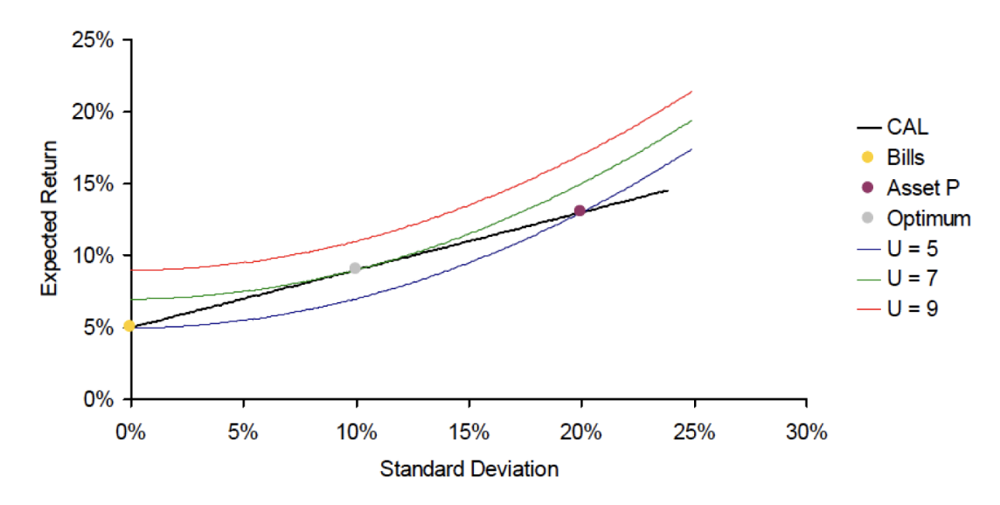

# Constructing Portfolios

## Combining Two Assets

Asset returns are random variables $r_1$ and $r_2$.

Portfolio: $r_p=\sum_{i=1}^{N}w_ir_i$

Portfolio expected return and risk:
$$
E(r_p)=w_1E(r_1)+w_2E(r_2)\\
\sigma_p^2=w_1^2\sigma_1^2+w_2^2\sigma_2^2+2w_1w_2\sigma_{12}\nonumber
$$

## Portfolios with a risk-free asset

If $\sigma_1^2=0$, then $\sigma_p^2=w_2^2\sigma_2^2$.

### Capital Allocation Line, CAL

$$
E(r_c)=r_f+y(E(r_p)-r_f)=r_f+S\sigma_c\nonumber
$$

$E(r_p)-r_f$ is called the **risk-premium** of the asset $P$​.

$S$: Reward-to-Volatility (Sharpe) Ratio
$$
S=\frac{\rm Risk\ premium}{\rm SD\ of\ excess\ returns}=\frac{E(r_p)-r_f}{\sigma_p}\nonumber
$$
*What does the CAL look like if borrowing rate exceeds $r_f$?*

CAL becomes flatter when $y>1$.

**Investors will always choose the portfolio with the higher Sharpe ratio, regardless of the inverstors' preferences.**

### Optimal Choice

The solution to optimal portfolio allocation is
$$
y^*=\frac{E(r_p)-r_f}{A\sigma_p^2}\nonumber
$$
We can also obtain this solution by moving indifference curves.

Weight can be negative.

  

