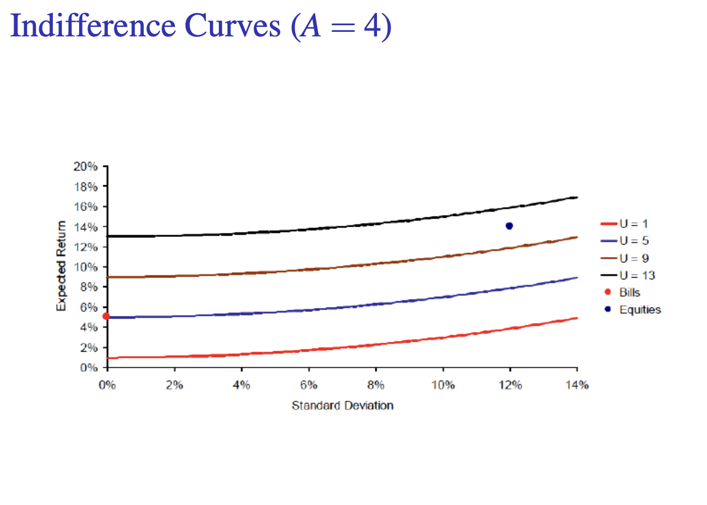
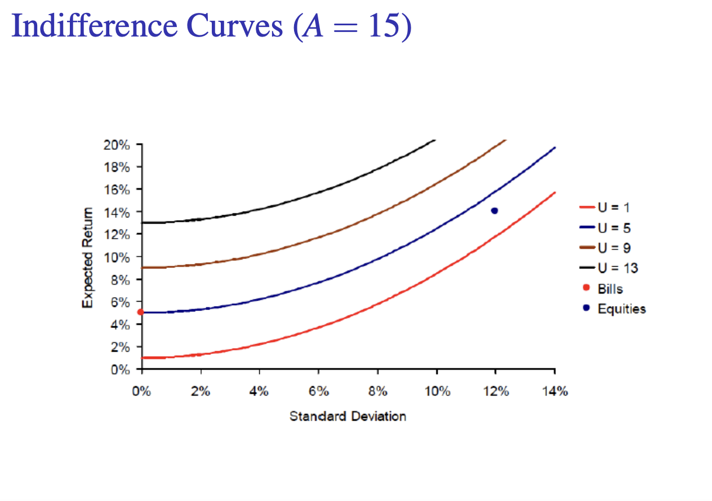

# Introduction to Portfolio Choice

## Risk Aversion and Utility

Assumption: Most investors are **risk averse**, indicating that they reject investment that are fair games or worse.

Utility function
$$
U=E(r)-\frac12A\sigma^2\nonumber
$$
Where $E(r)$ is the expected return on the asset, $\sigma^2$ is the varience of returns.

$A$ reflects the extent to which investors are risk averse.

- $A > 0$ : risk averse
- $A = 0$ : risk neutral
- $A < 0$ : risk loving

Here we have assumed that the utility function only relies on the **expected value** and the **standard deviation** (which is a strong assumption).

*However, in some circumstances, such as a portfolio where dominance exists, the utility function fails to describe people's choice.*

*If returns of portfolio satisfy the normal distribution, then the utility function is strictly valid.*

## Preferences & Choice

### Certainty equivalent

For a certain investor, certainty equivalent and the risky asset have the same utility.

### Indifference curves

Higher curves correspond to higher ranked assets.

Indifference curves must be upward-sloping (for risk-averse investors): Investors face trade-off between expected profits and risks.

Indifference curves cannot cross.

As $A$​ increases, indifference curves become steeper.

  

  

