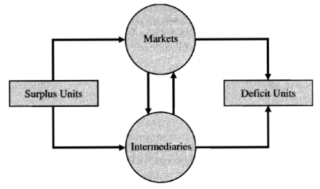

# Introduction

## Real Assets v.s. Financial Assets

Net Worth = Assets - Liabilities

Leverage = Liabilities / Assets

Financial assets and financial liabilities will cancel out if we aggregate all balance sheets, leaving only **real assets**.

## Types of Financial Assets

+ **Fixed-income securities (debt securities):** The stream of income is determined when issued. Therefore, it's considered less risky.
+ **Equity (common stock):** Represents ownership share in a corporation. Creditors are not owners of the corporation, so common stock only represents a **residual claim**. Common stock is closely related to the condition of business, which is different from debt securities.
  + **Limited liability**. The Stockholders have no obligations to pay more money to meet the shortfall of debt securities.
+ **Derivatives**: options, futures, structured finance

## Finacial Markets and the Economy

Financial assets allow us to make the most of economy's real assets.

+ The information role: efficient allocation of resources
+ Consumption timing: smooth consumption (If there is no storage or investment, the consumption is always less than income.)
+ Allocation of risk: Different types of financial assets have different risks, which satisfies various tastes for risk.
+ Separation of ownership and management

## Financial System

**Financial intermediaries** often have high leverage.

Bank is the major part of financial intermediaries.

Surplus Units & Deficit Units & Intermediaries & Markets

  

