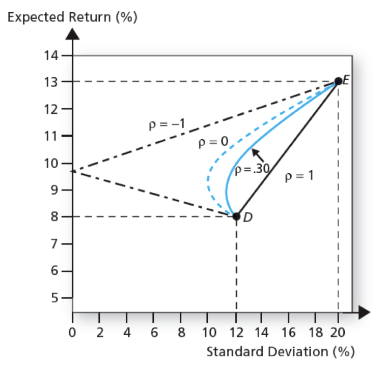

# Optimal Risky Portfolios

## Diversification and Portfolio Risk

Market-risk, also called systematic and nondiversifiable

Firm-specific risk (can be eliminated by diversification)

## Portfolio of Two Risky Assets

$$
E(r_p)=(1-x)E(r_d)+xE(r_e)\\
\sigma_p^2=(1-x)^2\sigma_d^2+x^2\sigma_e^2+2x(1-x)\sigma_{de}\nonumber
$$

**Portfolio opportunity set**: $(\sigma_p,E(r_p))$ combinations obtained by varying $x$.

We can find a point with minimum variance (when $\rho\neq1$, $\rho$ is the correlation coefficient) >> **minimum variance portfolio**.

We can prove that the portfolio opportunity set curve is a hyperbola on $E(r_p)-\sigma$ plane.

  

> e.g. If we have two assets $D$ and $E$ with the same expected return but different standard deviation, but their returns are independent ($\sigma_{DE}=0$), we can still combine two risky assets in a way that minimizes the risk.
> $$
> \min x^2\sigma_D^2+(1-x)^2\sigma_E^2\nonumber
> $$
> Obviously, $x$ is neither 0 nor 1.

Efficient frontier: the upward-slopng segment of the portfolio opportunity set.

Optimal choice is at the tangent point of indifference curve and portfolio opportunity set >> optimal choice depends on preferences.

If the indifference curves are flatter (the investor is less risk averse), the investor would prefer a riskier choice.
