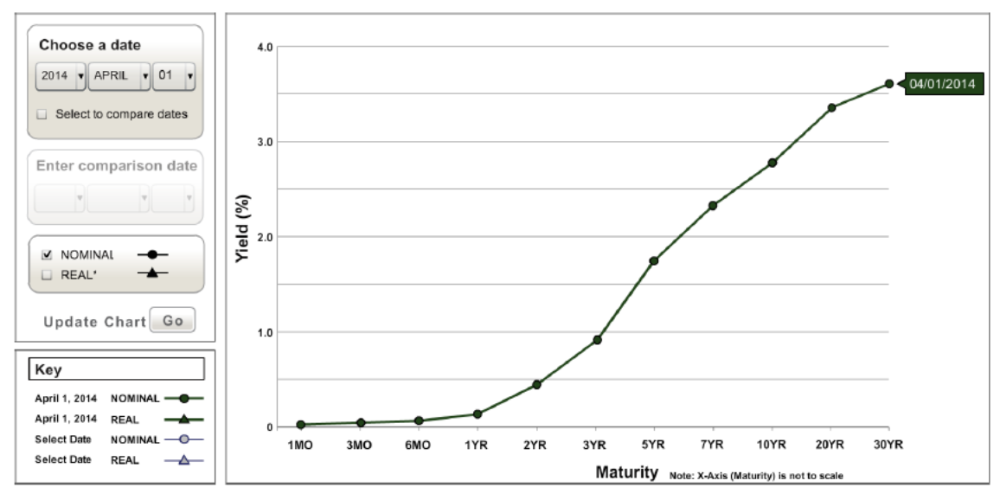

# The Term Structure of Interest Rates

## Yield Curve

The yield curve displays the relationship between yield to maturity (YTM) and time to maturity.

We care about pure yield curve (uses zero coupon bonds).

## Zero Coupon Bonds (Zeros)

We can construct a zero coupon bond using a ZCB and a non-ZCB (long one and short another to cancel out cash flow on the coupon date).

## The Yield Curve under Certainty

spot rate: $y_2$ / short rate today: $r_1$ / short rate next year: $r_2$

A spot rate is the geometric average of its component short rates.
$$
(1+y_2)^2=(1+r_1)(1+r_2),\ r_1=y_1\nonumber
$$
If $r_2>r_1$, the yield curve slopes up - May indicate rates are expected to rise.

If $r_2<r_1$, the yield curve slopes down - May indicate rates are expected to fall.

Future interest rates are uncertain?? - **Forward interest rates**: a forecast of a future short rate

In general, we have
$$
1+f_n=\frac{(1+y_n)^n}{(1+y_{n-1})^{n-1}}\nonumber
$$

## The Yield Curve under Uncertainty

When future interest rates are uncertain?
$$
(1+y_2)^2=(1+r_1)(1+E(r_2))\nonumber
$$
$E(r_2)$ denotes expected short rate for the following year

> Suppose a zero coupon bond has a face value of 1000.
>
> 1-year zero v.s. 2-year zero
> $$
> E(P_1)=\frac{1000}{1+E(r_2)},\quad\frac{E(P_1)-P_0}{P_0}>r_1\nonumber
> $$
> Investors are risk averse, so they require a risk premium to hold a longer-term bond >> $E(r_2)<f_2$​

## Theories of Term Structure

### The Expectations Hypothisis Theory

Liquidity premiums are zero.

An upward-sloping yield curve would be clear evidence that investors anticipate increases in interest rates.

The risk premium will be zero.

### Liquidity Preference Theory

If the liquidity premium is zero
$$
f_n=E(r_n)\nonumber
$$
A long-term horizon investor would be inclined to invest in long-term bonds, while a short-term horizon investor would be inclined to invest in short-term bonds (Suppose all investors are risk averse).

Whether the liquidity premium is positive or not depends on which kind of investors dominates the market.

In reality, there are more short-term horizon investors >> $f_n>E(r_n)$​

### Interpreting the Term Structure

An upward sloping curve could indicate:

1. Rates and expected to rise
2. Investors require large liquidity premiums to hold long term bonds

Even if the expected short rate keeps constant in the future, the yield curve could be upward sloping due to positive liquidity premium.
