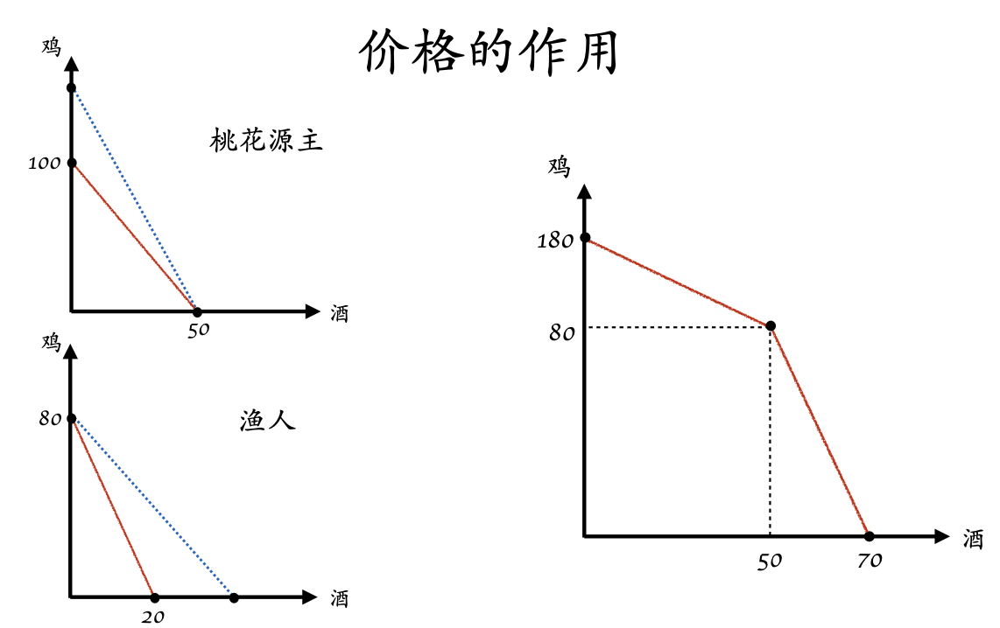

## 双赢的贸易 (Gains from Trade)

在全球经济中满足自身需求？

+ 自给自足 (autarky)
+ 与他人贸易 (trade)

为何产生贸易？？贸易的出现使得生产和消费不再对等。

**机会成本的<u>差别</u>（比较优势）为人们从贸易中收益创造了条件。**

Joint PPF 一定是凹 (concave) 的 >> 体现有效的生产 >> 此结论**不依赖**消费者的偏好

  

### 贸易促进专业化？

人们会对激励做出反应！！

消费可能性边界 (Consumption Possibility Frontier) 一定与PPF相切

价格使得每个人只要做出最有利于自己的反应，就能达到社会联合PPF

*反全球化 与 模型的矛盾？*

+ *模型忽略了产业结构*
+ *战争的发生*
