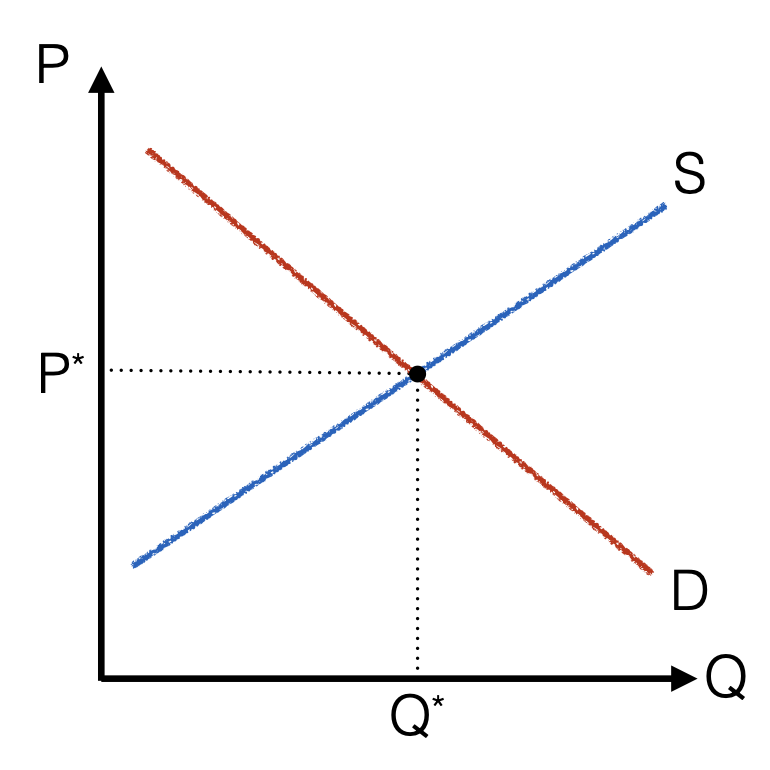

# 供需的市场力量 (The Market Forces of Supply and Demand)

## 需求和需求量

需求量 (quantity demanded) >> 数字

需求 (demand) >> 函数：以价格为自变量，需求量为因变量

## 需求定律和需求曲线

### 需求定律 (the law of demand)

**其他条件不变**，价格上升导致需求量下降 >> 房子？钻戒？价格中蕴含着商品的某种信息，需求定律被打破

市场需求是个人需求在**每一价格**下的水平加总 << 每个人看到的市场价格一样（即没有打折的现象） << 由市场的竞争决定

需求量的变化 >> 只与价格有关 >> Movement **along** the demand curve

需求的变化 >> 只与价格之外的因素有关 >> A **shift** in the demand curve >> 只能**向左或者向右**移动
$$
{\rm Demand\ curve:}\ P=D(Q,X)
$$
若$X$为收入：正常品 (normal good)和低档品 (inferior good) >> 这是个局部定义（靠考虑两条需求曲线相交的情形）
$$
P=D(Q)+\beta \times I
$$
$\beta >0$ >> 正常品，$\beta <0$ >> 低档品。若不能定义自变量可分离的函数，可以引入偏导

若$X$为相关产品的**价格**：替代品 (substitutes)和互补品 (complements)
$$
P=D(Q)+\gamma\times\widetilde{P}
$$
$\gamma>0$ >> 替代品，$\gamma<0$ >> 互补品

*注意替代品和互补品的定义。*

## 供给与供给量的变化

*同需求完全一致的分析*

## 均衡分析 (Equilibrium Analysis)

Equilibrium price & Equilibrium quantity

#### 供需定理

前提

+ 市场上存在足够多的竞争（不论是买家还是卖家），无人拥有市场势力 (market power)
+ 买卖双方为价格接受者 (price taker)
+ 产品完全同质 (homogeneous good)

模型没有回答：谁来降价或者提价？（只有价格变动的动力？）>> 来源于对于问题的过度抽象

  

### 比较静态分析 (Comparative Statics)

沿着供给曲线运动还是沿着需求曲线运动？

eg. 网络购物的盛行如何影响冰激凌市场？

sol. 需求曲线左移，厂家没有及时反应（价格具有黏性），导致滞销，厂商降价，达到新均衡

比较静态分析告诉我们：价格是市场上大量的卖家和买家竞争互动的结果，我们研究的对象是内生变量

*始终注意我们是通过外生变量研究内生变量（比较静态分析），内生变量的变化不会影响另一个内生变量（否则导致逻辑循环）*

eg. 休渔期+需求不振 对市场价格的影响

## 边际的力量

需求曲线 (D)=边际收益曲线 (MB)

需求曲线：给定价格，得到买家总数量 >> 需要市场和价格

边际收益曲线：给定边际买家，得到边际收益（支付意愿）>> 不需要市场和价格

供给曲线 (S)=边际成本曲线 (MC)
