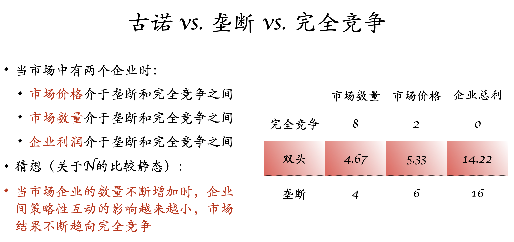

# 寡头与博弈论 (Oligopoly and Game Theory)

寡头情形下：策略性的互动 (strategic interactions)

如何预测策略性互动影响下经济个体的行为？博弈论 (Game Theory)！

双头模型：最简单的寡头模型

博弈的元素

- 玩家 (Players)
- 可能的行动 (Possible actions)
- 信息 (Information)
- 收益 (Payoffs)

## 囚徒困境 (Prisoner's Dilemma)

$$
\begin{array}{}
&{\rm confess}&{\rm deny}\\
{\rm confess}&\mathbf{-5,-5} & 0, -10\\
{\rm deny}&-10, 0 & -1,-1
\end{array}
$$

注意：上面的收益是**序数**概念

- 最佳应对 (best response)
- 占优策略 (dominant strategy)

## 纳什均衡 (Nash Equilibrium)

博弈中每一个玩家，在其他玩家选择的策略既定时，选择了自己的最优策略。

在纳什均衡中，没有玩家有激励偏离自己的策略。

- 冯诺依曼：从策略上思考问题 >> dominant/ dominated strategy
- 纳什：从结果思考问题（形成一个“好的”结果） >> equilibrium notion/ concept

如果用策略的思维思考问题，得到的结果和纳什均衡的结果应该一样。

## 囚徒困境的福利分析

我们使用帕累托有效评价博弈的结果

用帕累托有效评价，上面的囚徒困境有三个有效率的结果

但是均衡下的结果恰恰是那个唯一的无效率的结果！

亚当斯密告诉我们：价格理论中，所有人基于自己的理性进行行动，群体的行动将会是理性的 >> 市场“看不见的手”

但是，在博弈论的框架下，个体理性的结果会导致群体行为的无效率

根本原因：博弈论中策略性互动的存在。在价格理论中，所有消费者和生产者都是价格接收者（完全竞争），每个人本质上都只是在做自己收益的最大化，抹去了人与人之间策略性的互动，从而最终结果会是有效率的。

如果我们将囚徒困境看作是一种机制设计 (mechaism design)......

- 收益矩阵内生化
- 这种机制设计本质上是屈打成招

重新思考纳什均衡：纳什均衡中，没有玩家单方面愿意偏离均衡结果？联合背离？？>> collusion proof?? 所有的博弈中纳什均衡存在？唯一？

## 囚徒困境的应用

### 团队合作

shirk or effort

两个均衡的结果......

纳什均衡不是最后的结果 >> 只排除了一系列“不好”的结果

为什么两种博弈会有两种截然不同的结果？（奋进版 v.s. 堕落版）

别人的努力可以替代你的努力？...对方努力与否，影响着我努力的边际收益，这是一种互补的情形

生产存在着互补性 >> 双方都有强激励匹配对方的选择 >> 双方会发生合作 >> 多重均衡

现实例子：网络协同

### 广告竞争

广告的作用：1. 广而告之，使市场的需求曲线外移；2. 使对方的需求曲线内移；3. 使需求曲线旋转；4. 向市场发出信号 (signaling)，解决信息的不对称问题

更严厉的政策可能会带来更好的结果

在多人博弈的情境下，所有人不一定会因为选择变多而变得更好 >> 这和我们朴素的逻辑是相悖的

选择变多，带来的结果不仅仅是自己的选择变多 >> 知道对方手中的牌更多 >> 策略性的互动更加复杂

### 性别大战 (Battle of the Sexes)

双方都没有占优策略。

两个均衡的结果，到底哪个结果最终会被实现？不知道。

此博弈中也存在策略性的互补。纳什均衡中恰好包含了所有帕累托有效的结果。

### 便士匹配 (Matching Pennies)

零和博弈 (zero-sum game) >> 博弈中的所有结果都是帕累托有效的

这个博弈中不存在**纯策略的**纳什均衡 (pure strategy Nash equilibrium)，但是存在**混合策略**的纳什均衡 (mixed strategy Nash equilibrium)

“双人以等概率出示正反面”是一个纳什均衡

1抛硬币 >> 2对正反面无差异 >> 但是2为了让1在正反面无差异，他也会选择抛硬币

## 纳什定理

在一个有N个玩家的博弈中（有限策略），至少存在一个纳什均衡

纳什均衡在数学中就是*不动点*

## 博弈论刻画的寡头

### 价格竞争 (price competition)——Betrand竞争

唯一的纳什均衡：两个寡头的价格都等于边际成本

结果：两个企业都获得零利润 >> 和完全竞争的结果一样。符合现实吗？这是一个好结果吗？

直觉：企业在价格上及其激烈的竞争

**Betrand paradox.**

引入企业的异质性？

### 数量竞争 (quantity competition)——Cournot竞争

  

