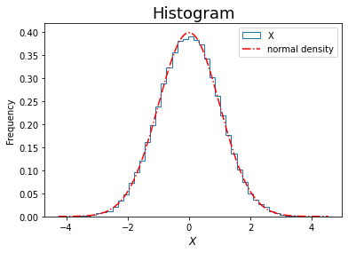

# Lecture 1: Financial Engineering in a Nutshell

$$
\newcommand{\bea}{\begin{eqnarray}}
\newcommand{\eea}{\end{eqnarray}}
\newcommand{\supp}{\mathrm{supp}}
\newcommand{\F}{\mathcal{F} }
\newcommand{\cF}{\mathcal{F} }
\newcommand{\E}{\mathbb{E} }
\newcommand{\Eof}[1]{\mathbb{E}\left[ #1 \right]}
\newcommand{\Etof}[1]{\mathbb{E}_t\left[ #1 \right]}
\def\Cov{{ \mbox{Cov} }}
\def\Var{{ \mbox{Var} }}
\newcommand{\1}{\mathbf{1} }
\newcommand{\p}{\partial}
\newcommand{\PP}{\mathbb{P} }
\newcommand{\Pof}[1]{\mathbb{P}\left[ #1 \right]}
\newcommand{\QQ}{\mathbb{Q} }
\newcommand{\R}{\mathbb{R} }
\newcommand{\DD}{\mathbb{D} }
\newcommand{\HH}{\mathbb{H} }
\newcommand{\spn}{\mathrm{span} }
\newcommand{\cov}{\mathrm{cov} }
\newcommand{\HS}{\mathcal{L}_{\mathrm{HS}} }
\newcommand{\Hess}{\mathrm{Hess} }
\newcommand{\trace}{\mathrm{trace} }
\newcommand{\LL}{\mathcal{L} }
\newcommand{\s}{\mathcal{S} }
\newcommand{\ee}{\mathcal{E} }
\newcommand{\ff}{\mathcal{F} }
\newcommand{\hh}{\mathcal{H} }
\newcommand{\bb}{\mathcal{B} }
\newcommand{\dd}{\mathcal{D} }
\newcommand{\g}{\mathcal{G} }
\newcommand{\half}{\frac{1}{2} }
\newcommand{\T}{\mathcal{T} }
\newcommand{\bit}{\begin{itemize}}
\newcommand{\eit}{\end{itemize}}
\newcommand{\beq}{\begin{equation}}
\newcommand{\eeq}{\end{equation}}
\newcommand{\tr}{\mbox{tr}}
$$

<center>
<font size=5, color=blue> Tai-Ho Wang (王 太和)</font>
</center>
<center>

</center>

## Coordinates

* Email: tai-ho.wang@baruch.cuny.edu
* Webpage: [mfe.baruch.cuny.edu/tai-ho.wang](https://mfe.baruch.cuny.edu/tai-ho.wang)


## Teaching Assistants

<font size=3.5, color=blue>郭鵬</font>
- 北大數院博士生
- 江湖人稱郭大俠
- Email: g.p@pku.edu.cn

<font size=3.5, color=blue>丁宏駿</font>
- 北大計算機專業本科生 
- Email: dinghongjun@stu.pku.edu.cn

## Aims of this course

* To be familiar with the financial products and the modeling of their prices
* To be familiar with well-known pricing models.
* To be familiar with the principle of no arbitrage and its applications
* To grasp theories of probability and statistics underpinning the models
* To gain experiences in working with Jupyter notebook and programming in `python`

## Agenda

- Financial market and financial product
- What is financial engineering?
- $\mathbb{P}$ quant v.s. $\mathbb{Q}$ quant
- Theory of pricing
    - Law of one price
    - Monotonicity
    - Linearity
- Principle of no arbitrage
- Brief introduction to Jupyter notebook and programming in Python

## Online resources

- [Investopedia](https://www.investopedia.com/)
- [Wikipedia](https://www.wikipedia.org/)
- [Advanced Risk and Portfolio Management](https://www.arpm.co/)

## Financial market

*What is finance? - Finance is all about trading.*

Quotes from [Investopedia](https://www.investopedia.com):

*A financial market is a broad term describing any marketplace where buyers and sellers participate in the trade of assets such as equities, bonds, currencies and derivatives. Financial markets are typically defined by having transparent pricing, basic regulations on trading, costs and fees, and market forces determining the prices of securities that trade.*

Types of financial markets and their roles
- Captial market
    - bond market (fixed income market)
    - equity market
- Derivative market
- Forex (foreign exchange) and interbank market
- Primary vs secondary market
    - A primary market issues new securities on an exchange.
    - The secondary market is where investors purchase securities or assets from other investors, rather than from issuing companies themselves.
- OTC (over-the-counter) market (in contrast to centralized market)
- Third and fourth market

For more details, visit
[Types of Financial Markets and their roles](https://www.investopedia.com/walkthrough/corporate-finance/1/financial-markets.aspx) at [Investopedia](https://www.investopedia.com).

We will only cover the equity and fixed income markets. 


## Financial products

- Primary or underlying
    - Equity 
    - Fixed income
    - Commodity
    - Credit

- Secondary or derivatives
    - Forward and futures
    - Options
    - Swaps 

## What is financial engineering?

According to [this article](https://www.iaqf.org/financial-engineering) in the website of Internation Association for Quantitative Finance (IAQF) (used to be named as IAFE), financial engineering is 

- the application of mathematical methods to the solution of problems in finance
- also known as financial mathematics, mathematical finance, and computational finance

Therefore, 
- Financial engineering draws on tools from applied mathematics, computer science, statistics, and economic theory.
- Investment banks, commercial banks, hedge funds, insurance companies, corporate treasuries, and regulatory agencies employ financial engineers.
- These businesses apply the methods of financial engineering to problems such as new product development, derivative securities valuation, portfolio structuring, risk management, and scenario simulation.


## What is financial engineering for?

- **Derivative pricing**
- **Portfolio construction**
- **Risk management**
- **Trading strategy**
- Quantitative trading
- Market making
- Order implementation

We shall mostly focus on the pricing of derivatives based on the principle of no arbitrage. 

As pricing is concerned, in finanical engineering we usually consider the following types of problems:
- direct problem: under a given model for the underlying, calculate the prices of its derivatives
- inverse problem: for a given set of prices of liquidly derivatives, determine the parameters or even a model that generates the observed market prices. 

## What skills are required to be a financial engineer?

Quantitative finance is an interdisciplinary field, it requires hard skills in 
- Math: calculus, linear algebra, probability, stochastic process, differential equation, optimization, etc 
- Finance: derivative pricing theory, modern portfolio theory, market microstructure models
- Statistics: regression and classification, factor analysis, time series analysis
- Programming: R, Python, C++, Matlab, etc

Nowadays also requires 
- machine learnining techniques
- sentiment analysis

## Quantitative analyst - Quant

Excerpt from [Quants: The Rocket Scientists of Wall Street](https://www.investopedia.com/articles/financialcareers/08/quants-quantitative-analyst.asp) in Investopedia, 

>As financial securities become increasingly complex, demand has grown steadily for people who not only understand the complex mathematical models that price these securities, but who are able to enhance them to generate profits and reduce risk. These individuals are known as quantitative analysts, or simply "quants."

Quantitative analysts
- design and implement complex models that allow financial firms to price and trade securities
- front desk quants work directly with traders, providing them with pricing or trading tools 
- back office quants validate the models, conduct research and create new strategies
- positions are found almost exclusively in major financial centers with trading operations

## $\mathbb{P}$ quant v.s. $\mathbb{Q}$ quant

Quants are briefly categorized as $\mathbb{P}$ quants and $\mathbb{Q}$ quants.

- $\mathbb{P}$ refers to the physical measure under which the financial assets presumably evolves. 
- $\mathbb{Q}$ refers to the risk neutral measure for pricing under the principle of no arbitrage.  


The mentality behind $\mathbb P$ quant and the buy side is 

- Regard the market as a whole, process historical data then forecast price movements 
- Construct portfolio or investment strategy based on performance measures 
- Decide the horizon of holding the portfolio
- Risk management

The mentality behind $\mathbb Q$ quant and the sell side is 

- Construct model that could possibly explain the market 
- Cablibrate parameters of model to market data
- Apply the calibrated model to price new derivatives
- Hedging 

### Note
- In this course, we shall cover topics on both sides, though not evenly.
- Please refer to [this link](https://www.arpm.co/lab/about-quantitative-finance.html#x4-130001) in [ARPM.co](https://www.arpm.co/) for more details on the interplay between $\mathbb P$ quants and $\mathbb Q$ quants.

## Theory of asset pricing

Heuristically, pricing is a rule or a map that assigns a (unique, current) value to each (random) payoff/cashflow which can only be realized at the future investment horizon. The collection/universe of all the payoffs at the investment horizon is assumed to be equipped with a vector space structure. In other words, we would be able to add or subtract a payoff from another, and also be able to scale up or down by any (real, positive or negative) scalar. Thus, we can regard pricing as a function or a functional $\Pi$ from the space of (random) payoffs to real numbers: 

$$
\Pi : \mathcal P \to \R,
$$

where $\mathcal P$ is space of payoffs at investment horizon. 

A pricing functional $\Pi$ presumably bears the following axioms

- Law of one price 
- Monotonicity
- Linearity

By esssentially the Riesz representation theorem, a pricing function/functional, should it exist, can be charactrized by the expectation of a (random) payoff weighted by a stochastic discount factor. 

The price of any asset in the universe is given by the an expectation of discounted payoff discounted by a stochastic discount factor. 

### Note
In this course we shall explore the modeling of the pricing functional. 

## Law of one price

Two payoffs with equal values in all scenarios must have the same price. 


## Monotonicity

If the payoff $X$ dominates the payoff $Y$, i.e., $X > Y$ in any scenario, then the price of $X$ must be higher than that of $Y$. 

## Linearity

The price of linear combination of the payoffs $X$ and $Y$ is the same linear combination of the price of $X$ and $Y$. That is, 

$$
\Pi(\alpha X + \beta Y) = \alpha \Pi(X) + \beta \Pi(Y)
$$

If the pricing function/functional satisfies the axioms, it can be represented as a discounted expectation. Precisely, for a given payoff $X$, its price is given by

$$
\Pi(X) = \Eof{D X}
$$

where $D$ is a (positive) random variable called *stochastic discount factor*.

### Note
The $\Eof{D}$ is the price of zero coupon bond since, the payoff of zero coupon bond of face value 1 is $X \equiv 1$. 

## Principle of no arbitrage

### Arbitrage opportunity
Intuitively, an *arbitrage opportunity* is a trade or a trading strategy that have positive payoff at the investment horizon with zero cost currently. In other words, we are able to aquire a financial position, be statically or dynamically, without being required to pay initially for entering the position.  

Any viable financial model should not permit arbitrage opportunity.

In reality, arbitrage opportunity does exist. However, it disappears very quickly even much quicker now due to the advent of technology, since once it is exploited, sophiscated market participants will quickly take the advantage of it, then the market reacts to it so as to reach a new status without arbitrage opportunity. 

Principle of no arbitrage is the core behind the theory of derivative pricing. 

## Fundamental theorem of asset pricing

Explanations from [Wikipedia](https://en.wikipedia.org/wiki/Fundamental_theorem_of_asset_pricing).

>*The fundamental theorems of asset pricing (also: of arbitrage, of finance) provide necessary and sufficient conditions for a market to be arbitrage free and for a market to be complete.*

To be more specific, 

*In a discrete (i.e. finite state) market, the following hold:*

### The First Fundamental Theorem of Asset Pricing 
A discrete market, on a discrete probability space $(\Omega, \cF, \PP)$, is arbitrage-free if and only if there exists at least one risk neutral probability measure that is equivalent to the original probability measure, $\PP$.

### The Second Fundamental Theorem of Asset Pricing 
An arbitrage-free market $(S, B)$ consisting of a collection of stocks $S$ and a risk-free bond $B$ is complete if and only if there exists a unique risk-neutral measure that is equivalent to $\PP$ and has numeraire $B$.


## Brief introduction to Jupyter notebook and Python

Online resources

- [Jupyter notebook and Jupyter lab](https://jupyter.org/)
- [Python documentation](https://docs.python.org/3/)
- [Numpy](https://numpy.org/)
- [Scipy](https://scipy.org/)
- [Pandas](https://pandas.pydata.org/)

For example, this is a markdown cell.  
Let's have some fun.


```python
78
```


    78


```python
# And this is a code cell
```

# Head 1
## Head 2
### Head 3
#### Head 4

LaTex we can try to type $\log x \times \cos y$

Test on integral

$$ \int_{-\infty}^\infty e^{-\frac{x^2}2} dx = \sqrt{2\pi}.$$


This is an example for sum of an infinite series.

$$
\zeta(2) = \sum_{n=1}^\infty \frac1{n^2} = 1 + \frac1{2^2} + \frac1{3^2} + \cdots + \frac1{n^2} + \cdots = \frac{\pi^2}6
$$


```python
import seaborn as sns
```


```python
# install modules if necessary
# pip install pandas
# pip install seaborn
```


```python
import numpy as np
```


```python
np.exp(1), np.log(np.exp(1))
```


    (2.718281828459045, 1.0)


```python
from numpy import exp
```


```python
exp(1), np.exp(1)
```


    (2.718281828459045, 2.718281828459045)


```python
# import modules that will be commonly used in the course
import numpy as np 
import matplotlib.pyplot as plt
from numpy import exp, log, sqrt
import pandas as pd
from scipy.stats import norm, t
import scipy.stats as ss
import seaborn as sns
```


```python
exp(0), np.exp(0)
```


    (1.0, 1.0)


```python
x=6
x
```


    6


```python
# list
tickers = ['aapl', 'goog', 'spx']

# tuple
prices = (140, 600, 4500)

# dict/dictionary
stocks = {'ticker': tickers, 'price': prices}
stocks
```


    {'ticker': ['aapl', 'goog', 'spx'], 'price': (140, 600, 4500)}


```python
stocks['ticker'], stocks['price']
```


    (['aapl', 'goog', 'spx'], (140, 600, 4500))


```python
# present data as a pandas.DataFrame
df = pd.DataFrame({'ticker': tickers, 'price': prices})
df
```


<div>
<style scoped>
    .dataframe tbody tr th:only-of-type {
        vertical-align: middle;
    }

    .dataframe tbody tr th {
        vertical-align: top;
    }
    
    .dataframe thead th {
        text-align: right;
    }
</style>
<table border="1" class="dataframe">
  <thead>
    <tr style="text-align: right;">
      <th></th>
      <th>ticker</th>
      <th>price</th>
    </tr>
  </thead>
  <tbody>
    <tr>
      <th>0</th>
      <td>aapl</td>
      <td>140</td>
    </tr>
    <tr>
      <th>1</th>
      <td>goog</td>
      <td>600</td>
    </tr>
    <tr>
      <th>2</th>
      <td>spx</td>
      <td>4500</td>
    </tr>
  </tbody>
</table>
</div>


```python
# add a column to pandas.DataFrame
df['index'] = (6, 8, 9)
df
```


<div>
<style scoped>
    .dataframe tbody tr th:only-of-type {
        vertical-align: middle;
    }

    .dataframe tbody tr th {
        vertical-align: top;
    }
    
    .dataframe thead th {
        text-align: right;
    }
</style>
<table border="1" class="dataframe">
  <thead>
    <tr style="text-align: right;">
      <th></th>
      <th>ticker</th>
      <th>price</th>
      <th>index</th>
    </tr>
  </thead>
  <tbody>
    <tr>
      <th>0</th>
      <td>aapl</td>
      <td>140</td>
      <td>6</td>
    </tr>
    <tr>
      <th>1</th>
      <td>goog</td>
      <td>600</td>
      <td>8</td>
    </tr>
    <tr>
      <th>2</th>
      <td>spx</td>
      <td>4500</td>
      <td>9</td>
    </tr>
  </tbody>
</table>
</div>


```python
# concatenate lists
taiho = [3, 2, 'this is a string']
print(taiho)
taiho += [90]
print(taiho)
print(['bye'] + taiho + ['hello'])
```

    [3, 2, 'this is a string']
    [3, 2, 'this is a string', 90]
    ['bye', 3, 2, 'this is a string', 90, 'hello']


```python
np.identity(3)
```


    array([[1., 0., 0.],
           [0., 1., 0.],
           [0., 0., 1.]])


```python
# matrix mulplications
A = np.identity(4)
#A
print(A)
print(2*A) 
2*A + 1
```

    [[1. 0. 0. 0.]
     [0. 1. 0. 0.]
     [0. 0. 1. 0.]
     [0. 0. 0. 1.]]
    [[2. 0. 0. 0.]
     [0. 2. 0. 0.]
     [0. 0. 2. 0.]
     [0. 0. 0. 2.]]


    array([[3., 1., 1., 1.],
           [1., 3., 1., 1.],
           [1., 1., 3., 1.],
           [1., 1., 1., 3.]])


```python
B = [1, 2, 3]
c = [4, 5, 6]
print(B + c)
np.array(B) + np.array(c)
```

    [1, 2, 3, 4, 5, 6]


    array([5, 7, 9])


```python
f = lambda x: 2*x**2 + 1
[f(i) for i in range(9)]
```


    [1, 3, 9, 19, 33, 51, 73, 99, 129]


```python
f(np.arange(9))
```


    array([  1,   3,   9,  19,  33,  51,  73,  99, 129])


```python
np.linspace(0, 1, 10)
```


    array([0.        , 0.11111111, 0.22222222, 0.33333333, 0.44444444,
           0.55555556, 0.66666667, 0.77777778, 0.88888889, 1.        ])


```python
np.arange(0, 1, 0.1)
```


    array([0. , 0.1, 0.2, 0.3, 0.4, 0.5, 0.6, 0.7, 0.8, 0.9])


```python
B = np.arange(16)
print(B)
B = np.arange(16).reshape(4, 4)
B
```

    [ 0  1  2  3  4  5  6  7  8  9 10 11 12 13 14 15]


    array([[ 0,  1,  2,  3],
           [ 4,  5,  6,  7],
           [ 8,  9, 10, 11],
           [12, 13, 14, 15]])


```python
A, B
```


    (array([[1., 0., 0., 0.],
            [0., 1., 0., 0.],
            [0., 0., 1., 0.],
            [0., 0., 0., 1.]]),
     array([[ 0,  1,  2,  3],
            [ 4,  5,  6,  7],
            [ 8,  9, 10, 11],
            [12, 13, 14, 15]]))


```python
d = np.array([1, 2, 3, 0])
```


```python
A, d
```


    (array([[1., 0., 0., 0.],
            [0., 1., 0., 0.],
            [0., 0., 1., 0.],
            [0., 0., 0., 1.]]),
     array([1, 2, 3, 0]))


```python
A*d
```


    array([[1., 0., 0., 0.],
           [0., 2., 0., 0.],
           [0., 0., 3., 0.],
           [0., 0., 0., 0.]])


```python
# entrywise multiplication, if they have the same shape
print(A*B)

# matrix multiplication, if they are conformable
A.dot(B), B.dot(A)
```

    [[ 0.  0.  0.  0.]
     [ 0.  5.  0.  0.]
     [ 0.  0. 10.  0.]
     [ 0.  0.  0. 15.]]


    (array([[ 0.,  1.,  2.,  3.],
            [ 4.,  5.,  6.,  7.],
            [ 8.,  9., 10., 11.],
            [12., 13., 14., 15.]]),
     array([[ 0.,  1.,  2.,  3.],
            [ 4.,  5.,  6.,  7.],
            [ 8.,  9., 10., 11.],
            [12., 13., 14., 15.]]))


```python
vv, ww = np.array([1,2,4]), np.array([3, 4])
2*vv + 1, ww
```


    (array([3, 5, 9]), array([3, 4]))


```python
c = np.arange(1, 5)
c
```


    array([1, 2, 3, 4])


```python
c, B
```


    (array([1, 2, 3, 4]),
     array([[ 0,  1,  2,  3],
            [ 4,  5,  6,  7],
            [ 8,  9, 10, 11],
            [12, 13, 14, 15]]))


```python
c = np.arange(1, 5)
c
```


    array([1, 2, 3, 4])


```python
c, B
```


    (array([1, 2, 3, 4]),
     array([[ 0,  1,  2,  3],
            [ 4,  5,  6,  7],
            [ 8,  9, 10, 11],
            [12, 13, 14, 15]]))


```python
c*B
```


    array([[ 0,  2,  6, 12],
           [ 4, 10, 18, 28],
           [ 8, 18, 30, 44],
           [12, 26, 42, 60]])


```python
c.dot(B)
```


    array([ 80,  90, 100, 110])


```python
B.dot(c)
```


    array([ 20,  60, 100, 140])


```python
c[3], B[1,1]
```


    (4, 5)


## `numpy.arange` vs `numpy.linspace`


```python
print(np.arange(0, 1, 0.1))
np.linspace(0, 1, 10)
```

    [0.  0.1 0.2 0.3 0.4 0.5 0.6 0.7 0.8 0.9]


    array([0.        , 0.11111111, 0.22222222, 0.33333333, 0.44444444,
           0.55555556, 0.66666667, 0.77777778, 0.88888889, 1.        ])


## Probability distributions in `scipy.stats`

- Distributions 
    - `norm` for normal distribution
    - `expon` for exponential distribution
    - `f` for $F$-distribution
    - `t` for $t$-distribution
    - `chi2` for $\chi^2$

- Methods
    - `cdf` for cumulative distribution function
    - `pdf` for probability density function
    - `rvs` for random samples
    - `ppf` for percentile/quantile function 
    - `sf` for survival function


```python
c
```


    array([1, 2, 3, 4])


```python
ss.norm.ppf(0.75)
```


    0.6744897501960817


```python
# set random seed for reproducing the same result
np.random.seed(1414)
ss.norm.rvs(size=20)
```


    array([-0.43142496, -0.32047833,  0.4235297 , -1.45983243, -0.2240876 ,
           -1.41350104,  1.29988913,  1.018297  ,  1.33755056, -0.52439005,
            0.47429069, -0.44344702, -0.20691966,  0.02181808, -0.6298927 ,
            1.16081368, -0.600044  , -0.35154273, -1.25638395,  0.37230831])


```python
# restructure in to a matrix
np.random.seed(0)
x = norm.rvs(size=10)
x.reshape(5, 2)
```


    array([[ 1.76405235,  0.40015721],
           [ 0.97873798,  2.2408932 ],
           [ 1.86755799, -0.97727788],
           [ 0.95008842, -0.15135721],
           [-0.10321885,  0.4105985 ]])


```python
x = ss.chi2.rvs(size=10, df=3)
x.std()
#x.mean(), x.std()
```


    1.055358778792368


```python
x = norm.rvs(size=10000)
x.mean(), x.std()
```


    (0.009860692655194417, 0.9932045967619453)


```python
# t distribution
x = ss.t.rvs(size=20, df=3)
x = x.reshape(5, 4)
x.std(axis=0), x.mean(axis=1)
```


    (array([1.37879318, 0.90832706, 0.54941869, 1.06259522]),
     array([-0.25745669, -1.00116667,  0.49639331, -0.14980356,  0.09080126]))


```python
# set seed for reproducing the same result
np.random.seed(3141)
A = ss.t.rvs(size=50, df=3).reshape(10, 5)
print(A)

# columns means, row means, mean
A.mean(axis=0), A.mean(axis=1), A.mean(), A[0,:].mean(), A[:,1].mean()
```

    [[ 0.38460161  0.30557167  0.98733417 -0.91383565  0.29287735]
     [-4.80767259  1.75715301  0.56930703 -0.18584678 -0.27178843]
     [-2.22506467  0.75044717  0.64565414 -6.61192184  0.52245651]
     [-3.9920851  -0.09520588 -1.13886262  0.10359085  0.98480259]
     [ 1.14992001 -0.0721649   1.11039801 -1.2657385   0.24885729]
     [ 0.83122811  1.1900472   2.20384757  0.241097    0.7355704 ]
     [ 0.35649725 -0.05568609  0.91596184  0.57625402 -1.13201945]
     [-0.33241969 -0.86425951  0.70613486  0.58578441  0.83649889]
     [-3.05161328 -0.12689271 -0.95750987  0.43748489 -0.01460354]
     [ 0.91656328  0.61010723 -1.11239471 -0.96544386 -0.38342567]]


    (array([-1.07700451,  0.33991172,  0.39298704, -0.79985755,  0.18192259]),
     array([ 0.21130983, -0.58776955, -1.38368574, -0.82755203,  0.23425438,
             1.04035806,  0.13220151,  0.18634779, -0.7426269 , -0.18691875]),
     -0.19240813934357784,
     0.21130982710311189,
     0.3399117196808371)


```python
A.std(axis=0), A.std(axis=1), A.std()
```


    (array([2.1202166 , 0.71816393, 1.05120007, 2.04105521, 0.61667702]),
     array([0.61866546, 2.23188063, 2.8407215 , 1.72041687, 0.88883698,
            0.65598228, 0.70644573, 0.66713118, 1.23930652, 0.81904152]),
     1.5861889765952781)


```python
f(3.14)
```


    0.0015926529164868282


```python
# plot graph of a function
f = lambda x: np.sin(x)
g = lambda x: np.sin(x - np.pi/6)
h = lambda x: np.sin(x - np.pi/4)
x = np.linspace(0, 2*np.pi, 200)

# plot
plt.figure(figsize=(9, 6))
plt.plot(x, f(x), 'r', lw=1, label='$y = f(x)$')
plt.plot(x, g(x), 'k--', lw=1, label='$y = g(x)$')
plt.plot(x, h(x), 'b-.', lw=1, label='$y = h(x)$')
plt.xlabel('$x$', fontsize=12)
plt.ylabel('$y$', fontsize=25)
#plt.ylabel('$y$', fontsize=12)
#plt.title('Whatever the Title', fontsize=15)
plt.grid()
#plt.legend();
```


​    

​    


```python
# examples for histogram
# set seed
np.random.seed(2718)
sample = pd.DataFrame(norm.rvs(size=int(5e4)))
sample.head(10), sample.tail(10)
```


    (          0
     0  1.722518
     1 -0.626257
     2 -3.533687
     3  0.716898
     4  1.353317
     5  1.603105
     6  0.501179
     7  0.748855
     8 -1.790165
     9  0.533090,
                   0
     49990  0.004426
     49991  0.235329
     49992 -0.188821
     49993 -0.183680
     49994  0.475978
     49995 -1.139552
     49996 -0.162364
     49997 -0.355614
     49998 -0.793454
     49999  1.334050)


```python
sample.describe().transpose()
#sample.describe().transpose()
```


<div>
<style scoped>
    .dataframe tbody tr th:only-of-type {
        vertical-align: middle;
    }

    .dataframe tbody tr th {
        vertical-align: top;
    }
    
    .dataframe thead th {
        text-align: right;
    }
</style>

<table border="1" class="dataframe">
  <thead>
    <tr style="text-align: right;">
      <th></th>
      <th>count</th>
      <th>mean</th>
      <th>std</th>
      <th>min</th>
      <th>25%</th>
      <th>50%</th>
      <th>75%</th>
      <th>max</th>
    </tr>
  </thead>
  <tbody>
    <tr>
      <th>0</th>
      <td>50000.0</td>
      <td>0.000345</td>
      <td>1.002402</td>
      <td>-4.568631</td>
      <td>-0.675698</td>
      <td>0.006211</td>
      <td>0.681126</td>
      <td>4.001952</td>
    </tr>
  </tbody>
</table>
</div>


```python
# generate random samples from standard normal
sample = pd.DataFrame(norm.rvs(size=int(5e4))) # 1e5 = 10^5, 1e3 = 10^3 = 1000

x = np.linspace(sample.min(), sample.max(), 200)
y = norm.pdf(x)

# histogram by hvplot.hist
#sample.hvplot.hist(bins=50, height=350, width=550, label='histogram') * \
#hv.Curve((x, y*8500)).opts(color='red', line_dash='dashed')
```


```python
# histogram by seaborn.histplot
# we shall mostly using this module for plotting histograms
plt.figure(figsize=(9, 6))
sns.histplot(sample[0], bins=50, stat='density', kde=True, label='histogram')

#sns.histplot(sample[0], bins=50, color='k', fill=False)
plt.xlabel('$X$', fontsize=12)
plt.title('Histogram', fontsize=18)

# superimpose density of standard normal 
x = np.linspace(sample.min(), sample.max(), 200)
y = norm.pdf(x)
plt.plot(x, y, 'r--', label='normal density')
plt.legend();
```


​    

​    


```python
sample.columns = ['X']
```


```python
# histogram using built-in pandas.DataFrame method
sample.plot(kind='hist', bins=50, density=True, histtype='step')
# superimpose the density
x = np.linspace(sample.min(), sample.max(), 200)
y = norm.pdf(x)
plt.plot(x, y, 'r-.', label='normal density')
plt.xlabel('$X$', fontsize=12)
plt.title('Histogram', fontsize=18)
plt.legend();
```



​    


```python
# histogram using pyplot
plt.figure(figsize=(9, 6))
plt.hist(sample, density=True, bins=50, histtype='bar', rwidth=0.85, label='histogram')

# superimpose the density
x = np.linspace(sample.min(), sample.max(), 200)
y = norm.pdf(x)
plt.plot(x, y, 'r-.', label='normal density')
plt.xlabel('$X$', fontsize=12)
plt.legend();
```


​    

