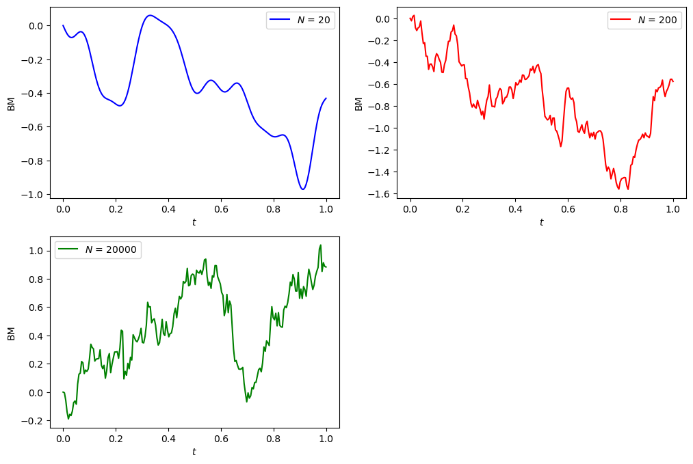
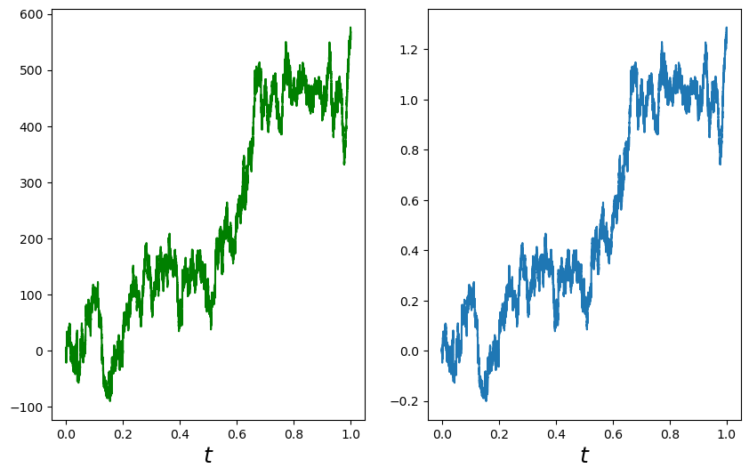
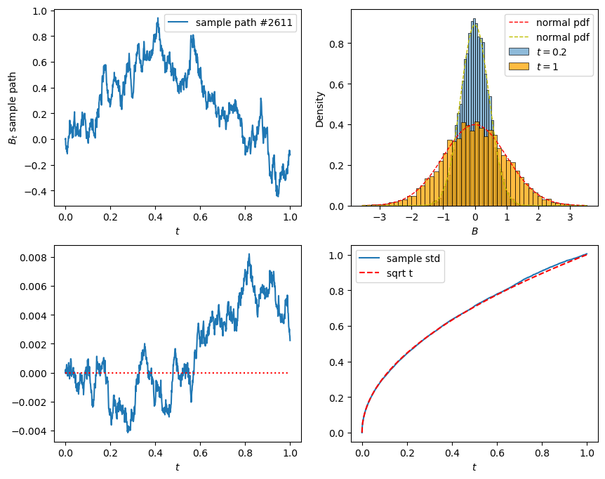
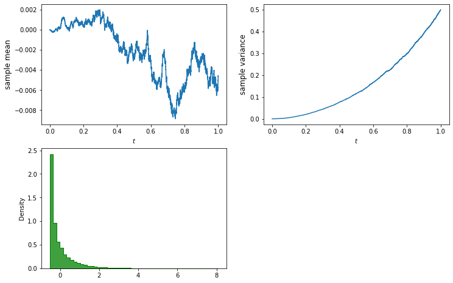
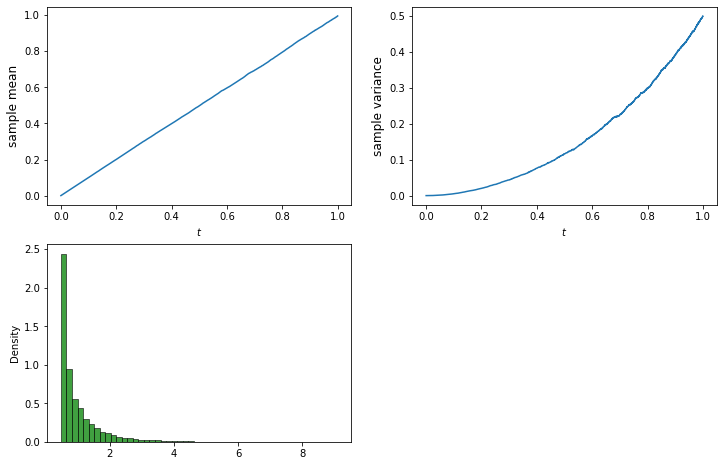
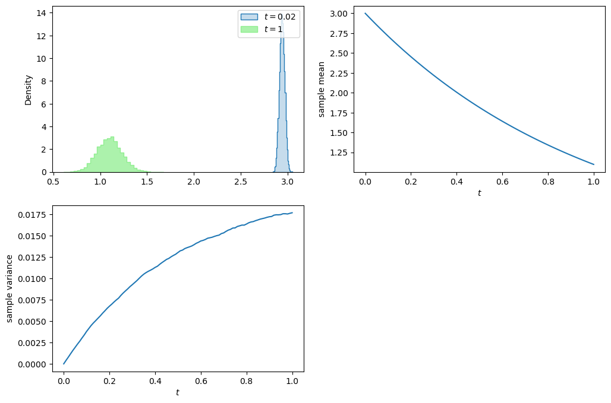
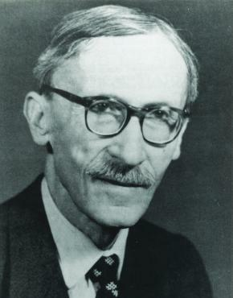
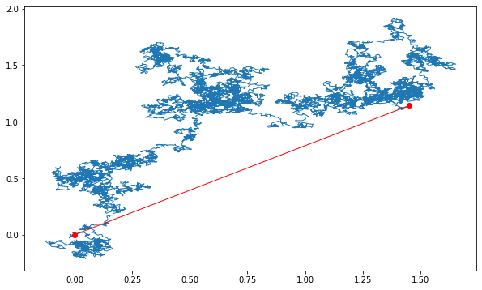

# Lecture 2: Crash Course on Stochastic Calculus

$$
\newcommand{\bea}{\begin{eqnarray}}
\newcommand{\eea}{\end{eqnarray}}
\newcommand{\supp}{\mathrm{supp}}
\newcommand{\F}{\mathcal{F} }
\newcommand{\cF}{\mathcal{F} }
\newcommand{\E}{\mathbb{E} }
\newcommand{\Eof}[1]{\mathbb{E}\left[ #1 \right]}
\def\Cov{{ \mbox{Cov} }}
\def\Var{{ \mbox{Var} }}
\newcommand{\1}{\mathbb{1} }
\newcommand{\p}{\partial}
\renewcommand{\P}{\mathbb{P} }
\newcommand{\PP}{\mathbb{P} }
\newcommand{\Pof}[1]{\mathbb{P}\left[ #1 \right]}
\newcommand{\QQ}{\mathbb{Q} }
\newcommand{\R}{\mathbb{R} }
\newcommand{\DD}{\mathbb{D} }
\newcommand{\HH}{\mathbb{H} }
\newcommand{\spn}{\mathrm{span} }
\newcommand{\cov}{\mathrm{cov} }
\newcommand{\HS}{\mathcal{L}_{\mathrm{HS}} }
\newcommand{\Hess}{\mathrm{Hess} }
\newcommand{\trace}{\mathrm{trace} }
\newcommand{\LL}{\mathcal{L} }
\newcommand{\s}{\mathcal{S} }
\newcommand{\ee}{\mathcal{E} }
\newcommand{\ff}{\mathcal{F} }
\newcommand{\hh}{\mathcal{H} }
\newcommand{\bb}{\mathcal{B} }
\newcommand{\dd}{\mathcal{D} }
\newcommand{\g}{\mathcal{G} }
\newcommand{\half}{\frac{1}{2} }
\newcommand{\T}{\mathcal{T} }
\newcommand{\bit}{\begin{itemize}}
\newcommand{\eit}{\end{itemize}}
\newcommand{\beq}{\begin{equation}}
\newcommand{\eeq}{\end{equation}}
\newcommand{\tr}{\mbox{tr}}
$$

<center>
<font size=5, color=blue> Tai-Ho Wang (王 太和)</font>
</center>
<center>

</center>

## Outline of Lecture 2

* Brownian motion 
* Stochastic integral 
* Ito's formula 
* Feynman-Kac formula
    - Characteristic function for Lévy area

## Definition of Brownian motion

Let $(\Omega,\cF_t,\P)$ be a filtered probability space. 

A stochastic process $B_t$ adapted to $\cF_t$ is called a (standard) *Brownian motion* or a *Wiener process* if it
satisfies the following conditions

* $\P[\omega: B_0(\omega) = 0] = 1$, i.e., the process starts at zero almost surely.

* For any $0 \leq s < t$, the random variable $B_t - B_s$ is normally distributed with mean 0 and variance $t-s$, i.e., for any $a<b$,
$$
\P[a \leq B_t - B_s \leq b] = \frac{1}{\sqrt{2\pi(t-s)}}\int_a^b e^{-\frac{x^2}{2(t-s)}}dx.
$$

* $B_t$ has independent increment, i.e., for any $0\leq t_1 < t_2 < \cdots < t_n$, the random variables
  $$
    B_{t_1}, \; B_{t_2} - B_{t_1},\; \cdots, \; B_{t_n} - B_{t_{n-1}}
  $$
  are independent.

* Almost all sample paths of $B_t$ are continuous functions, i.e.,
  $$
    \P[\omega:B_t(\omega) \mbox{ is continuous } ] = 1
  $$
  

*The Brownian motion is a series of independent normally distributed increment (similar to random walk, but for the continuous situation).*

### Remark
* A Brownian motion is sometimes defined as a stochastic process satisfying only the first 3 conditions in the  definition. Such a process always has continuous modification by applying Kolmogorov's continuity criterion.
* The standard Brownian motion starts at 0. A Brownian motion starts at $x\neq 0$ is obtain by shifting $x + B_t$.
* $X_t = x + \sigma B_t$, $X_t$ has mean $x$ and variance $\sigma^2 t$, whereas $X_t - X_s$ has mean $0$ variance $\sigma^2(t-s)$.

## Kolmogorov's continuity criterion

#### Theorem

A process $X$, for which there exist three constants $\alpha$,
$\beta$, $C > 0$ such that
$$
  \E|X_{t+h} - X_t|^{\alpha} \leq C h^{1 + \beta}
$$
for every $t$ and $h$, has a modification which is almost surely
continuous.

For Brownian motion $B_t$, since the random variable $B_{t+h} - B_t$ is centered Gaussian with variance $h$, we have

$$
\Eof{(B_{t+h} - B_t)^4} = 3 h^2.
$$

Therefore, by taking $\alpha=4$, $\beta = 1$, and $C=3$, the Kolmogorov's continuity criterion applies.

## Historical note

Quotes from the [Wikipage](https://en.wikipedia.org/wiki/Brownian_motion):

>"Brownian motion or pedesis (from Greek: πήδησις /pɛ̌ːdɛːsis/ "leaping") is the random motion of particles suspended in a fluid (a liquid or a gas) resulting from their collision with the quick atoms or molecules in the gas or liquid."
>
>
>"This transport phenomenon is named after the botanist Robert Brown. In 1827, while looking through a microscope at particles found in pollen grains in water, he noted that the particles moved through the water but was not able to determine the mechanisms that caused this motion."
>
>"The first person to describe the mathematics behind Brownian motion was Thorvald N. Thiele in a paper on the method of least squares published in 1880. This was followed independently by Louis Bachelier in 1900 in his PhD thesis "The theory of speculation", in which he presented a stochastic analysis of the stock and option markets. Albert Einstein (in one of his 1905 papers) and Marian Smoluchowski (1906) brought the solution of the problem to the attention of physicists, and presented it as a way to indirectly confirm the existence of atoms and molecules. Their equations describing Brownian motion were subsequently verified by the experimental work of Jean Baptiste Perrin in 1908."

## Андре́й Никола́евич Колмого́ров

<h2></h2> 


Courtesy: Photo from 
[Encyclopedia Britannica](https://www.britannica.com/biography/Andrey-Nikolayevich-Kolmogorov)

Quotes from the [Wikipage](https://en.wikipedia.org/wiki/Andrey_Kolmogorov):

> Andrey Nikolaevich Kolmogorov (Russian: Андре́й Никола́евич Колмого́ров), 25 April 1903 – 20 October 1987) was a Soviet mathematician who contributed to the mathematics of probability theory, topology, intuitionistic logic, turbulence, classical mechanics, algorithmic information theory and computational complexity. 

## Nobert Wiener

<h2></h2> 


Courtesy: Photo from [Encyclopedia Britannica](https://www.britannica.com/biography/Norbert-Wiener)

Quotes from the [Wikipage](https://en.wikipedia.org/wiki/Norbert_Wiener):
> Norbert Wiener, November 26, 1894 – March 18, 1964, was an American mathematician and philosopher. He was a professor of mathematics at the Massachusetts Institute of Technology. A child prodigy, Wiener later became an early researcher in stochastic and mathematical noise processes, contributing work relevant to electronic engineering, electronic communication, and control systems. 

## Properties of Brownian motion

The following properties hold for Brownian motion $B_t$.

* *Time-homogeneity*
For any $s>0$, the process $B_{t+s} - B_s$, $t\geq 0$ is also a Brownian motion and is independent of the $\sigma$-algrebra $\sigma(B_u, u\leq s)$.
* *Symmetry*
  The process $-B_t$, $t\geq 0$, is a Brownian motion.
* *Self-similarity*
  For every $c > 0$, the process $cB_{t/c^2}$, $t \geq 0$, is a Brownian motion.
* *Time inversion*
  The process $X$ defined by $X_0=0$, $X_t = tB_{1/t}$ for $t>0$, is a Brownian motion.


## Distributional properties of Brownian motion

Brownian motion is a Gaussian process, it is fully characterized by the mean and the covariance functions. 

* $\Eof{B_t} = 0$ for all $t$
* $\cov(B_t,B_s) = \min\{s,t\}$ 

To calculate the covariance, without loss of generality, we assume $s < t$. 

\begin{eqnarray*}
  \cov(B_t,B_s) &=& \Eof{B_t\, B_s} = \Eof{(B_t - B_s + B_s)B_s} = \Eof{(B_t - B_s)B_s} + s \\
  &=& \Eof{B_t - B_s}\,\Eof{B_s} + s \quad (\because \mbox{ independent increment}) \\
  &=& s = \min\{s,t\}.
\end{eqnarray*}


## Review: Gaussian process

A stochastic process $X_t$ is called a *Gaussian process* if all its finite dimensional distributions are multivariate normally distributed. Thus, a Gaussian process is fully characterized by its mean function $\mu(t) = \Eof{X_t}$ and (auto)covariance function $\gamma(t,s) = \cov(X_t,X_s)$.

#### Commonly encountered Gaussian processes

* Brownian motion
* Brownian motion with deterministic drift
* Brownian bridge
* Ornstein-Uhlenbeck process
* fractional Brownian motion

## Carl Friedrich Gauss

<h2></h2> 

Courtesy: [Wikipedia](https://en.wikipedia.org/wiki/File:Carl_Friedrich_Gauss_1840_by_Jensen.jpg)

Quote from the [Wikipage](https://en.wikipedia.org/wiki/Carl_Friedrich_Gauss):

> Johann Carl Friedrich Gauss (/ɡaʊs/; German: Gauß [kaʁl ˈfʁiːdʁɪç ˈɡaʊs]; Latin: Carolus Fridericus Gauss; 30 April 1777 – 23 February 1855) was a German mathematician and physicist who made significant contributions to many fields in mathematics and science. Sometimes referred to as the Princeps mathematicorum (Latin for '"the foremost of mathematicians"') and "the greatest mathematician since antiquity", Gauss had an exceptional influence in many fields of mathematics and science, and is ranked among history's most influential mathematicians.

## Variation of a function

Let $f:[0,T] \to \R$. Let $\Pi_n = \{0=t_0 < t_1 < \cdots < t_n = T \}$ be a sequence of partitions of the finite interval $[0,T]$ and denote $\displaystyle\|\Pi_n\| = \max_n\{ t_i - t_{i-1} \}$. The variation $V_f(T)$ of $f$ in $[0,T]$ is defined as
$$
  V_f(T) = \lim_{\|\Pi_n\|\to 0} \sum_{i=1}^n |f(t_i) - f(t_{i-1})|
$$
provided the limit exists.

#### Remark
An important property for functions of finite variation is that it can be uniquely written as the sum of an increasing function and a decreasing function.  

## Quadratic variation and covariation

Let $f,g:[0,T] \to \R$. Let $\Pi_n = \{0=t_0 < t_1 < \cdots < t_n = T\}$ be a sequence of partitions of the finite interval $[0,T]$ and denote $\|\Pi_n\| = \max_n\{ t_i - t_{i-1} \}$.

#### Quadratic variation

The quadratic variation of $f$, denoted by $[f](T)$, in $[0,T]$ is defined as

$$
  [f](T) = \lim_{\|\Pi_n\|\to 0} \sum_{i=1}^n |f(t_i) - f(t_{i-1})|^2
$$

provided the limit exists.

#### Quadratic covariation
The quadratic covariation of $f$ and $g$, denoted by $[f,g](T)$, in $[0,T]$ is defined as

$$
  [f,g](T) = \lim_{\|\Pi_n\|\to 0} \sum_{i=1}^n [f(t_i) - f(t_{i-1})][g(t_i) - g(t_{i-1})]
$$

provided the limit exists.

#### Remark
One can define even higher order variations, say, cubic variation. However, if the variation at some order is finite, all the higher order variations vanish. For example, the cubic variation of Brownian motion vanishes since it has finite quadratic variation. 

## Quadratic variation of Brownian motion

Let $\Delta_n = \{a=t_0 < t_1 < \cdots < t_n = b \}$ be a partition of a finite interval $[a,b]$. Then

$$
  \lim_{n\to\infty}\sum_{i=1}^n (B_{t_{i}} - B_{t_{i-1}})^2 = b-a \quad \mbox{ in } L^2(\Omega)
$$

as $\|\Delta_n\| = \displaystyle\max_{1\leq i \leq n}(t_i - t_{i-1})$ goes to 0.

In other words, the quadratic variation $[B]_t$ of Brownian motion $B_t$ in $[0,t]$ is $[B]_t = t$.

#### Remark
Almost sure convergence is guaranteed if the sequence
$\{\Delta_n\}$ satisfies the condition

$$
  \Delta_1 \subset \Delta_2 \subset \cdots \subset \Delta_n
  \subset \cdots.
$$

Almost sure convergence is also guaranteed when $\{\Delta_n\}$
satisfies $\displaystyle\sum_{n=1}^\infty \| \Delta_n \| < \infty$.


## Technical note: Convergence in $L^p$

A sequence of random variables $X_n$ defined on the probability space $(\Omega,\F,\P)$ is called *convergent to* $X$ *in* $L^p$ if 

$$
\lim_{n\to\infty} \|X_n - X\|_p = 0 \quad \mbox{ or equivalently } \quad \lim_{n\to\infty} \Eof{|X_n - X|^p} = 0
$$

where $\|X\|_p = \sqrt[p]{\Eof{|X|^p}}$ is the $L^p$-norm of the random variable $X$.

#### Remark
Recall that we have the relationship among different types of convergence 

$$
\begin{array}{ccccc}
\mbox{in } L^p & \Rightarrow & \mbox{in probability} & \Rightarrow & \mbox{in distribution or weakly} \\
& & \Uparrow & & \\
& & \mbox{almost surely}
\end{array}
$$

## Local properties of Brownian paths
Let $B_t$ be a Brownian motion.

* $B_t$ is locally Hölder continuous of order $\alpha$ for every $\alpha < \frac12$.


* The Brownian paths are almost surely of infinite variation on any interval.


* The Brownian paths are almost surely nowhere locally Hölder continuous of order $\alpha$ for $\alpha > \frac12$.


* Levy's modulus of continuity. Let $h(t) = \sqrt{2 t \log(1/t) }$. Then

$$
\P\left[ \mathop{\overline{\lim}}_{\epsilon \to 0} \left( \sup_{0\leq t_1 < t_2 \leq 1, \\ t_2 - t_1 \leq \epsilon}\frac{|B_{t_2} - B_{t_1}|}{h(\epsilon)} \right) = 1 \right] = 1
$$


## Technical note: Lipschitz and Hölder continuity 

#### Definition (Lipschitz continuous)

A function $f$ is called Lipschitz or Lipschitz continuous on the interval $[a,b]$ if there exists a constant $L$ such that 

$$
|f(t) - f(s)| \leq L|t-s|
$$

for all $t,s \in [a,b]$. 

#### Definition (Hölder continuous)

A function $f$ is called Hölder continuous of order $\alpha$ on the interval $[a,b]$ if there exists a constant $K$ such that 

$$
|f(t) - f(s)| \leq K|t-s|^\alpha
$$

for all $t,s \in [a,b]$.

## The Lévy-Ciesielski construction of Brownian motion 

Let $\{\psi_i\}$ be a complete orthonormal basis for $L^2[0,1]$ and $\xi_i$, $i=1,2,\cdots$, an iid sequence of standard normal random variables defined on a probability space $(\Omega,\F,\P)$. Define $\phi_i(t) = \int_0^t \psi_i(s) ds$, for $t\in[0,1]$. Then the stochastic process $W$ defined by

$$
  W_t = \sum_{i=1}^\infty \xi_i \phi_i(t)
$$

is a Brownian motion.

## Paley-Wiener expansion of Brownian motion

The Paley-Wiener representation of a Brownian path in terms of a random Fourier series. 

Let $\xi_n$ be an iid sequence of standard normal variables. Then

$$
B_t=\xi_0 t+ \sqrt{2}\sum_{n=1}^\infty\xi_n\frac{\sin( n\pi t)}{n \pi}
$$

and

$$
B_t = \sqrt{2} \sum_{n=1}^\infty \xi_n \frac{\sin \left(\left(n - \frac{1}{2}\right) \pi t\right)}{ \left(n - \frac{1}{2}\right) \pi} 
$$

represent a Brownian motion on [0,1]. 


```python
# import modules 
import numpy as np 
import matplotlib.pyplot as plt
from numpy import exp, log, sqrt
import pandas as pd
from scipy.stats import norm
import scipy.stats as ss
import seaborn as sns
```


```python
# set seed for reproducing the same result
np.random.seed(1414)

# the following function plots the Brownian motion path by the Paley-Wiener expansion
def plotBM(N, color='blue', n_steps=200):
    xi0, xi = norm.rvs(size=1)[0], norm.rvs(size=N)
    n = np.arange(1, N+1)
    W = lambda t: xi0*t + (sqrt(2)*sum(xi*np.sin(n*np.pi*t)/n/np.pi))*(N>0)
    t = np.linspace(0, 1, n_steps)
    y = [W(x) for x in t]
    plt.plot(t, y, color=color, label=f'$N$ = {N}')
    plt.xlabel('$t$')
    plt.ylabel('BM');    
    return None

# plot
plt.figure(figsize=(12, 8))
plt.subplot(2, 2, 1)
plotBM(20)
plt.legend()

plt.subplot(2, 2, 2)
plotBM(200, color='red')
plt.legend()

plt.subplot(2, 2, 3)
plotBM(20_000, color='green')
plt.legend();
```


​    

​    


## Donsker's invariance principle

* Donsker's invariance principle is also referred to as the Donsker's theorem.


Suppose $\{X_i\}_{i=1}^\infty$ is an iid sequence of random variables with mean 0 and and variance 1. Let $S_n = \sum_{i=1}^n X_i$. Define the function $\mathfrak{S}_n$ of $t$ by 

$$
  \mathfrak{S}_n(t) = \frac1{\sqrt n}\sum_{i=1}^n\left[S_{i-1} + n \left( t-\frac{i-1}n \right) X_i \right]\,\1_{\left(\frac{i-1}n,\frac in\right]}(t) .
$$

In fact, $\mathfrak{S}_n$ is simply the linear interpolation of the scaled random walk $\left\{\frac{S_1}{\sqrt n}, \frac{S_2}{\sqrt n}, \cdots, \frac{S_n}{\sqrt n} \right\}$.

Then, $\mathfrak{S}_n\Longrightarrow W$ as $n\to\infty$, where $W$ denotes a Brownian motion. 

In other words, as $n\to\infty$, the linearly interpolated scaled random walk $\mathfrak{S}_n$ converges weakly to a Brownian motion. 


## Technical note: Weak convergence or convergence in distribution

A sequence of random variables $X_n$ is called convergent weakly or convergent in distribution to $X$ if it satisfies one of the following equivalent conditions. 

* $\displaystyle\lim_{n\to\infty} \phi_{X_n}(u) = \phi_X(u)$ for every $u$, where $\phi$ is the characteristic function. 


* $\displaystyle\lim_{n\to\infty} \Eof{f(X_n)} = \Eof{f(X)}$ for all bounded continuous function $f$


* $\displaystyle\lim_{n\to\infty} F_n(x) = F(x)$ for every $x$ at which $F$ is continuous. $F_n$ and $F$ are cdfs of $X_n$ and $X$ respectively.  


#### Remark
As opposed to the definition of convergence a.s., in $L^p$, and in probability, in defining weak convergence, the random variables $X_n$'s and $X$ need not to be defined on the same probability space. 


```python
# Simulate random walk
np.random.seed(0)

n_steps, nu = 200_000, 3
X = ss.t.rvs(size=n_steps, df=nu)/sqrt(nu/(nu-2))
BM = np.append(0, X.cumsum())
t = np.linspace(0, 1, n_steps+1)
plt.figure(figsize=(10, 6))
# plot random walk
plt.subplot(1, 2, 1)
plt.plot(t, BM, 'g')
plt.xlabel('$t$', fontsize=18);
# plot scaled random walk
plt.subplot(1, 2, 2)
plt.plot(t, BM/np.sqrt(n_steps))
plt.xlabel('$t$', fontsize=18);
```


​    

​    


## Simulation of Brownian motion


```python
# Simulate BM by using the Donsker's invariance principle
# number of samples, number of steps, terminal time
n_sim, n_steps, T = 10_000, 1_000, 1  
dt = T/n_steps

# initialize the Brownians
B = np.zeros([n_sim, n_steps+1])

# simulation step
for i in range(n_steps):
    dB = norm.rvs(size=n_sim)
#    dB = dB - dB.mean() # now dB has mean 0
#    dB = dB/dB.std()  # now dB has variance 1
    dB = np.sqrt(dt)*dB
    B[:,i+1] = B[:,i] + dB 
```


```python
# plot
t = np.arange(0, T+dt, dt)
#t = np.linspace(0, T, n_steps+1)
plt.figure(figsize=(10, 8))

# sample path
path = np.random.choice(n_sim)
plt.subplot(2, 2, 1)
plt.plot(t, B[path, :], label=f'sample path #{path}')
plt.xlabel('$t$')
plt.ylabel('$B_t$ sample path')
plt.legend()

# histograms
plt.subplot(2, 2, 2)
time = 0.2
sns.histplot(B[:,t==time], bins=50, stat='density', label=f'$t={time}$')
sns.histplot(B[:,-1], bins=50, stat='density', color='orange', label=f'$t={T}$')
x = np.linspace(B[:,-1].min(), B[:,-1].max(), 100)
plt.plot(x, norm.pdf(x), 'r--', lw=1, label='normal pdf')
plt.plot(x, norm.pdf(x, scale=sqrt(time)), 'y--', lw=1, label='normal pdf')
plt.xlabel('$B$')
plt.legend()

# sample mean
plt.subplot(2, 2, 3)
plt.plot(t, B.mean(axis=0))
plt.hlines(y=0, xmin=0, xmax=T, color='red', ls='dotted')
plt.xlabel('$t$')

# sample standard deviation
plt.subplot(2, 2, 4)
plt.plot(t, B.std(axis=0), label='sample std')
plt.plot(t, np.sqrt(t), 'r--', label='sqrt t')
plt.xlabel('$t$')
plt.legend();
```


​    

​    


## Brownian motion with drift 

Let $(\Omega,\F_t,\P)$ be a filtered probability space and $B_t$ a Brownian motion on $\Omega$. 
A stochastic process $X$ of the form

$$
X_t = x + B_t + \int_0^t \mu_s ds \quad \Longleftrightarrow \quad dX_t = dB_t + \mu_t dt
$$

is called a Brownian motion with drift $\mu_t$, where $\mu$ is adapted to the filtration $\F_t$.

#### Remark

* $X_t$ is a Gaussian process if $\mu_t$ is deterministic. Apparently, the mean function is $\Eof{X_t} = x + \int_0^t \mu_s ds$ and the covariance function $\gamma(t,s) = \cov(X_t,X_s) = \min\{t,s\}$.
* We can always transform a Brownian motion with drift into a standard Brownian motion by change of the underlying probability measure so long as the drift $\mu_t$ satisfies certain conditions, say, bounded.  

## Wiener integral

* Let $f$ be a (deterministic) step function defined by $f = \sum_{i=1}^n a_i \1_{[t_{i-1}, t_i)}$, where $t_0 = a$ and $t_n = b$, $a_i \in \R$. The *Wiener integral* $I(f)$ of $f$ is defined by

    $$
    I(f) = \int_a^b f(t) dB_t = \sum_{i=1}^n a_i \Delta B_{t_i}, \quad \Delta B_{t_i} = B_{t_i} - B_{t_{i-1}}.
    $$

* Let $f\in L^2[a,b]$ and $f_n$ be a sequence of step functions such that $f_n \to f$ in $L^2[a,b]$. The Wiener integral $I(f)$ of $f$ is defined by

    $$
    I(f) = \int_a^b f(t) dB_t = \lim_{n\to\infty} \int_a^b f_n(t) dB_t, \quad \mbox{ in } L^2(\Omega).
    $$

A technical issue here: Is $I(f)$ well-defined?  

## Wiener integral is normally distributed


#### Theorem

For each $f\in L^2[a,b]$, the Wiener integral $\int_a^b f(t)dB_t$ is a Gaussian random variable with mean 0 and variance $\|f\|_2^2 = \int_a^b f^2(t)dt$. In short,

$$
   \int_a^b f(s) dB_s \sim N(0,\|f\|_2^2).
$$


* In particular, recall that if the integrand $f$ is the step function $f(t) = \sum_{i=1}^n a_i \1_{[t_{i-1},t_i)}(t)$, apparently the Wiener integral $I(f)$ of $f$ is normally distributed 

    $$
    I(f) = \sum_{i=1}^n a_i \Delta B_i \sim N\left(0,\sum_{i=1}^n a_i^2 \Delta t_i \right)
    $$

    since the $\Delta B_i$'s are independent normal random variables. 

* The proof for general $f\in L^2[a,b]$ is based on limiting process. 


#### Example 

$\int_0^t s dB_s \sim N\left(0,\frac{t^3}3\right)$

#### Corollary

If $f,g\in L^2[a,b]$, then

$$
  \E[I(f)I(g)] = \E\left[ \int_a^b f(s) dB_s \int_a^b g(s) dB_s\right] = \int_a^b f(t)g(t) dt.
$$

Thus, the Wiener integral $I:L^2[a,b] \to L^2(\Omega)$ is an isometry. In particular, if $f$ and $g$ are orthogonal, i.e., $\int_a^b f g dx = 0$,  then the Gaussian random variables $I(f)$ and $I(g)$ are independent.


## Properties of Wiener integral

Let $f$ and $g$ be deterministic $L^2[a,b]$ functions, $\alpha$ and $\beta$ are constants. Then

* $\int_a^b \left[\alpha f(t) + \beta g(t)\right] dB_t = \alpha \int_a^b f(t) dB_t + \beta \int_a^b g(t) dB_t$.


* $\int_a^b f(t) dB_t = \int_a^c f(t)dB_t+ \int_c^b f(t) dB_t$, for $c\in[a,b]$.


#### Integration by parts formula

Let $f$ be a continuous function of bounded variation. Then almost surely

$$
  \int_a^b f(t) dB_t = f(t) B_t |_a^b - \int_a^b B_t df(t).
$$

* Note that the integral on the left hand side is in the sense of Wiener, whereas on the right hand side is in the sense of Riemann-Stietjes.


#### Example

Determine the distribution of the random variable $\int_0^1 B_t dt$.

## Wiener integral defines a continuous martingale

Let $f\in L^2[a,b]$. Then the stochastic process $M_t$ obtained through Wiener integral

$$
  M_t = \int_a^t f(s) dB_s, \quad a \leq t \leq b,
$$

is a martingale with respect to $\F_s = \sigma(B_s; s \leq t)$.

* Don't be confused with a continuous time martingale and a continuous martingale. 

* Since Wiener integral defines a Gaussian process, continuity of the process can be obtained by applying Kolmogorov's continuity criterion.  

#### Technical note: martingale conditions

To show if the process $M_t$ is a martingale, we need to verify the three defining conditions

* $M_t$ is adapted 
* $M_t$ is integrable for every $t$
* For every $s < t$, $\Eof{M_t | \F_s} = M_s$ almost surely

## An illustrative example for Ito integral

Let's start with defining the simple integral as

$$
  \int_0^t B_s dB_s.
$$

As in the theory of Riemann-Stieltjes integral, we shall start with partitioning the interval $[0,t]$ into, say, $n$ subintervals. Within each subinterval, we pick a point and evaluate the integrand at that point, multiply that value by the increment of the integrator in that subinterval. Then we sum up the results from each subinterval and take limit as the mesh of the partition approaches zero. Possible choices for selecting points from each subinterval  may be, denoting $\Delta B_{t_k} = B_{t_k} - B_{t_{k-1}}$:

* The right point rule:
    $$
    R_n = \sum_{k=1}^n B_{t_k} \Delta B_{t_k}
    $$
* The left point rule:
    $$
    L_n = \sum_{k=1}^n B_{t_{k-1}} \Delta B_{t_k}
    $$
* The midpoint rule:
    $$
    M_n = \sum_{k=1}^n B_{t_*} \Delta B_{t_k}, \quad \mbox{ where } t_* = \frac{t_k + t_{k-1}}2
    $$

## Which rule rules?

Question: Which rule yields convergent integral? in what sense? We knew that it can't be pathwise because the integrator, in this case the Brownian motion, is not of finite variation (because it has nonzero second variation) almost surely. 

Note that the following identities hold.

$$
\begin{eqnarray*}
  && R_n - L_n = \sum_{k=1}^n \left( \Delta B_{t_k} \right)^2,  \qquad 
  R_n + L_n = \sum_{k=1}^n \Delta B_{t_k}^2 = B_t^2.  \\
\end{eqnarray*}
$$

Hence,

$$
\begin{eqnarray*}
  && R_n = \frac{B_t^2}2 + \frac12 \sum_{k=1}^n \left( \Delta B_{t_k} \right)^2,  \qquad 
   L_n = \frac{B_t^2}2 - \frac12 \sum_{k=1}^n \left( \Delta B_{t_k} \right)^2.
\end{eqnarray*}
$$

Notice that the first term in both expressions is independent of partitions and the second term, as we have seen in previous lecture, will converge to the quadratic variation of Brownian motion in $L^2$ as the mesh approaches zero! Consequently,

$$
\begin{eqnarray*}
  && \lim_{\|\Pi_n\|\to0} R_n = \frac{B_t^2}2 + \frac t2,  \qquad
   \lim_{\|\Pi_n\|\to0} L_n = \frac{B_t^2}2 - \frac t2.
\end{eqnarray*}
$$

So we learnt from this simple example that

* The right point rule and the left end point rule yield different "integrals".
* The difference between the "right integral" and the "left integral" is exactly the quadratic variation.
* The convergence is in $L^2$ sense.


#### Remark

* We need to stick with one specific rule in order to have convergence.
* Ito picked the left end point rule because of adaptivity and martingality.
* $L_n$ is a martingale whereas $R_n$ isn't.
* The midpoint rule leads to the Stratonovich integral.


## Simulation of stochastic integral: left endpoint rule


```python
# Simulate the stochastic integral int f(B) dB from 0 to t, for t in [0,1]
# Demonstrate the effect of Ito correction/term 

# number of samples, number of steps, terminal time
n_sim, n_step, T = 10_000, 100, 1   

dt = T/n_steps

B = np.zeros([n_sim, n_steps+1])
dB = np.zeros([n_sim, n_steps+1])

# Simulate Browian paths
for i in range(n_steps):
    db = norm.rvs(size=n_sim)
    db = db - db.mean() # now db has mean 0
    db = db/db.std() # now db has variance 1
    dB[:,i] = np.sqrt(dt)*db
    B[:,i+1] = B[:,i] + dB[:,i]

# Calculate the (discretized) stochastic integral using left endpoints
f = lambda x: x
dX = f(B)*dB
X = dX.cumsum(axis=1)

# plots
t = np.arange(0, T+dt, dt)
plt.figure(figsize=(12, 8))

# evolution of mean
plt.subplot(2, 2, 1)
plt.plot(t, X.mean(axis=0))
plt.xlabel('$t$')
plt.ylabel('sample mean', fontsize=12)
    
# evolution of variance
plt.subplot(2, 2, 2)
plt.plot(t,X.var(axis=0))
plt.xlabel('$t$')
plt.ylabel('sample variance', fontsize=12)
    
# histogram at terminal time
plt.subplot(2, 2, 3)
sns.histplot(X[:,-1], bins=50, stat='density', color='green', element='step');
```


​    

​    


## Simulation of stochastic integral: right endpoint rule


```python
# What happens if we use right endpoints? 

# Calculate the (discretized) stochastic integral using right endpoints
B = B[:,1:]
dB = dB[:,:-1]
dX = f(B)*dB
X = dX.cumsum(axis=1)

# plots
t = np.arange(0, T, dt)
plt.figure(figsize=(12, 8))

# evolution of mean
plt.subplot(2, 2, 1)
plt.plot(t,X.mean(axis=0))
plt.xlabel('$t$')
plt.ylabel('sample mean', fontsize=12)
    
# evolution of variance
plt.subplot(2, 2, 2)
plt.plot(t,X.var(axis=0))
plt.xlabel('$t$')
plt.ylabel('sample variance', fontsize=12)
    
# histogram at terminal time
plt.subplot(2, 2, 3)
sns.histplot(X[:,-1], bins=50, stat='density', color='green');
```


​    

​    


## 伊藤 清 先生 (Itô, Kiyoshi sensei)

<h2></h2> 

Courtesy: Photo from [Wikipedia](https://en.wikipedia.org/wiki/Kiyosi_It%C3%B4)

## Ito integral of simple processes


#### Definition (simple process) 

A process $\varphi_t$ is called *simple* if it is of the form 

$$
 \varphi_t(\omega) = \sum_{k=1}^n \xi_{k-1}(\omega) \1_{[t_{k-1},t_k)}(t),
$$

where $\xi_k \in \F_{t_k}$ for $k=0,\cdots,n$. 

* Basically, a simple process is simply a step function with random coefficients that are measurable with respect to the left endpoints. 

* Simple process is defined as such for mimicking a) the step functions in the Wiener integral and b) the left endpoint rule in the Riemann integral.

* The left endpoint measurability is key to the martingality of Ito integral, as we expected. 

#### Definition (Ito integral of a simple process)

The stochastic integral of a simple process $\varphi_t$ with respect to Brownian motion $B_t$ over $[0,T]$ is defined by

$$
  \int_0^T \varphi_t dB_t = \sum_{k=1}^n \xi_{k-1} \Delta B_{t_k}, \quad \mbox{ where } \Delta B_{t_k} = B_{t_k} - B_{t_{k-1}}.
$$


## Integrand for Ito integral 

#### Definition 

We will use $L^2_{ad}(\Omega\times[a,b])$ to denote the space of all stochastic processes $\varphi_t(\omega)$, $a\leq t \leq b$, satisfying


* $\varphi_t$ is adapted to the filtration $\F_t$.


* $\int_a^b \E|\varphi_t|^2 dt < \infty$.

In other words, $\varphi_t$ is adatped and in $L^2(\Omega\times[a,b])$. <br>
Note that, for notational simplicity, we usually omit the reference to the sample space $\Omega$ and deonte the space as $L^2_{ad}[a,b]$.


#### Lemma 
Any $L_{ad}^2$ process is the $L^2$ limit of a sequence of simple processes. Precisely, let $\varphi_t \in L^2_{\rm ad}([a,b])$. Then there exists a sequence of simple processes $\{\varphi^{(n)}_t\}$ in $L^2_{\rm ad}([a,b])$ such that

$$
  \lim_{n\to\infty} \E\int_a^b |\varphi^{(n)}_t - \varphi_t|^2 dt = 0.
$$

In other words, $\varphi^{(n)}_t \to \varphi_t$ in $L^2_{\rm ad}([a,b])$.

## Properties of Ito integral

Let $\varphi \in L^2_{ad}$ and, for $t \in [0,T]$,

$$
  X_t = \int_0^t \varphi_s dB_s
$$

be the stochastic integral of $\varphi_t$ with respect to Brownian motion $B_t$ up to time $t$. Then $X_t$ has the following properties.

* *Adaptivity*:  $X_t \in \F_t$ for each $t$.


* *Martingality*: $X_t$ is a martingale.


* *Ito isometry*:
    $$
        \E[X_t^2] = \E\int_0^t \varphi_s^2 ds\; \leftrightsquigarrow \; \E\left[\int_0^t \varphi_s dB_s\right]^2 = \int_0^t \Eof{\varphi_s^2} ds.
    $$


* *Quadratic variation*:  $[X]_t = \int_0^t \varphi_s^2 ds \leftrightsquigarrow d[X]_t = \varphi_t^2 dt$.


* *Continuity*: $X_t$ is continuous in $t$ a.s.


* *Linearity*: Let $\psi_t$ be another adapted process with $\E\int_0^T \psi_t^2 dt < \infty$ and $\alpha,\beta \in \R$. Then

    $$
    \int_0^t (\alpha \varphi_s + \beta \psi_s) dB_s = \alpha \int_0^t \varphi_s dB_s + \beta \int_0^t \psi_s dB_s
    $$


## Ito processes


#### Definition
An adapted process $X_t$ is called an *Ito process* if it is of the form

$$
  X_t = x + \int_0^t \sigma_s dB_s + \int_0^t b_s ds,
$$

where $\sigma_t$ and $b_s$ are adapted processes. We also write it in differential form as

$$
  d X_t = \sigma_t dB_t + b_t dt, \quad \mbox{with initial condition } X_0 = x.
$$

The coefficient $b_t$ is referred to as the *drift* (term) and $\sigma_t$ as the *diffusion* (term) of the Ito process $X_t$.


#### Lemma
The quadratic variation of the Ito process $X_t$ is

$$
  [X]_t = \int_0^t \sigma_s^2 ds \quad \leftrightsquigarrow \quad d[X]_t = \sigma_t^2 dt.
$$

Note that 

* though the quadratic variation of Brownian motion is deterministic (recall $[B]_t = t$ a.s.), in general the quadratic variation of an Ito process is stochastic;

* the proof is very similar to that of Brownian and is left as an exercise.

## Ito integral with respect to Ito processes

Let $X_t$ be an Ito process with drift $b_t$ and diffusion $\sigma_t$, i.e., $X_t$ is defined by

$$
  X_t = x + \int_0^t \sigma_s dB_s + \int_0^t b_s ds \quad \leftrightsquigarrow \quad dX_t = \sigma_t dB_t + b_t dt, \; X_0 = x.
$$

and $\varphi_t$ be an adapted process. We define the stochastic integral of $\varphi_t$ with respect to $X_t$ as

$$
  \int_0^t \varphi_s dX_s = \int_0^t \varphi_s \sigma_s dB_s + \int_0^t \varphi_s b_s ds
$$

provided the integrals on the right hand side are defined.

## Ito's formula for Brownian motion

#### Theorem 

Let $f(t,x)$ be a function with continuous partial derivatives $f_t$, $f_x$, and $f_{xx}$. Let $W_t = W_0 + B_t$ be a Brownian motion starting at $W_0$ (nonrandom). Then, for every $T \geq 0$,

$$
  f(T,W_T) - f(0,W_0) = \int_0^T f_x(t,W_t) dW_t + \int_0^T \left[f_t(t,W_t) + \frac12 f_{xx}(t,W_t) \right] dt.
$$

Or equivalently in differential form

$$
  df(t,W_t) = f_x(t,W_t) dW_t + \left[ f_t(t,W_t) + \frac12 f_{xx}(t,W_t) \right]dt.
$$


#### Remark
The idea is that we Taylor expand $f(t,W_t)$ to second order then formly apply the following rule:

$$
 (dB_t)^2 \rightsquigarrow dt, \quad (dt)^2 \rightsquigarrow 0, \quad dB_t dt \rightsquigarrow 0.
$$


## Ito's formula for Ito process

Let $f(t,x)$ be a function with continuous partial derivatives $f_t$, $f_x$, and $f_{xx}$. Then for every $T \geq 0$,

$$
\begin{eqnarray*}
  f(T,X_T) - f(0,x) &=& \int_0^T f_t(t,X_t) dt + \int_0^T f_x(t,X_t) dX_t + \frac12 \int_0^T f_{xx}(t,X_t) d[X]_t  \\
  &=& \int_0^T f_x(t,X_t) \sigma_t dB_t + \int_0^T \left[f_t + \frac{\sigma_t^2}2 f_{xx} + b_t f_x \right] dt.
\end{eqnarray*}
$$

Or in differential form

$$
\begin{eqnarray*}
  df(t,X_t) &=& f_t(t,X_t) dt + f_x(t,X_t) dX_t + \frac12 f_{xx}(t,X_t) d[X]_t   \\
  &=& \sigma_t f_x dB_t + \left[ f_t + \frac{\sigma_t^2}2 f_{xx} + b_t f_x \right] dt
\end{eqnarray*}
$$

#### Remark

* Ito's formula natually decomposes $f(t,X_t)$ into a drift/finite variation part plus a diffusion/martingale part; reminiscent of the Doob decomposition. Processes consist of a finite variation part and a martingale part are also referred to as *semimartingales*.

* Note that the second order differential operator $\frac{\sigma_t^2}2 \p_x^2 + b_t \p_x$ in the drift part is the infinitesimal generator of the process $X_t$. 

## Review: Fundamental theorem of calculus and Taylor's theorem

#### Fundamental theorem of calculus
Let $f$ be a continuously differentiable function. Then

$$
 f(y) - f(x) = \int_x^y f'(\xi) d\xi.
$$


#### Taylor's theorem
For a second differentiable function $f$, there exists some $\xi$ between $y$ and $x$ such that 

$$
\begin{eqnarray*}
&& f(y) - f(x) = f'(x) (y - x) + \frac{f''(\xi)}2 (y-x)^2.
\end{eqnarray*}
$$

Notice that the equation is exact, however in general it is not possible to specify what $\xi$ is.  

## Applications of Ito's formula I: Evaluating stochastic integral
In classical calculus, we barely evaluate an integral from the definitioin *per se*, i.e., partition the integrating interval, form Riemann sum, then take limit as the mesh of the partition approaches zero. Instead, we evaluate an integral by applying the Fundamental Theorem of Calculus. Though in stochastic calculus the Fundamental Theorem of Calculus does not really exist, we evaluate stochastic integrals by applying Ito's formula. 

#### Theorem 

$$
\int_a^b f(B_t) dB_t = F(B_t)|_{t=a}^b - \frac12 \int_a^b f'(B_t) dt,
$$

where $F$ is an antiderivative of $f$, i.e., $F'=f$.

#### Theorem 

$$
\int_a^b f(t,B_t) dB_t = F(t,B_t)|_{t=a}^b - \int_a^b \left[F_t(t,B_t) + \frac12 f_x(t,B_t)\right] dt,
$$

where $F_x = f$, i.e., $F$ is an antiderivative of $f$ with respect to $x$.


* The idea is, we find an antiderivative of $f$ (with respect to $x$), say, $F$; apply Ito's formula to $F$, then rearrange terms. 
* However, the price we pay is that in general the last (Riemann) integral on the right hand side usually has no simple analytical expression. 

## Examples of stochastic integral evaluation

* Evaluate the stochastic integral $\int_0^t B_s dB_s$. <br> 
    Note that in this case $f(x) = x$. Hence an antidrivative of $f$ is $F(x) = \frac{x^2}2$. <br>
    Apply Ito's formula to $F$ we have
    
    $$
    \begin{eqnarray*}
    && d F(B_t) = d\left(\frac{B_t^2}2\right) = B_t dB_t + \frac12 dt \\ 
    &\Longrightarrow& \frac{B_T^2}2 - \frac{B_0^2}2 = \int_0^T B_t dB_t + \frac12 \int_0^T dt \\
    &\Longrightarrow& \int_0^T B_t dB_t = \frac12(B_T^2 - T)
    \end{eqnarray*}
    $$
    
* Evaluate the stochastic integral $\int_0^t se^{B_s} dB_s$. <br>
    Note that in this case $f(t,x) = t e^x$. Hence an antidrivative $F$ of $f$ is $F(t,x) = t e^x$. <br>
    Apply Ito's formula to $F$ we have
    
    $$
    \begin{eqnarray*}
    && d F(t,B_t) = d\left(t e^{B_t} \right) = e^{B_t} dt + te^{B_t} dB_t + \frac12 te^{B_t} dt \\ 
    &\Longrightarrow& T e^{B_T} = \int_0^T t e^{B_t} dB_t + \int_0^T e^{B_t} \left(1 + \frac t2 \right) dt \\
    &\Longrightarrow& \int_0^T t e^{B_t} dB_t = T e^{B_T} - \int_0^T e^{B_t} \left(1 + \frac t2 \right) dt
    \end{eqnarray*}
    $$


## Applications of Ito's formula II: Solving SDEs

A stochastic differenital equation (SDE) is an differential equation with random noise of the form

$$
 dX_t = \mu(X_t,t) dt + \sigma (X_t,t) dB_t
$$

In cases, we can solve SDEs by applying Ito's formula to certain function of $X_t$. We demonstrate the technique by solving the following two very important examples. 

* *Geometric Brownian motion/Black-Scholes model*

    $dX_t = \mu X_t dt + \sigma X_t dB_t$, where $\mu$ and $\sigma$ are constants. 
    
    To solve it, we apply Ito's formula to $\log X_t$. 
    $$
    d(\log X_t)=\frac{1}{X_t}dX_t-\frac{1}{2X_t^2}(dX_t)^2=\left(\mu-\frac{\sigma^2}{2}\right)dt+\sigma dB_t
    $$
    Integrating both sides yields
    $$
    \log X_t-\log X_0=\left(\mu-\frac{\sigma^2}{2}\right)t+\sigma B_t\Longrightarrow X_t=X_0e^{\left(\mu-\frac{\sigma^2}{2}\right)t+\sigma B_t}
    $$

* *Ornstein-Uhlenbeck process/Vasicek model*

    $dX_t = \lambda(m - X_t) dt + \sigma dB_t$, where $m$, $\lambda$, and $\sigma$ are constants (the 2nd term on the right is called *mean-reversion*). 
    
    To solve it, we apply Ito's formula to $e^{\lambda t} X_t$.
    

#### Remark
Geometric Brownian motion and Ornstein-Uhlenbeck process are special cases of the so called *linear SDEs* which has the general form

$$
dX_t = (\mu_1 X_t + \mu_0) dt + (\sigma_1 X_t + \sigma_0) dB_t.
$$

Such SDEs have "closed form" solutions.

## Simulation of the Ornstein-Uhlenbeck process


```python
##### The code simulates the OU process dX = lambda (m - X) dt + sigma dB
# by Euler-Maruyama scheme

# Parameters of the OU process 
lmbda, m, sigma = 1, 0, 0.2
x0, T = 3, 1

# number of paths and number of time steps
n_sim, n_steps = 10_000, 100

# initialize X
X = np.ones([n_sim, n_steps+1])*x0

# Euler-Maruyama scheme
dt = T/n_steps
for i in range(n_steps):
    db = norm.rvs(size=n_sim)
    db = db - db.mean()
    db = db/db.std()
    X[:,i+1] = X[:,i] + lmbda*(m - X[:,i])*dt + sigma*np.sqrt(dt)*db

# plot
plt.figure(figsize=(12, 8))
t = np.arange(0, T+dt, dt)

# histograms at different times
plt.subplot(2, 2, 1)
time = 0.02 # 0.5, 0.8
sns.histplot(X[:,t==time], bins=30, stat='density', label=f'$t={time}$', element='step')
sns.histplot(X[:,-1], bins=30, stat='density', label=f'$t={T}$', color='lightgreen', element='step')
plt.legend()

# time evolution of mean
plt.subplot(2, 2, 2)
plt.plot(t, X.mean(axis=0))
plt.xlabel('$t$')
plt.ylabel('sample mean')

# time evolution of variance
plt.subplot(2, 2, 3)
plt.plot(t, X.var(axis=0))
plt.xlabel('$t$')
plt.ylabel('sample variance');
```


​    

​    


```python
(np.sin(X[:, -1]**2)).mean()
```


    0.8999955724162162


## Stochastic differential equation

Let $(\Omega,\cF_t,\P)$ be a filtered probability space and $W_t$ a Brownian motion defined on it. 
A stochastic differential equation (SDE) driven by the Brownian motion $W_t$ is an equation of the form

$$
dX_t = \mu(X_t,t) dt + \sigma(X_t,t) dW_t, \quad X_0 = x
$$

or in integral form

$$
X_t = x_0 + \int_0^t \mu(X_s,s) ds + \int_0^t \sigma(X_s,s) dW_s.
$$

As usual, $\mu(x,t)$ is referred to as the drift part and $\sigma(x,t)$ the diffusion part.

## Connection to partial differential equation

Stochastic differential equation provides a way to numerically solve second order parabolic partial differential equations by Monte Carlo simulation. The key point is a stochastic representation of the solution to partial differential equations which we develop in the following. 

Let $X_t$ be the diffusion process driven by

$$
  dX_t = \mu(X_t,t) dt + \sigma(X_t,t) dW_t.
$$

We shall suppress the dependence on $x,t$ of $\mu$ and $\sigma$ for notational simplicity.


#### Theorem 
Let $u = u(x,t)$ be the solution to the terminal value problem

\begin{eqnarray*}
  && u_t + \frac{\sigma^2}2 u_{xx} + \mu u_x = 0, \quad t < T, \\
  && u(x,T) = h(x).  
\end{eqnarray*}

Then $u$ has the representation

$$
  u(x,t) = \E_{t,x}\left[h(X_T)\right],
$$

where $\E_{t,x}[\cdot]$ denotes the conditional expectation $\E[\cdot|X_t = x]$.

Implication: **Calculating SDE with an expectation is equivalent to solving PDE with a terminal condition.**

Problems:

- No interest rate;
- No caring cost.

### Proof

Applying Ito's formula to $u(X_t,t)$ yields

$$
\begin{eqnarray*}
  u(X_T,T) - u(X_t,t) &=& \int_t^T \sigma(X_s,s)u_x(X_s,s) dW_s + \int_t^T \left[ u_t + \frac{\sigma^2}2 u_{xx} + \mu u_x \right]ds  \\
  &=& \int_t^T \sigma(X_s,s)u_x(X_s,s) dW_s
\end{eqnarray*}
$$

since $u$ satisfies the PDE

$$
u_t + \frac{\sigma^2}2 u_{xx} + \mu u_x = 0.
$$

Thus taking conditional expectation $\E_{t,x}[\cdot]$ on both sides and taking into account the terminal condition $u(x,T) = h(x)$ we end up with

$$
  u(x,t) = \E_{t,x}[h(X_T)].
$$


## The Feynman-Kac formula

Let $u = u(x,t)$ be the solution to the terminal value problem

$$
\begin{eqnarray*}
  && u_t + \frac{\sigma^2}2 u_{xx} + \mu u_x = V(x,t) u, \quad t < T,  \\
  && u(x,T) = h(x).  
\end{eqnarray*}
$$

Then $u$ has the representation

$$
  u(x,t) = \E_{t,x}\left[e^{-\int_t^T V(X_s,s) ds}h(X_T)\right],
$$

where $\E_{t,x}[\cdot]$ denotes the conditional expectation $\E[\cdot|X_t = x]$. This is the celebrated *Feynman-Kac formula*.

### Proof of Feynman-Kac formula

Applying Ito's formula to $u(X_t,t)e^{-\int_0^t V(X_s,s)ds}$ yields

$$
\begin{eqnarray*}
  && d\left[ u(X_t,t)e^{-\int_0^t V(X_s,s)ds} \right] \\
  &=& e^{-\int_0^t V(X_s,s)ds}\left[ u_t(X_t,t) dt - V(X_t,t) u(X_t,t) dt + u_x(X_t,t) dX_t + \frac12 u_{xx}(X_t,t) d[X]_t \right]  \\
  &=& e^{-\int_0^t V(X_s,s)ds}\left[ \left\{ u_t(X_t,t) + \frac{\sigma^2(X_t,t)}2 u_{xx}(X_t,t) + \mu u_x(X_t,t) - V(X_t,t) u(X_t,t) \right\} dt + \sigma(X_t,t) u_x(X_t,t) dB_t \right]  \\
  &=& e^{-\int_0^t V(X_s,s)ds} \sigma(X_t,t) u_x(X_t,t) dB_t
\end{eqnarray*}
$$

since $u$ satisfies the PDE

$$
u_t + \frac{\sigma^2}2 u_{xx} + \mu u_x = V(x,t) u.
$$

In integral form

$$
\begin{eqnarray*}
  u(X_T,T)e^{-\int_0^T V(X_s,s)ds} - u(X_t,t)e^{-\int_0^t V(X_s,s)ds} &=& \int_t^T e^{-\int_0^\tau V(X_s,s)ds} \sigma(X_\tau,\tau) u_x(X_\tau,\tau) dB_\tau
\end{eqnarray*}
$$

therefore, by dividing on both sides the term $e^{-\int_0^t V(X_s,s)ds}$ we have

$$
\begin{eqnarray*}
  u(X_T,T)e^{-\int_t^T V(X_s,s)ds} - u(X_t,t) &=& \int_t^T e^{-\int_t^\tau V(X_s,s)ds} \sigma(X_\tau,\tau) u_x(X_\tau,\tau) dB_\tau.
\end{eqnarray*}
$$

## Richard Phillips Feynman 

<h2></h2> 


Courtesy: Photo from [Wikipedia](https://en.wikipedia.org/wiki/Richard_Feynman)

## Marek Kac

<h2></h2> 

Courtesy: Photo from [Wikipedia](https://en.wikipedia.org/wiki/Mark_Kac)


Quoted from the [Wikipage](https://en.wikipedia.org/wiki/Mark_Kac):

>When Kac and Richard Feynman were both on the Cornell faculty he went to a lecture of Feynman's and saw that the two of them were working on the same thing from different directions. The Feynman-Kac formula resulted, which proves rigorously the real case of Feynman's path integrals. The complex case, which occurs when a particle's spin is included, is still unproven.

## Adding nonhomogeneous term

Let $u = u(x,t)$ be the solution to the terminal value problem

$$
\begin{eqnarray*}
  && u_t + \frac{\sigma^2}2 u_{xx} + \mu u_x = f(x,t), \quad t < T,  \\
  && u(x,T) = h(x).  
\end{eqnarray*}
$$

Then $u$ has the representation

$$
  u(x,t) = \E_{t,x}\left[h(X_T) - \int_t^T f(X_\tau,\tau) d\tau\right],
$$

where $\E_{t,x}[\cdot]$ denotes the conditional expectation $\E[\cdot|X_t = x]$.

## Backward second order parabolic PDEs

Finally, we have the stochastic representation for any backward second order parabolic linear PDE with terminal condition as follows.

#### Theorem 

Let $u = u(x,t)$ be the solution to the terminal value problem

$$
\begin{eqnarray*}
  && u_t + \frac{\sigma^2}2 u_{xx} + \mu u_x = V(x,t) u + f(x,t), \quad t < T,  \\
  && u(x,T) = h(x).  
\end{eqnarray*}
$$

Then $u$ has the representation

$$
  u(x,t) = \E_{t,x}\left[e^{-\int_t^T V(X_s,s)ds}h(X_T) - \int_t^T e^{-\int_t^\tau V(X_s,s)ds} f(X_\tau,\tau) d\tau\right],
$$

where $\E_{t,x}[\cdot] = \E[\cdot|X_t = x]$ is the conditional expectation.
Recall that $X_t$ denotes the diffusion process driven by

$$
  dX_t = \mu(X_t,t) dt + \sigma(X_t,t) dW_t.
$$


## Lévy area

As an application of the Feynmann-Kac formula, we demonstrate how to calculate the characteristic function of the Lévy area. Let $(W_t, Z_t)$ be a two-dimensional Brownian motion. The Lévy area $A_t$ is defined by

$$
A_t = \frac12 \int_0^t W_s dZ_s - Z_s dW_s
$$

which represents the (stochastic) area of the region enclosed by the two-dimensional Brownian motion $(W_t, Z_t)$ and the radial cord.

We are interested in calculating the characteristic function of the Lévy area $A_t$ at time $T$, i.e,. the expectation 

$$
\Eof{e^{i\xi A_T}}
$$

where $i = \sqrt{-1}$.

## Paul Lévy

<h2></h2>

Courtesy: Photo from [Wikipedia](https://en.wikipedia.org/wiki/Paul_Lévy_(mathematician))

Rama Cont in an article wrote:

>"He made major contributions to the study of Gaussian variables and processes, the law of large numbers, the central limit theorem, stable laws,
infinitely divisible laws and pioneered the study of processes with independent and stationary increments, now known as Lévy processes."

Michael Loeve:

>"Paul Lévy was a painter in the probabilistic world. Like the very great painting geniuses, his palette was his own and his paintings transmuted forever our vision of reality... His three main, somewhat overlapping, periods were: the limit laws period, the great period of additive processes and of martingales painted in pathtime colours, and the Brownian pathfinder period."


```python
# The code demonstrate the region enclosed by a 2-dim Brownian motion and the radial cord
# number of steps 
n_steps = 10_000
#10_000

# terminal time
T = 1   

dt = T/n_steps

dW = norm.rvs(size=n_steps)*np.sqrt(dt)
dZ = norm.rvs(size=n_steps)*np.sqrt(dt)
W = np.append(0, dW.cumsum())
Z = np.append(0, dZ.cumsum())

plt.figure(figsize=(10, 6))
plt.plot(W, Z, lw=1)
plt.plot([W[-1], W[0]], [Z[-1], Z[0]], 'ro-', lw=1);
```


​    

​    


## Distribution of Lévy area

First notice that $A_t$ is a (continuous, Brownian) martingale with quadratc variation $[A]_t$ given by 

$$
d[A]_t = \frac14 (W_t^2 + Z_t^2) dt
$$

since $W_t$ and $Z_t$ are independent. Let $R_t = W_t^2 + Z_t^2$. Hence, 

$$
A_t \,{\buildrel d \over =}\, B_{\frac14 \int_0^t R_s ds},
$$

where $B_t$ is a Brownian motion independent of $R_t$. In other words, $A_t$ is distributed as a Brownian motion running in the random time $\frac14 \int_0^t R_s ds$.

## Bessel squared process

Note that, by applying Ito's formula we obtain that $R_t$ satisfies the SDE

$$
\begin{eqnarray*}
dR_t &=& 2W_t dW_t + 2 Z_t dZ_t + 2dt \\
&=& 2 \sqrt{R_t} \left( \frac{W_t}{\sqrt{R_t}} dW_t + \frac{Z_t}{\sqrt{R_t}} dZ_t \right) + 2 dt \\
&=& 2 \sqrt{R_t} dM_t + 2 dt,
\end{eqnarray*}
$$

where $dM_t = \frac{W_t}{\sqrt{R_t}} dW_t + \frac{Z_t}{\sqrt{R_t}} dZ_t$ is a Brownian motion. 

#### Note
$R_t$ is knowned as the *Bessel squared* process. 

## Characteristic function of Lévy area

It follows that the characteristic function $A_t$ is related to the process $R_t$ as

$$
\begin{eqnarray*}
&& \Eof{e^{i\xi A_t}} 
= \Eof{e^{i\xi B_{\frac14 \int_0^t R_s ds}}}
= \Eof{e^{\frac{-\xi^2}8 \int_0^t R_s ds}}.
\end{eqnarray*}
$$

Thus, it is equivalent to determine the last expectation in the equation above. To that end, we shall apply the Feynman-Kac formula. Consider 

$$
u(t, r) = \Eof{\left. e^{-\frac{\xi^2}8 \int_t^T R_s ds} \right| R_t=r}.
$$

Feynman-Kac formula implies that $u$ satisfies the (backward) PDE

$$
u_t + 2 r u_{rr} + 2u_r = \frac{\xi^2}8 r u
$$

with terminal condition $u(T, r) = 1$.


## Solving the terminal value problem

Assume the ansatz for $u$

$$
u(t, r) = e^{H_1 r + H_0}.
$$

Since 

$$
\begin{eqnarray*}
&& u_t = \left(\dot H_1 r + \dot H_0\right)u \\
&& u_r = H_1 u \\
&& u_{rr} = H_1^2 u,
\end{eqnarray*}
$$

plugging the ansatz into the PDE yields

$$
\begin{eqnarray*}
&& \left(\dot H_1 r + \dot H_0 \right) + 2 r H_1^2 + 2 H_1 = \frac{\xi^2}8 r.
\end{eqnarray*}
$$

By comparing the coefficients we obtain the system of ODEs

$$
\begin{eqnarray*}
r &:& \dot H_1 + 2 H_1^2 = \frac{\xi^2}8 \\
1 &:& \dot H_0 = -2H_1
\end{eqnarray*}
$$

with terminal conditions $H_1(T) = H_0(T) = 0$. The solution is given by 

$$
\begin{eqnarray*}
&& H_1(t) = -\frac\xi4 \tanh\left(\frac\xi2 (T - t)\right), \\
&& H_0(t) = -\log\cosh\left(\frac\xi2(T - t) \right).
\end{eqnarray*}
$$

## Characteristic function of Lévy area

Thus, 

$$
\begin{eqnarray*}
u(t, r) &=& e^{-\frac\xi4 \tanh\left(\frac\xi2 (T - t)\right)r - \log\cosh\left(\frac\xi2(T - t)\right)} \\
&=& {\rm sech}\left(\frac\xi2(T - t)\right) e^{-\frac\xi4 \tanh\left(\frac\xi2 (T - t)\right)r}
\end{eqnarray*}
$$

Finally, we obtain the characteristic function of $A_T$ as

$$
\Eof{e^{i\xi A_T}} = u(0, 0) = {\rm sech}\left(\frac\xi2 T\right).
$$