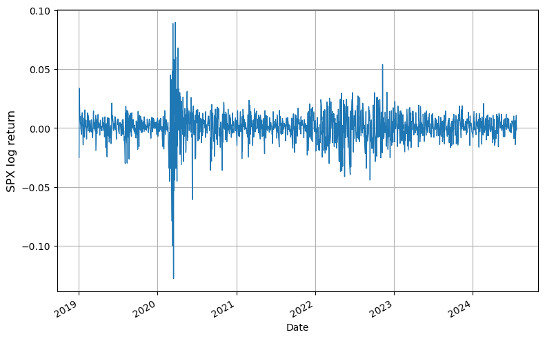
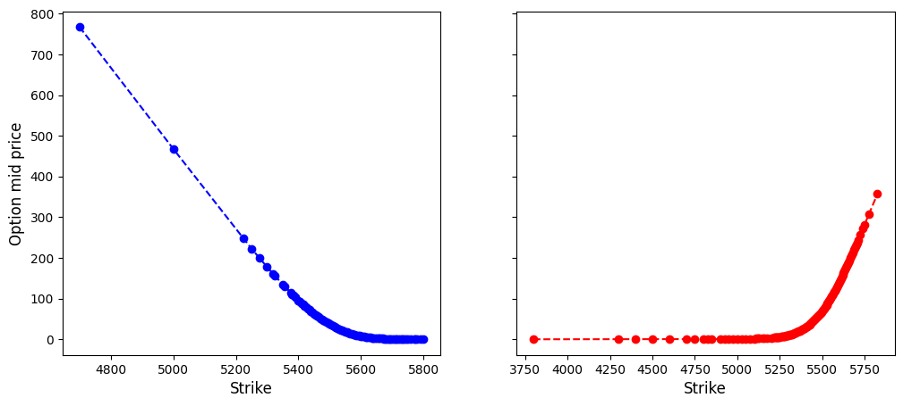
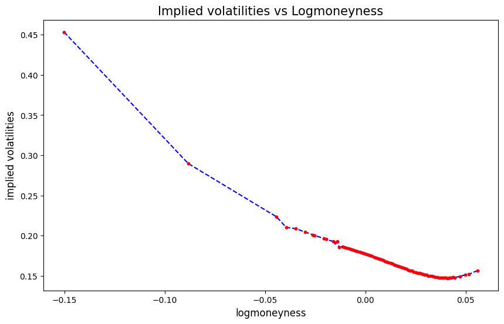
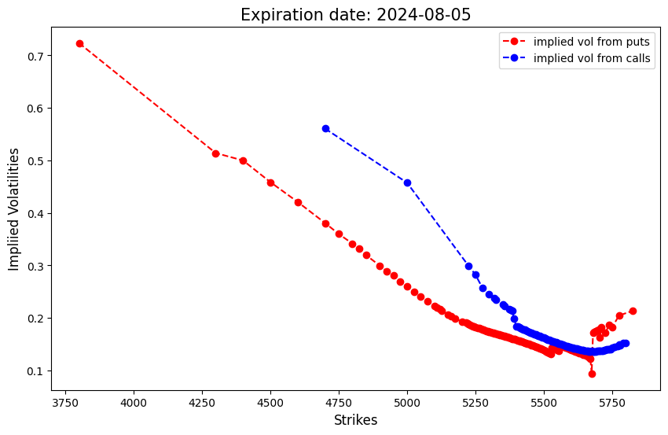
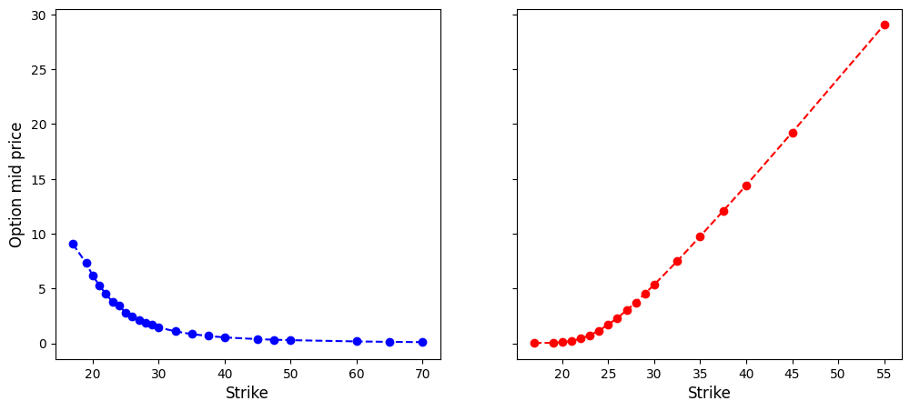
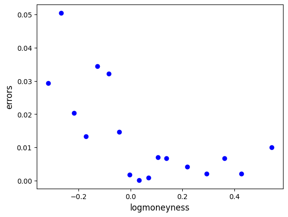
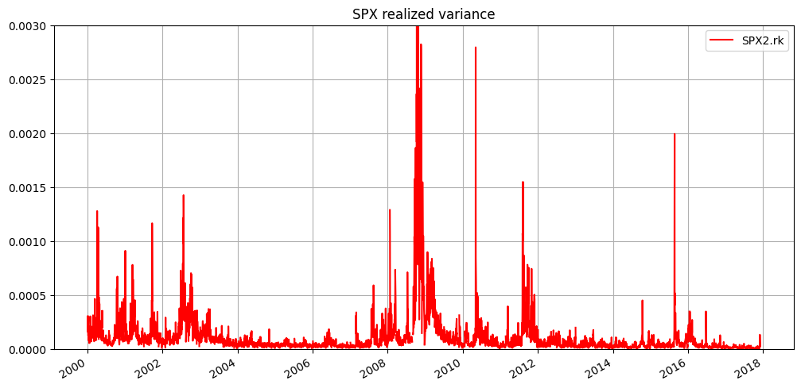

# Lecture 5: Volatility and Volatility-Linked Derivatives

$$
\newcommand{\bea}{\begin{eqnarray}}
\newcommand{\eea}{\end{eqnarray}}
\newcommand{\supp}{\mathrm{supp}}
\newcommand{\F}{\mathcal{F} }
\newcommand{\cF}{\mathcal{F} }
\newcommand{\E}{\mathbb{E} }
\newcommand{\Eof}[1]{\mathbb{E}\left[ #1 \right]}
\newcommand{\Etof}[1]{\mathbb{E}_t\left[ #1 \right]}
\def\Cov{{ \text{Cov} }}
\def\ES{{ \text{ES} }}
\def\Var{{ \text{Var} }}
\def\VaR{{ \text{VaR} }}
\def\sd{{ \text{sd} }}
\def\corr{{ \text{corr} }}
\newcommand{\1}{\mathbf{1} }
\newcommand{\p}{\partial}
\newcommand{\PP}{\mathbb{P} }
\newcommand{\Pof}[1]{\mathbb{P}\left[ #1 \right]}
\newcommand{\QQ}{\mathbb{Q} }
\newcommand{\R}{\mathbb{R} }
\newcommand{\DD}{\mathbb{D} }
\newcommand{\HH}{\mathbb{H} }
\newcommand{\spn}{\mathrm{span} }
\newcommand{\cov}{\mathrm{cov} }
\newcommand{\HS}{\mathcal{L}_{\mathrm{HS}} }
\newcommand{\Hess}{\mathrm{Hess} }
\newcommand{\trace}{\mathrm{trace} }
\newcommand{\LL}{\mathcal{L} }
\newcommand{\s}{\mathcal{S} }
\newcommand{\ee}{\mathcal{E} }
\newcommand{\ff}{\mathcal{F} }
\newcommand{\hh}{\mathcal{H} }
\newcommand{\bb}{\mathcal{B} }
\newcommand{\dd}{\mathcal{D} }
\newcommand{\g}{\mathcal{G} }
\newcommand{\half}{\frac{1}{2} }
\newcommand{\T}{\mathcal{T} }
\newcommand{\bit}{\begin{itemize}}
\newcommand{\eit}{\end{itemize}}
\newcommand{\beq}{\begin{equation}}
\newcommand{\eeq}{\end{equation}}
\newcommand{\tr}{\text{tr}}
\newcommand{\angl}[1]{\langle #1 \rangle}
$$

<center>
<font size=5, color=blue> Tai-Ho Wang (王 太和)</font>
</center>
<center>

</center>

## Agenda

- Volatility and its various estimators
    - Historical volatility
    - Implied volatility
    - Realized variance
    - VIX
- Implied volatility
    - Estimating discount factor and dividend rates by put-call parity
    - GPR fit of implied volatilities
- Volatility indices published by CBOE
- Volatility linked derivatives
    - VIX option
    
- Appendix (Optional)
    - Realized variance from high frequency data
    - The Corsi HAR-RV forecast

## What is volatility?

From the [Wikipage](https://en.wikipedia.org/wiki/Volatility_(finance)):

>In finance, volatility (symbol $\sigma$) is the degree of variation of a trading price series over time as measured by the standard deviation of logarithmic returns.
>
>- Historic volatility measures a time series of past market prices. 
>- Implied volatility looks forward in time, being derived from the market price of a market-traded derivative (in particular, an option). 
>- Realized variance estimates the integrated variance or quadratic variation by using high frequency data.

*Volatility is the conditional standard deviation of returns.*

## Why is volatility important?

From the same [Wikipage](https://en.wikipedia.org/wiki/Volatility_(finance)):

>Investors care about volatility for at least the following reasons:
>
>- The wider the swings in an investment's price, the harder emotionally it is to not worry;
>
>- Price volatility of a trading instrument can define position sizing in a portfolio;
>
>- When certain cash flows from selling a security are needed at a specific future date, higher volatility means a greater chance of a shortfall;
>
>- Higher volatility of returns while saving for retirement results in a wider distribution of possible final portfolio values;
>
>- Higher volatility of return when retired gives withdrawals a larger permanent impact on the portfolio's value;
>
>- Price volatility presents opportunities to buy assets cheaply and sell when overpriced;
>
>- <font color=blue> Portfolio volatility has a negative impact on the compound annual growth rate (CAGR) of that portfolio </font>
>
>- Volatility affects pricing of options, being a parameter of the Black–Scholes model.
>

In today's markets, it is also possible to trade volatility directly, through the use of derivative securities such as options and variance swaps. 

## Volatilities

Volatiltiy of a financial asset in its most prelimanry form is defined as the (conditional) standard deviation of its log return. In practice, there exist various notions of "volatility" that are commonly used including  

- Historical volatility
- Realized and integrated variance/volatility
- Implied volatility 
- Instantaneous volatility 

and methods of inferring these volatilities respectively from

- Daily or high-frequency time series data of the underlying
- Price series of variance swap
- Prices of liquidly traded vanilla options


## Historical volatility

Historical volatility uses, say daily, price series to calculate the sample conditional standard deviation of log returns in rolling time windows of a prespecified width.  

##  Example of historical volatility

Now let's calculate the volatility of S&P500 using 25-day rolling time windows. 

One can calculate the volatiltiy series of the input price series $S_t$, $1 \leq t \leq T$, by the following formula

$$
\sigma_t = \sqrt{\frac N{n-2}\sum_{i=1}^{n-1} (r_i - \bar r)^2}, \quad \text{ for } n \leq t \leq T,
$$

where 

$$
\begin{aligned}
r_i &= \ln S_{t + i} - \ln S_{t + i - 1}, \quad \text{for } 1 \leq i \leq n - 1, \\
\bar{r} &= \frac{1}{n-1} \sum_{i=1}^{n-1} r_i.
\end{aligned}
$$


### Note
- $n$ denotes the width (number of days) of rolling window
- $N$ denotes the number of days in a year, thus $\sqrt N$ is the annualizing factor
- The first $n-1$ points in the output volatility series appear as NA, for an obvious reason.

### Exponetially weighted moving average (EWMA)
An alternative to calculate historical volatility is the *exponentially weighted moving average* method. 

$$
\sigma_t = \sqrt{N(1 - \lambda)\sum_{i=1}^{\infty} \lambda^i (r_{t - i} - \bar r)^2}, \quad \text{ for } n \leq t \leq T,
$$

for some $\lambda \in (0, 1)$.

## Now let's dirty our hands ...


```python
# pip install yfinance
```


```python
import yfinance as yf
```


```python
import numpy as np
from numpy import exp, log, sqrt
import scipy.stats as ss
from scipy.stats import norm
import pandas as pd
import yfinance as yf
import matplotlib.pyplot as plt
import statsmodels.formula.api as sm
```


```python
start, end = '2019-01-01', '2024-07-24'
# download SPX from yahoo finance
spx = yf.download("^GSPC", start=start, end=end)
```

    [*********************100%%**********************]  1 of 1 completed


```python
# brief look at the data
spx.info(), spx.isna().sum()
```

    <class 'pandas.core.frame.DataFrame'>
    DatetimeIndex: 1398 entries, 2019-01-02 to 2024-07-23
    Data columns (total 6 columns):
     #   Column     Non-Null Count  Dtype  
    ---  ------     --------------  -----  
     0   Open       1398 non-null   float64
     1   High       1398 non-null   float64
     2   Low        1398 non-null   float64
     3   Close      1398 non-null   float64
     4   Adj Close  1398 non-null   float64
     5   Volume     1398 non-null   int64  
    dtypes: float64(5), int64(1)
    memory usage: 76.5 KB


    (None,
     Open         0
     High         0
     Low          0
     Close        0
     Adj Close    0
     Volume       0
     dtype: int64)


```python
# first and last few rows of the data
spx
```


<div>
<style scoped>
    .dataframe tbody tr th:only-of-type {
        vertical-align: middle;
    }

    .dataframe tbody tr th {
        vertical-align: top;
    }
    
    .dataframe thead th {
        text-align: right;
    }
</style>
<div style="overflow-x: auto;">
<table border="1" class="dataframe">
  <thead>
    <tr style="text-align: right;">
      <th></th>
      <th>Open</th>
      <th>High</th>
      <th>Low</th>
      <th>Close</th>
      <th>Adj Close</th>
      <th>Volume</th>
    </tr>
    <tr>
      <th>Date</th>
      <th></th>
      <th></th>
      <th></th>
      <th></th>
      <th></th>
      <th></th>
    </tr>
  </thead>
  <tbody>
    <tr>
      <th>2019-01-02</th>
      <td>2476.959961</td>
      <td>2519.489990</td>
      <td>2467.469971</td>
      <td>2510.030029</td>
      <td>2510.030029</td>
      <td>3733160000</td>
    </tr>
    <tr>
      <th>2019-01-03</th>
      <td>2491.919922</td>
      <td>2493.139893</td>
      <td>2443.959961</td>
      <td>2447.889893</td>
      <td>2447.889893</td>
      <td>3858830000</td>
    </tr>
    <tr>
      <th>2019-01-04</th>
      <td>2474.330078</td>
      <td>2538.070068</td>
      <td>2474.330078</td>
      <td>2531.939941</td>
      <td>2531.939941</td>
      <td>4234140000</td>
    </tr>
    <tr>
      <th>2019-01-07</th>
      <td>2535.610107</td>
      <td>2566.159912</td>
      <td>2524.560059</td>
      <td>2549.689941</td>
      <td>2549.689941</td>
      <td>4133120000</td>
    </tr>
    <tr>
      <th>2019-01-08</th>
      <td>2568.110107</td>
      <td>2579.820068</td>
      <td>2547.560059</td>
      <td>2574.409912</td>
      <td>2574.409912</td>
      <td>4120060000</td>
    </tr>
    <tr>
      <th>...</th>
      <td>...</td>
      <td>...</td>
      <td>...</td>
      <td>...</td>
      <td>...</td>
      <td>...</td>
    </tr>
    <tr>
      <th>2024-07-17</th>
      <td>5610.069824</td>
      <td>5622.490234</td>
      <td>5584.810059</td>
      <td>5588.270020</td>
      <td>5588.270020</td>
      <td>4246450000</td>
    </tr>
    <tr>
      <th>2024-07-18</th>
      <td>5608.560059</td>
      <td>5614.049805</td>
      <td>5522.810059</td>
      <td>5544.589844</td>
      <td>5544.589844</td>
      <td>4007510000</td>
    </tr>
    <tr>
      <th>2024-07-19</th>
      <td>5543.370117</td>
      <td>5557.500000</td>
      <td>5497.040039</td>
      <td>5505.000000</td>
      <td>5505.000000</td>
      <td>3760570000</td>
    </tr>
    <tr>
      <th>2024-07-22</th>
      <td>5544.540039</td>
      <td>5570.359863</td>
      <td>5529.040039</td>
      <td>5564.410156</td>
      <td>5564.410156</td>
      <td>3375180000</td>
    </tr>
    <tr>
      <th>2024-07-23</th>
      <td>5565.299805</td>
      <td>5585.339844</td>
      <td>5550.899902</td>
      <td>5555.740234</td>
      <td>5555.740234</td>
      <td>3500210000</td>
    </tr>
  </tbody>
</table>
<p>1398 rows × 6 columns</p>
</div>
</div>


```python
# save data, just in case
# spx.to_csv('spx_07252022.csv')
```


```python
# load saved data
# spx = pd.read_csv('spx_07252022.csv')
spx.index = spx['Date']
spx = spx.drop('Date', axis=1)
```


    ---------------------------------------------------------------------------
    
    KeyError                                  Traceback (most recent call last)
    
    File ~/miniconda3/envs/main/lib/python3.10/site-packages/pandas/core/indexes/base.py:3803, in Index.get_loc(self, key, method, tolerance)
       3802 try:
    -> 3803     return self._engine.get_loc(casted_key)
       3804 except KeyError as err:


    File ~/miniconda3/envs/main/lib/python3.10/site-packages/pandas/_libs/index.pyx:138, in pandas._libs.index.IndexEngine.get_loc()


    File ~/miniconda3/envs/main/lib/python3.10/site-packages/pandas/_libs/index.pyx:165, in pandas._libs.index.IndexEngine.get_loc()


    File pandas/_libs/hashtable_class_helper.pxi:5745, in pandas._libs.hashtable.PyObjectHashTable.get_item()


    File pandas/_libs/hashtable_class_helper.pxi:5753, in pandas._libs.hashtable.PyObjectHashTable.get_item()


    KeyError: 'Date'


​    
​    The above exception was the direct cause of the following exception:


    KeyError                                  Traceback (most recent call last)
    
    Cell In[38], line 3
          1 # load saved data
          2 # spx = pd.read_csv('spx_07252022.csv')
    ----> 3 spx.index = spx['Date']
          4 spx = spx.drop('Date', axis=1)


    File ~/miniconda3/envs/main/lib/python3.10/site-packages/pandas/core/frame.py:3805, in DataFrame.__getitem__(self, key)
       3803 if self.columns.nlevels > 1:
       3804     return self._getitem_multilevel(key)
    -> 3805 indexer = self.columns.get_loc(key)
       3806 if is_integer(indexer):
       3807     indexer = [indexer]


    File ~/miniconda3/envs/main/lib/python3.10/site-packages/pandas/core/indexes/base.py:3805, in Index.get_loc(self, key, method, tolerance)
       3803     return self._engine.get_loc(casted_key)
       3804 except KeyError as err:
    -> 3805     raise KeyError(key) from err
       3806 except TypeError:
       3807     # If we have a listlike key, _check_indexing_error will raise
       3808     #  InvalidIndexError. Otherwise we fall through and re-raise
       3809     #  the TypeError.
       3810     self._check_indexing_error(key)


    KeyError: 'Date'


```python
# summary statistics
spx.describe().transpose()
```


<div>
<style scoped>
    .dataframe tbody tr th:only-of-type {
        vertical-align: middle;
    }

    .dataframe tbody tr th {
        vertical-align: top;
    }
    
    .dataframe thead th {
        text-align: right;
    }
</style>
<div style="overflow-x: auto;">
<table border="1" class="dataframe">
  <thead>
    <tr style="text-align: right;">
      <th></th>
      <th>count</th>
      <th>mean</th>
      <th>std</th>
      <th>min</th>
      <th>25%</th>
      <th>50%</th>
      <th>75%</th>
      <th>max</th>
    </tr>
  </thead>
  <tbody>
    <tr>
      <th>Open</th>
      <td>1398.0</td>
      <td>3.896690e+03</td>
      <td>7.404446e+02</td>
      <td>2.290710e+03</td>
      <td>3.224580e+03</td>
      <td>3.977770e+03</td>
      <td>4.425177e+03</td>
      <td>5.644090e+03</td>
    </tr>
    <tr>
      <th>High</th>
      <td>1398.0</td>
      <td>3.919275e+03</td>
      <td>7.414695e+02</td>
      <td>2.300730e+03</td>
      <td>3.238730e+03</td>
      <td>4.009790e+03</td>
      <td>4.449748e+03</td>
      <td>5.669670e+03</td>
    </tr>
    <tr>
      <th>Low</th>
      <td>1398.0</td>
      <td>3.872932e+03</td>
      <td>7.396645e+02</td>
      <td>2.191860e+03</td>
      <td>3.212585e+03</td>
      <td>3.948365e+03</td>
      <td>4.401092e+03</td>
      <td>5.639020e+03</td>
    </tr>
    <tr>
      <th>Close</th>
      <td>1398.0</td>
      <td>3.897745e+03</td>
      <td>7.405478e+02</td>
      <td>2.237400e+03</td>
      <td>3.224927e+03</td>
      <td>3.979300e+03</td>
      <td>4.425167e+03</td>
      <td>5.667200e+03</td>
    </tr>
    <tr>
      <th>Adj Close</th>
      <td>1398.0</td>
      <td>3.897745e+03</td>
      <td>7.405478e+02</td>
      <td>2.237400e+03</td>
      <td>3.224927e+03</td>
      <td>3.979300e+03</td>
      <td>4.425167e+03</td>
      <td>5.667200e+03</td>
    </tr>
    <tr>
      <th>Volume</th>
      <td>1398.0</td>
      <td>4.269485e+09</td>
      <td>1.036368e+09</td>
      <td>1.296530e+09</td>
      <td>3.653008e+09</td>
      <td>4.013980e+09</td>
      <td>4.621978e+09</td>
      <td>9.976520e+09</td>
    </tr>
  </tbody>
</table>
</div>
</div>


```python
# plot spx adjusted close
plt.figure(figsize=(9, 6))
spx['Adj Close'].plot()
plt.ylabel('SPX', fontsize=12)
plt.grid();
```


​    

​    


```python
# log return of spx 
r = log(spx['Adj Close']).diff()

# historical volatility in this period
vol = r.std()*sqrt(252)
r, r.mean(), vol, type(r)
```


    (Date
     2019-01-02         NaN
     2019-01-03   -0.025068
     2019-01-04    0.033759
     2019-01-07    0.006986
     2019-01-08    0.009649
                     ...   
     2024-07-17   -0.014025
     2024-07-18   -0.007847
     2024-07-19   -0.007166
     2024-07-22    0.010734
     2024-07-23   -0.001559
     Name: Adj Close, Length: 1398, dtype: float64,
     0.000568745134424835,
     0.20594574559648623,
     pandas.core.series.Series)


```python
# plot log return
plt.figure(figsize=(9, 6))
r.plot(lw=1)
plt.ylabel('SPX log return', fontsize=12)
plt.grid();
```


​    

​    


```python
r.iloc[0:10], r.iloc[-10:]
```


    (Date
     2019-01-02         NaN
     2019-01-03   -0.025068
     2019-01-04    0.033759
     2019-01-07    0.006986
     2019-01-08    0.009649
     2019-01-09    0.004090
     2019-01-10    0.004508
     2019-01-11   -0.000146
     2019-01-14   -0.005271
     2019-01-15    0.010665
     Name: Adj Close, dtype: float64,
     Date
     2024-07-10    0.010156
     2024-07-11   -0.008802
     2024-07-12    0.005502
     2024-07-15    0.002822
     2024-07-16    0.006369
     2024-07-17   -0.014025
     2024-07-18   -0.007847
     2024-07-19   -0.007166
     2024-07-22    0.010734
     2024-07-23   -0.001559
     Name: Adj Close, dtype: float64)


```python
# n: rwidth of rolling window
# N: annualizing factor
def volatility(data, n=10, N=252):
    data = pd.Series(data)
    vol = [np.nan for i in range(n)]
    for i in range(len(data)-n):
        vol += [data.iloc[i:(i+n)].std()*sqrt(N)]
    return pd.DataFrame({'volatility': vol})
```


```python
volatility(r)
```


<div>
<style scoped>
    .dataframe tbody tr th:only-of-type {
        vertical-align: middle;
    }

    .dataframe tbody tr th {
        vertical-align: top;
    }
    
    .dataframe thead th {
        text-align: right;
    }
</style>
<div style="overflow-x: auto;">
<table border="1" class="dataframe">
  <thead>
    <tr style="text-align: right;">
      <th></th>
      <th>volatility</th>
    </tr>
  </thead>
  <tbody>
    <tr>
      <th>0</th>
      <td>NaN</td>
    </tr>
    <tr>
      <th>1</th>
      <td>NaN</td>
    </tr>
    <tr>
      <th>2</th>
      <td>NaN</td>
    </tr>
    <tr>
      <th>3</th>
      <td>NaN</td>
    </tr>
    <tr>
      <th>4</th>
      <td>NaN</td>
    </tr>
    <tr>
      <th>...</th>
      <td>...</td>
    </tr>
    <tr>
      <th>1393</th>
      <td>0.081197</td>
    </tr>
    <tr>
      <th>1394</th>
      <td>0.117438</td>
    </tr>
    <tr>
      <th>1395</th>
      <td>0.123942</td>
    </tr>
    <tr>
      <th>1396</th>
      <td>0.124998</td>
    </tr>
    <tr>
      <th>1397</th>
      <td>0.138452</td>
    </tr>
  </tbody>
</table>
<p>1398 rows × 1 columns</p>
</div>
</div>


```python
spx_vol = volatility(r)
spx_vol.index = r.index
plt.figure(figsize=(9, 6))
plt.plot(spx_vol)
plt.ylabel('Volatility', fontsize=12)
plt.title('SPX historical volatility', fontsize=24)
plt.grid();
```


​    

​    


```python
# leverage effect
spx_scaled = (spx - spx.mean())/(spx.max() - spx.min())
plt.figure(figsize=(9, 6))
spx_scaled['Adj Close'].plot(color='k', lw=1, label='scaled spx')
plt.ylim([-0.6, 1])
plt.plot(spx_vol, 'b-.', lw=1, label='volatility')
plt.grid()
plt.title('Leverage effect', fontsize=24)
plt.legend();
```


​    

​    


## Volatility estimation using OHLC

- Parkison
- Garman-Klass
- Rogers-Satchell
- Yang-Zhang

$$
\begin{aligned}
\sigma_P^2 &= \frac{1}{4\ln2} \frac{1}{n}\sum_{i=1}^n (\ln H_i - \ln L_i)^2, \\
\sigma_{GK}^2 &= \frac{1}{n} \left\{\sum_{i=1}^n \frac{1}{2}(\ln H_i - \ln L_i)^2 + (2\ln2 - 1)(\ln C_i - \ln O_i)^2 \right\}, \\
\sigma_{RS}^2 &= \frac{1}{n} \sum_{i=1}^n u_i(u_i - c_i) + d_i(d_i - c_i), \\
\sigma_{YZ}^2 &= \sigma_O^2 + w\sigma_C^2 + (1 - w)\sigma_P^2, \quad w = \frac{0.34}{1.34 + \frac{n+1}{n-1}}.
\end{aligned}
$$


- $u_i = \ln H_i - \ln O_i$: daily high weighted by open, 
- $d_i = \ln L_i - \ln O_i$: daily low weighted by open
- $o_i = \ln O_i - \ln C_{i-1}$
- $c_i = \ln C_i - \ln O_i$

We make the calculation of these volatilties into a python `class`. 


```python
class Volatilities:
    def __init__(self, OHLC, n=10, N=252):
        self.n = n
        self.N = N
        self.OHLC = pd.DataFrame(OHLC)
        self.o = self.OHLC.Open
        self.h = self.OHLC.High
        self.l = self.OHLC.Low
        self.c = self.OHLC.Close
        self.r = log(self.OHLC['Adj Close']).diff()
        self.vols_c = [np.nan for i in range(self.n)] 
        self.vols_p = [np.nan for i in range(self.n)]
        self.vols_gk = [np.nan for i in range(self.n)] 
        self.vols_rs = [np.nan for i in range(self.n)] 
        
        for i in range(len(self.r) - self.n):
            self.vols_c += [self.r.iloc[i:(i+self.n)].std()*sqrt(self.N)]
            self.vols_p += [self.cal_vol_p(self.h.iloc[i:(i+self.n)], self.l.iloc[i:(i+self.n)])*sqrt(self.N)]
            self.vols_gk += [self.cal_vol_gk(self.o.iloc[i:(i+self.n)], self.h.iloc[i:(i+self.n)], self.l.iloc[i:(i+self.n)], self.c.iloc[i:(i+self.n)])*sqrt(self.N)]
            self.vols_rs += [self.cal_vol_rs(self.o.iloc[i:(i+self.n)], self.h.iloc[i:(i+self.n)], self.l.iloc[i:(i+self.n)], self.c.iloc[i:(i+self.n)])*sqrt(self.N)]
        self.vols = pd.DataFrame({'close': self.vols_c, 'parkinson': self.vols_p, 'garman-klass': self.vols_gk, 'rogers-satchell': self.vols_rs})
        self.vols.index = self.OHLC.index
        
    def cal_vol_p(self, H, L):
        return np.sqrt(((log(H) - log(L))**2).mean()/log(2)/4)
    
    def cal_vol_gk(self, O, H, L, C):
        term1 = ((log(O) - log(L))**2).mean()/2
        term2 = (2*log(2) - 1)*((log(C) - log(O))**2).mean()
        return np.sqrt(term1 + term2)
    
    def cal_vol_rs(self, O, H, L, C):
        u, d, c = log(H) - log(O), log(L) - log(O), log(C) - log(O)
        return np.sqrt((u*(u-c)).mean() + (d*(d-c)).mean())
```


```python
%%time
spx_vols = Volatilities(spx)
```

    CPU times: user 1.29 s, sys: 8.23 ms, total: 1.3 s
    Wall time: 1.3 s


```python
spx_vols.vols['garman-klass']
```


    Date
    2019-01-02         NaN
    2019-01-03         NaN
    2019-01-04         NaN
    2019-01-07         NaN
    2019-01-08         NaN
                    ...   
    2024-07-17    0.068756
    2024-07-18    0.066384
    2024-07-19    0.091649
    2024-07-22    0.097313
    2024-07-23    0.098237
    Name: garman-klass, Length: 1398, dtype: float64


```python
plt.figure(figsize=(10, 6))
spx_vols.vols['close'].plot(ls='--', label='Close', lw=0.8)
spx_vols.vols['parkinson'].plot(lw=0.8, label='Parkinson')
spx_vols.vols['garman-klass'].plot(lw=0.8, label='Garman-Klass')
spx_vols.vols['rogers-satchell'].plot(lw=0.8, label='Rogers-Satchell')
plt.legend()
plt.grid();
```


​    

​    


```python
spx.tail(1)
```


<div>
<style scoped>
    .dataframe tbody tr th:only-of-type {
        vertical-align: middle;
    }

    .dataframe tbody tr th {
        vertical-align: top;
    }
    
    .dataframe thead th {
        text-align: right;
    }
</style>
<div style="overflow-x: auto;">
<table border="1" class="dataframe">
  <thead>
    <tr style="text-align: right;">
      <th></th>
      <th>Open</th>
      <th>High</th>
      <th>Low</th>
      <th>Close</th>
      <th>Adj Close</th>
      <th>Volume</th>
    </tr>
    <tr>
      <th>Date</th>
      <th></th>
      <th></th>
      <th></th>
      <th></th>
      <th></th>
      <th></th>
    </tr>
  </thead>
  <tbody>
    <tr>
      <th>2024-07-23</th>
      <td>5565.299805</td>
      <td>5585.339844</td>
      <td>5550.899902</td>
      <td>5555.740234</td>
      <td>5555.740234</td>
      <td>3500210000</td>
    </tr>
  </tbody>
</table>
</div>
</div>


## Implied volatility

"A wrong number to a wrong formula for a correct answer."

- In the Black-Scholes model there is a one-to-one relation between the price of the option and the volatility parameter $\sigma$. The option prices are often quoted by stating this specific volatility, called the *implied volatility*.

- In Black-Scholes world, the volatility is assumed constant. But in reality, options of different strike require different volatilities to match their market prices. This is called the *volatility smile*.

- Most of the work was inspired in modeling the implied volatility.

## Why implied volatility rather than the price itself?

- Price of a call option is decreasing in strike and increasing in time to expiry
- Price of a far out-of-money option is small whereas price of a far in-the-money option carries mostly the intrinsic value
- Statistically speaking, implied volatility is a more standard quantity to infer
- Traders trade options in terms of implied volatilities rather than their prices

## A practical tip for fetching risk free and dividend rates

Q: How to obtain the interest rate $r$ and dividend rate $d$ for the calculation of implied volatility?

A: Put-call parity.

Recall the Put-Call Parity for European options

$$
C - P = Se^{-dT}  - K e^{-rT} = e^{-rT} (F - K),
$$

where $F$ denotes the forward price of the underlying. 
Hence, if we regress $C - P$ against $K$, the (negative) slope gives us the discount factor and the intercept gives the ex-dividend underlying.  

## Example - Implied volatilities of options on SPX


```python
# import required modules
import datetime
from datetime import datetime as dt
import numpy as np
from numpy import exp, log, sqrt
import scipy.stats as ss
from scipy.stats import norm
import pandas as pd
import yfinance as yf
import matplotlib.pyplot as plt
import statsmodels.formula.api as sm
```


```python
# download spx options data from yahoo finance
spx = yf.Ticker('^SPX')
spx_expiries = spx.options
print(spx_expiries)
```

    ('2024-07-30', '2024-07-31', '2024-08-01', '2024-08-02', '2024-08-05', '2024-08-06', '2024-08-07', '2024-08-08', '2024-08-09', '2024-08-12', '2024-08-13', '2024-08-14', '2024-08-15', '2024-08-16', '2024-08-19', '2024-08-20', '2024-08-21', '2024-08-22', '2024-08-23', '2024-08-26', '2024-08-27', '2024-08-28', '2024-08-29', '2024-08-30', '2024-09-03', '2024-09-06', '2024-09-09', '2024-09-13', '2024-09-20', '2024-09-30', '2024-10-18', '2024-10-31', '2024-11-15', '2024-11-29', '2024-12-20', '2024-12-31', '2025-01-17', '2025-02-21', '2025-03-21', '2025-03-31', '2025-04-17', '2025-05-16', '2025-06-20', '2025-06-30', '2025-07-18', '2025-08-15', '2025-09-19', '2025-12-19', '2026-01-16', '2026-03-20', '2026-06-18', '2026-12-18', '2027-12-17', '2028-12-15', '2029-12-21')


```python
# choose an expiry 
idx = 17
today = dt.strftime(dt.now(), '%Y-%m-%d')
day_count = (dt.strptime(spx_expiries[idx], '%Y-%m-%d') - dt.now()).days
print(f'option expiry = {spx_expiries[idx]}, today = {today}')
print(f'There are {day_count} days to expiry')
option_chain = spx.option_chain(spx_expiries[idx])
spx_calls = option_chain.calls
spx_puts = option_chain.puts
```

    option expiry = 2024-08-22, today = 2024-07-30
    There are 22 days to expiry


```python
spx_calls.shape, spx_puts.shape
```


    ((48, 14), (72, 14))


```python
spx_calls.info()
```

    <class 'pandas.core.frame.DataFrame'>
    RangeIndex: 48 entries, 0 to 47
    Data columns (total 14 columns):
     #   Column             Non-Null Count  Dtype              
    ---  ------             --------------  -----              
     0   contractSymbol     48 non-null     object             
     1   lastTradeDate      48 non-null     datetime64[ns, UTC]
     2   strike             48 non-null     float64            
     3   lastPrice          48 non-null     float64            
     4   bid                48 non-null     float64            
     5   ask                48 non-null     float64            
     6   change             48 non-null     float64            
     7   percentChange      48 non-null     float64            
     8   volume             45 non-null     float64            
     9   openInterest       48 non-null     int64              
     10  impliedVolatility  48 non-null     float64            
     11  inTheMoney         48 non-null     bool               
     12  contractSize       48 non-null     object             
     13  currency           48 non-null     object             
    dtypes: bool(1), datetime64[ns, UTC](1), float64(8), int64(1), object(3)
    memory usage: 5.0+ KB


```python
spx_calls.isna().sum()
```


    contractSymbol       0
    lastTradeDate        0
    strike               0
    lastPrice            0
    bid                  0
    ask                  0
    change               0
    percentChange        0
    volume               3
    openInterest         0
    impliedVolatility    0
    inTheMoney           0
    contractSize         0
    currency             0
    dtype: int64


```python
spx_puts.isna().sum()
```


    contractSymbol       0
    lastTradeDate        0
    strike               0
    lastPrice            0
    bid                  0
    ask                  0
    change               0
    percentChange        0
    volume               7
    openInterest         0
    impliedVolatility    0
    inTheMoney           0
    contractSize         0
    currency             0
    dtype: int64


```python
spx_calls
```


<div>
<style scoped>
    .dataframe tbody tr th:only-of-type {
        vertical-align: middle;
    }

    .dataframe tbody tr th {
        vertical-align: top;
    }
    
    .dataframe thead th {
        text-align: right;
    }
</style>
<div style="overflow-x: auto;">
<table border="1" class="dataframe">
  <thead>
    <tr style="text-align: right;">
      <th></th>
      <th>contractSymbol</th>
      <th>lastTradeDate</th>
      <th>strike</th>
      <th>lastPrice</th>
      <th>bid</th>
      <th>ask</th>
      <th>change</th>
      <th>percentChange</th>
      <th>volume</th>
      <th>openInterest</th>
      <th>impliedVolatility</th>
      <th>inTheMoney</th>
      <th>contractSize</th>
      <th>currency</th>
    </tr>
  </thead>
  <tbody>
    <tr>
      <th>0</th>
      <td>SPXW240822C04800000</td>
      <td>2024-07-19 15:52:07+00:00</td>
      <td>4800.0</td>
      <td>743.58</td>
      <td>674.20</td>
      <td>681.50</td>
      <td>0.0</td>
      <td>0.0</td>
      <td>1.0</td>
      <td>0</td>
      <td>0.363593</td>
      <td>True</td>
      <td>REGULAR</td>
      <td>USD</td>
    </tr>
    <tr>
      <th>1</th>
      <td>SPXW240822C05340000</td>
      <td>2024-07-23 15:42:28+00:00</td>
      <td>5340.0</td>
      <td>280.68</td>
      <td>172.50</td>
      <td>174.00</td>
      <td>0.0</td>
      <td>0.0</td>
      <td>NaN</td>
      <td>0</td>
      <td>0.181603</td>
      <td>True</td>
      <td>REGULAR</td>
      <td>USD</td>
    </tr>
    <tr>
      <th>2</th>
      <td>SPXW240822C05360000</td>
      <td>2024-07-23 15:42:28+00:00</td>
      <td>5360.0</td>
      <td>262.78</td>
      <td>157.40</td>
      <td>158.80</td>
      <td>0.0</td>
      <td>0.0</td>
      <td>NaN</td>
      <td>0</td>
      <td>0.177884</td>
      <td>True</td>
      <td>REGULAR</td>
      <td>USD</td>
    </tr>
    <tr>
      <th>3</th>
      <td>SPXW240822C05380000</td>
      <td>2024-07-25 15:39:09+00:00</td>
      <td>5380.0</td>
      <td>146.92</td>
      <td>142.50</td>
      <td>143.80</td>
      <td>0.0</td>
      <td>0.0</td>
      <td>4.0</td>
      <td>0</td>
      <td>0.173638</td>
      <td>True</td>
      <td>REGULAR</td>
      <td>USD</td>
    </tr>
    <tr>
      <th>4</th>
      <td>SPXW240822C05390000</td>
      <td>2024-07-25 15:39:09+00:00</td>
      <td>5390.0</td>
      <td>139.92</td>
      <td>135.70</td>
      <td>137.00</td>
      <td>0.0</td>
      <td>0.0</td>
      <td>4.0</td>
      <td>0</td>
      <td>0.172490</td>
      <td>True</td>
      <td>REGULAR</td>
      <td>USD</td>
    </tr>
    <tr>
      <th>5</th>
      <td>SPXW240822C05400000</td>
      <td>2024-07-25 13:35:14+00:00</td>
      <td>5400.0</td>
      <td>117.83</td>
      <td>128.70</td>
      <td>130.00</td>
      <td>0.0</td>
      <td>0.0</td>
      <td>1.0</td>
      <td>0</td>
      <td>0.170697</td>
      <td>True</td>
      <td>REGULAR</td>
      <td>USD</td>
    </tr>
    <tr>
      <th>6</th>
      <td>SPXW240822C05420000</td>
      <td>2024-07-29 17:20:07+00:00</td>
      <td>5420.0</td>
      <td>127.81</td>
      <td>114.80</td>
      <td>116.00</td>
      <td>0.0</td>
      <td>0.0</td>
      <td>8.0</td>
      <td>0</td>
      <td>0.166329</td>
      <td>True</td>
      <td>REGULAR</td>
      <td>USD</td>
    </tr>
    <tr>
      <th>7</th>
      <td>SPXW240822C05425000</td>
      <td>2024-07-25 13:35:14+00:00</td>
      <td>5425.0</td>
      <td>102.23</td>
      <td>111.80</td>
      <td>112.80</td>
      <td>0.0</td>
      <td>0.0</td>
      <td>1.0</td>
      <td>0</td>
      <td>0.165616</td>
      <td>True</td>
      <td>REGULAR</td>
      <td>USD</td>
    </tr>
    <tr>
      <th>8</th>
      <td>SPXW240822C05440000</td>
      <td>2024-07-29 19:34:40+00:00</td>
      <td>5440.0</td>
      <td>108.49</td>
      <td>102.30</td>
      <td>103.30</td>
      <td>0.0</td>
      <td>0.0</td>
      <td>24.0</td>
      <td>0</td>
      <td>0.163228</td>
      <td>True</td>
      <td>REGULAR</td>
      <td>USD</td>
    </tr>
    <tr>
      <th>9</th>
      <td>SPXW240822C05450000</td>
      <td>2024-07-26 14:13:32+00:00</td>
      <td>5450.0</td>
      <td>94.10</td>
      <td>96.20</td>
      <td>97.00</td>
      <td>0.0</td>
      <td>0.0</td>
      <td>25.0</td>
      <td>0</td>
      <td>0.161328</td>
      <td>True</td>
      <td>REGULAR</td>
      <td>USD</td>
    </tr>
    <tr>
      <th>10</th>
      <td>SPXW240822C05460000</td>
      <td>2024-07-29 19:58:19+00:00</td>
      <td>5460.0</td>
      <td>91.46</td>
      <td>90.20</td>
      <td>91.00</td>
      <td>0.0</td>
      <td>0.0</td>
      <td>7.0</td>
      <td>0</td>
      <td>0.159661</td>
      <td>True</td>
      <td>REGULAR</td>
      <td>USD</td>
    </tr>
    <tr>
      <th>11</th>
      <td>SPXW240822C05470000</td>
      <td>2024-07-29 18:42:54+00:00</td>
      <td>5470.0</td>
      <td>86.42</td>
      <td>84.40</td>
      <td>85.20</td>
      <td>0.0</td>
      <td>0.0</td>
      <td>12.0</td>
      <td>0</td>
      <td>0.158036</td>
      <td>False</td>
      <td>REGULAR</td>
      <td>USD</td>
    </tr>
    <tr>
      <th>12</th>
      <td>SPXW240822C05475000</td>
      <td>2024-07-29 14:14:23+00:00</td>
      <td>5475.0</td>
      <td>87.70</td>
      <td>81.80</td>
      <td>82.70</td>
      <td>0.0</td>
      <td>0.0</td>
      <td>106.0</td>
      <td>0</td>
      <td>0.157822</td>
      <td>False</td>
      <td>REGULAR</td>
      <td>USD</td>
    </tr>
    <tr>
      <th>13</th>
      <td>SPXW240822C05480000</td>
      <td>2024-07-29 17:30:21+00:00</td>
      <td>5480.0</td>
      <td>82.81</td>
      <td>78.80</td>
      <td>79.70</td>
      <td>0.0</td>
      <td>0.0</td>
      <td>11.0</td>
      <td>0</td>
      <td>0.156628</td>
      <td>False</td>
      <td>REGULAR</td>
      <td>USD</td>
    </tr>
    <tr>
      <th>14</th>
      <td>SPXW240822C05490000</td>
      <td>2024-07-29 16:28:07+00:00</td>
      <td>5490.0</td>
      <td>81.75</td>
      <td>73.50</td>
      <td>74.20</td>
      <td>0.0</td>
      <td>0.0</td>
      <td>3.0</td>
      <td>0</td>
      <td>0.154889</td>
      <td>False</td>
      <td>REGULAR</td>
      <td>USD</td>
    </tr>
    <tr>
      <th>15</th>
      <td>SPXW240822C05500000</td>
      <td>2024-07-29 16:57:39+00:00</td>
      <td>5500.0</td>
      <td>77.10</td>
      <td>68.30</td>
      <td>69.00</td>
      <td>0.0</td>
      <td>0.0</td>
      <td>50.0</td>
      <td>0</td>
      <td>0.153348</td>
      <td>False</td>
      <td>REGULAR</td>
      <td>USD</td>
    </tr>
    <tr>
      <th>16</th>
      <td>SPXW240822C05510000</td>
      <td>2024-07-25 09:09:54+00:00</td>
      <td>5510.0</td>
      <td>64.50</td>
      <td>63.30</td>
      <td>64.10</td>
      <td>0.0</td>
      <td>0.0</td>
      <td>21.0</td>
      <td>0</td>
      <td>0.152001</td>
      <td>False</td>
      <td>REGULAR</td>
      <td>USD</td>
    </tr>
    <tr>
      <th>17</th>
      <td>SPXW240822C05520000</td>
      <td>2024-07-25 20:11:03+00:00</td>
      <td>5520.0</td>
      <td>44.80</td>
      <td>58.70</td>
      <td>59.50</td>
      <td>0.0</td>
      <td>0.0</td>
      <td>152.0</td>
      <td>0</td>
      <td>0.150847</td>
      <td>False</td>
      <td>REGULAR</td>
      <td>USD</td>
    </tr>
    <tr>
      <th>18</th>
      <td>SPXW240822C05525000</td>
      <td>2024-07-29 19:51:40+00:00</td>
      <td>5525.0</td>
      <td>61.40</td>
      <td>56.40</td>
      <td>57.20</td>
      <td>0.0</td>
      <td>0.0</td>
      <td>13.0</td>
      <td>0</td>
      <td>0.150136</td>
      <td>False</td>
      <td>REGULAR</td>
      <td>USD</td>
    </tr>
    <tr>
      <th>19</th>
      <td>SPXW240822C05530000</td>
      <td>2024-07-24 16:46:10+00:00</td>
      <td>5530.0</td>
      <td>59.40</td>
      <td>54.20</td>
      <td>54.90</td>
      <td>0.0</td>
      <td>0.0</td>
      <td>2.0</td>
      <td>0</td>
      <td>0.149331</td>
      <td>False</td>
      <td>REGULAR</td>
      <td>USD</td>
    </tr>
    <tr>
      <th>20</th>
      <td>SPXW240822C05540000</td>
      <td>2024-07-29 19:51:40+00:00</td>
      <td>5540.0</td>
      <td>54.50</td>
      <td>49.70</td>
      <td>50.50</td>
      <td>0.0</td>
      <td>0.0</td>
      <td>16.0</td>
      <td>0</td>
      <td>0.147813</td>
      <td>False</td>
      <td>REGULAR</td>
      <td>USD</td>
    </tr>
    <tr>
      <th>21</th>
      <td>SPXW240822C05550000</td>
      <td>2024-07-26 14:24:57+00:00</td>
      <td>5550.0</td>
      <td>47.20</td>
      <td>45.90</td>
      <td>46.70</td>
      <td>0.0</td>
      <td>0.0</td>
      <td>12.0</td>
      <td>0</td>
      <td>0.147061</td>
      <td>False</td>
      <td>REGULAR</td>
      <td>USD</td>
    </tr>
    <tr>
      <th>22</th>
      <td>SPXW240822C05560000</td>
      <td>2024-07-29 19:34:40+00:00</td>
      <td>5560.0</td>
      <td>45.27</td>
      <td>41.80</td>
      <td>42.50</td>
      <td>0.0</td>
      <td>0.0</td>
      <td>24.0</td>
      <td>0</td>
      <td>0.145146</td>
      <td>False</td>
      <td>REGULAR</td>
      <td>USD</td>
    </tr>
    <tr>
      <th>23</th>
      <td>SPXW240822C05570000</td>
      <td>2024-07-26 17:12:35+00:00</td>
      <td>5570.0</td>
      <td>48.80</td>
      <td>38.10</td>
      <td>38.80</td>
      <td>0.0</td>
      <td>0.0</td>
      <td>2.0</td>
      <td>0</td>
      <td>0.143807</td>
      <td>False</td>
      <td>REGULAR</td>
      <td>USD</td>
    </tr>
    <tr>
      <th>24</th>
      <td>SPXW240822C05575000</td>
      <td>2024-07-29 19:23:01+00:00</td>
      <td>5575.0</td>
      <td>39.59</td>
      <td>36.40</td>
      <td>37.10</td>
      <td>0.0</td>
      <td>0.0</td>
      <td>7.0</td>
      <td>0</td>
      <td>0.143292</td>
      <td>False</td>
      <td>REGULAR</td>
      <td>USD</td>
    </tr>
    <tr>
      <th>25</th>
      <td>SPXW240822C05580000</td>
      <td>2024-07-29 15:48:02+00:00</td>
      <td>5580.0</td>
      <td>35.02</td>
      <td>34.60</td>
      <td>35.40</td>
      <td>0.0</td>
      <td>0.0</td>
      <td>3.0</td>
      <td>0</td>
      <td>0.142674</td>
      <td>False</td>
      <td>REGULAR</td>
      <td>USD</td>
    </tr>
    <tr>
      <th>26</th>
      <td>SPXW240822C05590000</td>
      <td>2024-07-26 14:24:14+00:00</td>
      <td>5590.0</td>
      <td>33.42</td>
      <td>31.60</td>
      <td>32.30</td>
      <td>0.0</td>
      <td>0.0</td>
      <td>1.0</td>
      <td>0</td>
      <td>0.141770</td>
      <td>False</td>
      <td>REGULAR</td>
      <td>USD</td>
    </tr>
    <tr>
      <th>27</th>
      <td>SPXW240822C05600000</td>
      <td>2024-07-26 15:58:51+00:00</td>
      <td>5600.0</td>
      <td>31.60</td>
      <td>28.60</td>
      <td>29.30</td>
      <td>0.0</td>
      <td>0.0</td>
      <td>1.0</td>
      <td>0</td>
      <td>0.140672</td>
      <td>False</td>
      <td>REGULAR</td>
      <td>USD</td>
    </tr>
    <tr>
      <th>28</th>
      <td>SPXW240822C05610000</td>
      <td>2024-07-26 19:46:48+00:00</td>
      <td>5610.0</td>
      <td>26.67</td>
      <td>25.60</td>
      <td>26.30</td>
      <td>0.0</td>
      <td>0.0</td>
      <td>1.0</td>
      <td>0</td>
      <td>0.139138</td>
      <td>False</td>
      <td>REGULAR</td>
      <td>USD</td>
    </tr>
    <tr>
      <th>29</th>
      <td>SPXW240822C05620000</td>
      <td>2024-07-29 19:34:29+00:00</td>
      <td>5620.0</td>
      <td>25.21</td>
      <td>23.00</td>
      <td>23.70</td>
      <td>0.0</td>
      <td>0.0</td>
      <td>24.0</td>
      <td>0</td>
      <td>0.138085</td>
      <td>False</td>
      <td>REGULAR</td>
      <td>USD</td>
    </tr>
    <tr>
      <th>30</th>
      <td>SPXW240822C05625000</td>
      <td>2024-07-25 19:49:43+00:00</td>
      <td>5625.0</td>
      <td>20.72</td>
      <td>21.80</td>
      <td>22.50</td>
      <td>0.0</td>
      <td>0.0</td>
      <td>4.0</td>
      <td>0</td>
      <td>0.137643</td>
      <td>False</td>
      <td>REGULAR</td>
      <td>USD</td>
    </tr>
    <tr>
      <th>31</th>
      <td>SPXW240822C05630000</td>
      <td>2024-07-26 15:17:31+00:00</td>
      <td>5630.0</td>
      <td>21.20</td>
      <td>20.80</td>
      <td>21.40</td>
      <td>0.0</td>
      <td>0.0</td>
      <td>51.0</td>
      <td>0</td>
      <td>0.137342</td>
      <td>False</td>
      <td>REGULAR</td>
      <td>USD</td>
    </tr>
    <tr>
      <th>32</th>
      <td>SPXW240822C05640000</td>
      <td>2024-07-26 15:28:12+00:00</td>
      <td>5640.0</td>
      <td>19.10</td>
      <td>18.60</td>
      <td>19.20</td>
      <td>0.0</td>
      <td>0.0</td>
      <td>3.0</td>
      <td>0</td>
      <td>0.136422</td>
      <td>False</td>
      <td>REGULAR</td>
      <td>USD</td>
    </tr>
    <tr>
      <th>33</th>
      <td>SPXW240822C05650000</td>
      <td>2024-07-29 19:23:01+00:00</td>
      <td>5650.0</td>
      <td>18.14</td>
      <td>16.40</td>
      <td>17.00</td>
      <td>0.0</td>
      <td>0.0</td>
      <td>5.0</td>
      <td>0</td>
      <td>0.135045</td>
      <td>False</td>
      <td>REGULAR</td>
      <td>USD</td>
    </tr>
    <tr>
      <th>34</th>
      <td>SPXW240822C05660000</td>
      <td>2024-07-29 16:33:16+00:00</td>
      <td>5660.0</td>
      <td>17.65</td>
      <td>14.60</td>
      <td>15.10</td>
      <td>0.0</td>
      <td>0.0</td>
      <td>1.0</td>
      <td>0</td>
      <td>0.134034</td>
      <td>False</td>
      <td>REGULAR</td>
      <td>USD</td>
    </tr>
    <tr>
      <th>35</th>
      <td>SPXW240822C05670000</td>
      <td>2024-07-26 14:47:40+00:00</td>
      <td>5670.0</td>
      <td>13.10</td>
      <td>13.00</td>
      <td>13.50</td>
      <td>0.0</td>
      <td>0.0</td>
      <td>4.0</td>
      <td>0</td>
      <td>0.133470</td>
      <td>False</td>
      <td>REGULAR</td>
      <td>USD</td>
    </tr>
    <tr>
      <th>36</th>
      <td>SPXW240822C05675000</td>
      <td>2024-07-29 15:22:03+00:00</td>
      <td>5675.0</td>
      <td>12.20</td>
      <td>12.20</td>
      <td>12.70</td>
      <td>0.0</td>
      <td>0.0</td>
      <td>3.0</td>
      <td>0</td>
      <td>0.133027</td>
      <td>False</td>
      <td>REGULAR</td>
      <td>USD</td>
    </tr>
    <tr>
      <th>37</th>
      <td>SPXW240822C05680000</td>
      <td>2024-07-29 13:46:07+00:00</td>
      <td>5680.0</td>
      <td>14.90</td>
      <td>11.40</td>
      <td>12.00</td>
      <td>0.0</td>
      <td>0.0</td>
      <td>5.0</td>
      <td>0</td>
      <td>0.132798</td>
      <td>False</td>
      <td>REGULAR</td>
      <td>USD</td>
    </tr>
    <tr>
      <th>38</th>
      <td>SPXW240822C05700000</td>
      <td>2024-07-29 13:50:51+00:00</td>
      <td>5700.0</td>
      <td>11.00</td>
      <td>8.80</td>
      <td>9.20</td>
      <td>0.0</td>
      <td>0.0</td>
      <td>1.0</td>
      <td>0</td>
      <td>0.130754</td>
      <td>False</td>
      <td>REGULAR</td>
      <td>USD</td>
    </tr>
    <tr>
      <th>39</th>
      <td>SPXW240822C05725000</td>
      <td>2024-07-29 19:23:53+00:00</td>
      <td>5725.0</td>
      <td>7.04</td>
      <td>6.30</td>
      <td>6.70</td>
      <td>0.0</td>
      <td>0.0</td>
      <td>25.0</td>
      <td>0</td>
      <td>0.129510</td>
      <td>False</td>
      <td>REGULAR</td>
      <td>USD</td>
    </tr>
    <tr>
      <th>40</th>
      <td>SPXW240822C05750000</td>
      <td>2024-07-29 19:28:41+00:00</td>
      <td>5750.0</td>
      <td>5.00</td>
      <td>4.50</td>
      <td>4.80</td>
      <td>0.0</td>
      <td>0.0</td>
      <td>16.0</td>
      <td>0</td>
      <td>0.128404</td>
      <td>False</td>
      <td>REGULAR</td>
      <td>USD</td>
    </tr>
    <tr>
      <th>41</th>
      <td>SPXW240822C05800000</td>
      <td>2024-07-26 17:38:59+00:00</td>
      <td>5800.0</td>
      <td>3.54</td>
      <td>2.20</td>
      <td>2.45</td>
      <td>0.0</td>
      <td>0.0</td>
      <td>3.0</td>
      <td>0</td>
      <td>0.127511</td>
      <td>False</td>
      <td>REGULAR</td>
      <td>USD</td>
    </tr>
    <tr>
      <th>42</th>
      <td>SPXW240822C05850000</td>
      <td>2024-07-26 18:44:34+00:00</td>
      <td>5850.0</td>
      <td>1.85</td>
      <td>1.15</td>
      <td>1.35</td>
      <td>0.0</td>
      <td>0.0</td>
      <td>5.0</td>
      <td>0</td>
      <td>0.129312</td>
      <td>False</td>
      <td>REGULAR</td>
      <td>USD</td>
    </tr>
    <tr>
      <th>43</th>
      <td>SPXW240822C05900000</td>
      <td>2024-07-26 18:44:34+00:00</td>
      <td>5900.0</td>
      <td>1.13</td>
      <td>0.60</td>
      <td>0.85</td>
      <td>0.0</td>
      <td>0.0</td>
      <td>7.0</td>
      <td>0</td>
      <td>0.133798</td>
      <td>False</td>
      <td>REGULAR</td>
      <td>USD</td>
    </tr>
    <tr>
      <th>44</th>
      <td>SPXW240822C06000000</td>
      <td>2024-07-29 18:15:42+00:00</td>
      <td>6000.0</td>
      <td>0.32</td>
      <td>0.25</td>
      <td>0.40</td>
      <td>0.0</td>
      <td>0.0</td>
      <td>195.0</td>
      <td>0</td>
      <td>0.144906</td>
      <td>False</td>
      <td>REGULAR</td>
      <td>USD</td>
    </tr>
    <tr>
      <th>45</th>
      <td>SPXW240822C06100000</td>
      <td>2024-07-24 15:48:26+00:00</td>
      <td>6100.0</td>
      <td>0.25</td>
      <td>0.10</td>
      <td>0.30</td>
      <td>0.0</td>
      <td>0.0</td>
      <td>3.0</td>
      <td>0</td>
      <td>0.162240</td>
      <td>False</td>
      <td>REGULAR</td>
      <td>USD</td>
    </tr>
    <tr>
      <th>46</th>
      <td>SPXW240822C06200000</td>
      <td>2024-07-24 14:14:05+00:00</td>
      <td>6200.0</td>
      <td>0.14</td>
      <td>0.05</td>
      <td>0.25</td>
      <td>0.0</td>
      <td>0.0</td>
      <td>2.0</td>
      <td>0</td>
      <td>0.179940</td>
      <td>False</td>
      <td>REGULAR</td>
      <td>USD</td>
    </tr>
    <tr>
      <th>47</th>
      <td>SPXW240822C06400000</td>
      <td>2024-07-22 17:30:48+00:00</td>
      <td>6400.0</td>
      <td>0.15</td>
      <td>0.00</td>
      <td>0.20</td>
      <td>0.0</td>
      <td>0.0</td>
      <td>NaN</td>
      <td>0</td>
      <td>0.215340</td>
      <td>False</td>
      <td>REGULAR</td>
      <td>USD</td>
    </tr>
  </tbody>
</table>
</div>
</div>


```python
# clean up data
# remove NA's
spx_calls = spx_calls.drop(['currency', 'contractSize'], axis=1).dropna()
spx_puts = spx_puts.drop(['currency', 'contractSize'], axis=1).dropna()
spx_calls.shape, spx_puts.shape
```


    ((45, 12), (65, 12))


```python
spx_calls[spx_calls['lastTradeDate'] > '2024-07']
```


<div>
<style scoped>
    .dataframe tbody tr th:only-of-type {
        vertical-align: middle;
    }

    .dataframe tbody tr th {
        vertical-align: top;
    }
    
    .dataframe thead th {
        text-align: right;
    }
</style>
<div style="overflow-x: auto;">
<table border="1" class="dataframe">
  <thead>
    <tr style="text-align: right;">
      <th></th>
      <th>contractSymbol</th>
      <th>lastTradeDate</th>
      <th>strike</th>
      <th>lastPrice</th>
      <th>bid</th>
      <th>ask</th>
      <th>change</th>
      <th>percentChange</th>
      <th>volume</th>
      <th>openInterest</th>
      <th>impliedVolatility</th>
      <th>inTheMoney</th>
    </tr>
  </thead>
  <tbody>
    <tr>
      <th>0</th>
      <td>SPXW240822C04800000</td>
      <td>2024-07-19 15:52:07+00:00</td>
      <td>4800.0</td>
      <td>743.58</td>
      <td>674.20</td>
      <td>681.50</td>
      <td>0.0</td>
      <td>0.0</td>
      <td>1.0</td>
      <td>0</td>
      <td>0.363593</td>
      <td>True</td>
    </tr>
    <tr>
      <th>3</th>
      <td>SPXW240822C05380000</td>
      <td>2024-07-25 15:39:09+00:00</td>
      <td>5380.0</td>
      <td>146.92</td>
      <td>142.50</td>
      <td>143.80</td>
      <td>0.0</td>
      <td>0.0</td>
      <td>4.0</td>
      <td>0</td>
      <td>0.173638</td>
      <td>True</td>
    </tr>
    <tr>
      <th>4</th>
      <td>SPXW240822C05390000</td>
      <td>2024-07-25 15:39:09+00:00</td>
      <td>5390.0</td>
      <td>139.92</td>
      <td>135.70</td>
      <td>137.00</td>
      <td>0.0</td>
      <td>0.0</td>
      <td>4.0</td>
      <td>0</td>
      <td>0.172490</td>
      <td>True</td>
    </tr>
    <tr>
      <th>5</th>
      <td>SPXW240822C05400000</td>
      <td>2024-07-25 13:35:14+00:00</td>
      <td>5400.0</td>
      <td>117.83</td>
      <td>128.70</td>
      <td>130.00</td>
      <td>0.0</td>
      <td>0.0</td>
      <td>1.0</td>
      <td>0</td>
      <td>0.170697</td>
      <td>True</td>
    </tr>
    <tr>
      <th>6</th>
      <td>SPXW240822C05420000</td>
      <td>2024-07-29 17:20:07+00:00</td>
      <td>5420.0</td>
      <td>127.81</td>
      <td>114.80</td>
      <td>116.00</td>
      <td>0.0</td>
      <td>0.0</td>
      <td>8.0</td>
      <td>0</td>
      <td>0.166329</td>
      <td>True</td>
    </tr>
    <tr>
      <th>7</th>
      <td>SPXW240822C05425000</td>
      <td>2024-07-25 13:35:14+00:00</td>
      <td>5425.0</td>
      <td>102.23</td>
      <td>111.80</td>
      <td>112.80</td>
      <td>0.0</td>
      <td>0.0</td>
      <td>1.0</td>
      <td>0</td>
      <td>0.165616</td>
      <td>True</td>
    </tr>
    <tr>
      <th>8</th>
      <td>SPXW240822C05440000</td>
      <td>2024-07-29 19:34:40+00:00</td>
      <td>5440.0</td>
      <td>108.49</td>
      <td>102.30</td>
      <td>103.30</td>
      <td>0.0</td>
      <td>0.0</td>
      <td>24.0</td>
      <td>0</td>
      <td>0.163228</td>
      <td>True</td>
    </tr>
    <tr>
      <th>9</th>
      <td>SPXW240822C05450000</td>
      <td>2024-07-26 14:13:32+00:00</td>
      <td>5450.0</td>
      <td>94.10</td>
      <td>96.20</td>
      <td>97.00</td>
      <td>0.0</td>
      <td>0.0</td>
      <td>25.0</td>
      <td>0</td>
      <td>0.161328</td>
      <td>True</td>
    </tr>
    <tr>
      <th>10</th>
      <td>SPXW240822C05460000</td>
      <td>2024-07-29 19:58:19+00:00</td>
      <td>5460.0</td>
      <td>91.46</td>
      <td>90.20</td>
      <td>91.00</td>
      <td>0.0</td>
      <td>0.0</td>
      <td>7.0</td>
      <td>0</td>
      <td>0.159661</td>
      <td>True</td>
    </tr>
    <tr>
      <th>11</th>
      <td>SPXW240822C05470000</td>
      <td>2024-07-29 18:42:54+00:00</td>
      <td>5470.0</td>
      <td>86.42</td>
      <td>84.40</td>
      <td>85.20</td>
      <td>0.0</td>
      <td>0.0</td>
      <td>12.0</td>
      <td>0</td>
      <td>0.158036</td>
      <td>False</td>
    </tr>
    <tr>
      <th>12</th>
      <td>SPXW240822C05475000</td>
      <td>2024-07-29 14:14:23+00:00</td>
      <td>5475.0</td>
      <td>87.70</td>
      <td>81.80</td>
      <td>82.70</td>
      <td>0.0</td>
      <td>0.0</td>
      <td>106.0</td>
      <td>0</td>
      <td>0.157822</td>
      <td>False</td>
    </tr>
    <tr>
      <th>13</th>
      <td>SPXW240822C05480000</td>
      <td>2024-07-29 17:30:21+00:00</td>
      <td>5480.0</td>
      <td>82.81</td>
      <td>78.80</td>
      <td>79.70</td>
      <td>0.0</td>
      <td>0.0</td>
      <td>11.0</td>
      <td>0</td>
      <td>0.156628</td>
      <td>False</td>
    </tr>
    <tr>
      <th>14</th>
      <td>SPXW240822C05490000</td>
      <td>2024-07-29 16:28:07+00:00</td>
      <td>5490.0</td>
      <td>81.75</td>
      <td>73.50</td>
      <td>74.20</td>
      <td>0.0</td>
      <td>0.0</td>
      <td>3.0</td>
      <td>0</td>
      <td>0.154889</td>
      <td>False</td>
    </tr>
    <tr>
      <th>15</th>
      <td>SPXW240822C05500000</td>
      <td>2024-07-29 16:57:39+00:00</td>
      <td>5500.0</td>
      <td>77.10</td>
      <td>68.30</td>
      <td>69.00</td>
      <td>0.0</td>
      <td>0.0</td>
      <td>50.0</td>
      <td>0</td>
      <td>0.153348</td>
      <td>False</td>
    </tr>
    <tr>
      <th>16</th>
      <td>SPXW240822C05510000</td>
      <td>2024-07-25 09:09:54+00:00</td>
      <td>5510.0</td>
      <td>64.50</td>
      <td>63.30</td>
      <td>64.10</td>
      <td>0.0</td>
      <td>0.0</td>
      <td>21.0</td>
      <td>0</td>
      <td>0.152001</td>
      <td>False</td>
    </tr>
    <tr>
      <th>17</th>
      <td>SPXW240822C05520000</td>
      <td>2024-07-25 20:11:03+00:00</td>
      <td>5520.0</td>
      <td>44.80</td>
      <td>58.70</td>
      <td>59.50</td>
      <td>0.0</td>
      <td>0.0</td>
      <td>152.0</td>
      <td>0</td>
      <td>0.150847</td>
      <td>False</td>
    </tr>
    <tr>
      <th>18</th>
      <td>SPXW240822C05525000</td>
      <td>2024-07-29 19:51:40+00:00</td>
      <td>5525.0</td>
      <td>61.40</td>
      <td>56.40</td>
      <td>57.20</td>
      <td>0.0</td>
      <td>0.0</td>
      <td>13.0</td>
      <td>0</td>
      <td>0.150136</td>
      <td>False</td>
    </tr>
    <tr>
      <th>19</th>
      <td>SPXW240822C05530000</td>
      <td>2024-07-24 16:46:10+00:00</td>
      <td>5530.0</td>
      <td>59.40</td>
      <td>54.20</td>
      <td>54.90</td>
      <td>0.0</td>
      <td>0.0</td>
      <td>2.0</td>
      <td>0</td>
      <td>0.149331</td>
      <td>False</td>
    </tr>
    <tr>
      <th>20</th>
      <td>SPXW240822C05540000</td>
      <td>2024-07-29 19:51:40+00:00</td>
      <td>5540.0</td>
      <td>54.50</td>
      <td>49.70</td>
      <td>50.50</td>
      <td>0.0</td>
      <td>0.0</td>
      <td>16.0</td>
      <td>0</td>
      <td>0.147813</td>
      <td>False</td>
    </tr>
    <tr>
      <th>21</th>
      <td>SPXW240822C05550000</td>
      <td>2024-07-26 14:24:57+00:00</td>
      <td>5550.0</td>
      <td>47.20</td>
      <td>45.90</td>
      <td>46.70</td>
      <td>0.0</td>
      <td>0.0</td>
      <td>12.0</td>
      <td>0</td>
      <td>0.147061</td>
      <td>False</td>
    </tr>
    <tr>
      <th>22</th>
      <td>SPXW240822C05560000</td>
      <td>2024-07-29 19:34:40+00:00</td>
      <td>5560.0</td>
      <td>45.27</td>
      <td>41.80</td>
      <td>42.50</td>
      <td>0.0</td>
      <td>0.0</td>
      <td>24.0</td>
      <td>0</td>
      <td>0.145146</td>
      <td>False</td>
    </tr>
    <tr>
      <th>23</th>
      <td>SPXW240822C05570000</td>
      <td>2024-07-26 17:12:35+00:00</td>
      <td>5570.0</td>
      <td>48.80</td>
      <td>38.10</td>
      <td>38.80</td>
      <td>0.0</td>
      <td>0.0</td>
      <td>2.0</td>
      <td>0</td>
      <td>0.143807</td>
      <td>False</td>
    </tr>
    <tr>
      <th>24</th>
      <td>SPXW240822C05575000</td>
      <td>2024-07-29 19:23:01+00:00</td>
      <td>5575.0</td>
      <td>39.59</td>
      <td>36.40</td>
      <td>37.10</td>
      <td>0.0</td>
      <td>0.0</td>
      <td>7.0</td>
      <td>0</td>
      <td>0.143292</td>
      <td>False</td>
    </tr>
    <tr>
      <th>25</th>
      <td>SPXW240822C05580000</td>
      <td>2024-07-29 15:48:02+00:00</td>
      <td>5580.0</td>
      <td>35.02</td>
      <td>34.60</td>
      <td>35.40</td>
      <td>0.0</td>
      <td>0.0</td>
      <td>3.0</td>
      <td>0</td>
      <td>0.142674</td>
      <td>False</td>
    </tr>
    <tr>
      <th>26</th>
      <td>SPXW240822C05590000</td>
      <td>2024-07-26 14:24:14+00:00</td>
      <td>5590.0</td>
      <td>33.42</td>
      <td>31.60</td>
      <td>32.30</td>
      <td>0.0</td>
      <td>0.0</td>
      <td>1.0</td>
      <td>0</td>
      <td>0.141770</td>
      <td>False</td>
    </tr>
    <tr>
      <th>27</th>
      <td>SPXW240822C05600000</td>
      <td>2024-07-26 15:58:51+00:00</td>
      <td>5600.0</td>
      <td>31.60</td>
      <td>28.60</td>
      <td>29.30</td>
      <td>0.0</td>
      <td>0.0</td>
      <td>1.0</td>
      <td>0</td>
      <td>0.140672</td>
      <td>False</td>
    </tr>
    <tr>
      <th>28</th>
      <td>SPXW240822C05610000</td>
      <td>2024-07-26 19:46:48+00:00</td>
      <td>5610.0</td>
      <td>26.67</td>
      <td>25.60</td>
      <td>26.30</td>
      <td>0.0</td>
      <td>0.0</td>
      <td>1.0</td>
      <td>0</td>
      <td>0.139138</td>
      <td>False</td>
    </tr>
    <tr>
      <th>29</th>
      <td>SPXW240822C05620000</td>
      <td>2024-07-29 19:34:29+00:00</td>
      <td>5620.0</td>
      <td>25.21</td>
      <td>23.00</td>
      <td>23.70</td>
      <td>0.0</td>
      <td>0.0</td>
      <td>24.0</td>
      <td>0</td>
      <td>0.138085</td>
      <td>False</td>
    </tr>
    <tr>
      <th>30</th>
      <td>SPXW240822C05625000</td>
      <td>2024-07-25 19:49:43+00:00</td>
      <td>5625.0</td>
      <td>20.72</td>
      <td>21.80</td>
      <td>22.50</td>
      <td>0.0</td>
      <td>0.0</td>
      <td>4.0</td>
      <td>0</td>
      <td>0.137643</td>
      <td>False</td>
    </tr>
    <tr>
      <th>31</th>
      <td>SPXW240822C05630000</td>
      <td>2024-07-26 15:17:31+00:00</td>
      <td>5630.0</td>
      <td>21.20</td>
      <td>20.80</td>
      <td>21.40</td>
      <td>0.0</td>
      <td>0.0</td>
      <td>51.0</td>
      <td>0</td>
      <td>0.137342</td>
      <td>False</td>
    </tr>
    <tr>
      <th>32</th>
      <td>SPXW240822C05640000</td>
      <td>2024-07-26 15:28:12+00:00</td>
      <td>5640.0</td>
      <td>19.10</td>
      <td>18.60</td>
      <td>19.20</td>
      <td>0.0</td>
      <td>0.0</td>
      <td>3.0</td>
      <td>0</td>
      <td>0.136422</td>
      <td>False</td>
    </tr>
    <tr>
      <th>33</th>
      <td>SPXW240822C05650000</td>
      <td>2024-07-29 19:23:01+00:00</td>
      <td>5650.0</td>
      <td>18.14</td>
      <td>16.40</td>
      <td>17.00</td>
      <td>0.0</td>
      <td>0.0</td>
      <td>5.0</td>
      <td>0</td>
      <td>0.135045</td>
      <td>False</td>
    </tr>
    <tr>
      <th>34</th>
      <td>SPXW240822C05660000</td>
      <td>2024-07-29 16:33:16+00:00</td>
      <td>5660.0</td>
      <td>17.65</td>
      <td>14.60</td>
      <td>15.10</td>
      <td>0.0</td>
      <td>0.0</td>
      <td>1.0</td>
      <td>0</td>
      <td>0.134034</td>
      <td>False</td>
    </tr>
    <tr>
      <th>35</th>
      <td>SPXW240822C05670000</td>
      <td>2024-07-26 14:47:40+00:00</td>
      <td>5670.0</td>
      <td>13.10</td>
      <td>13.00</td>
      <td>13.50</td>
      <td>0.0</td>
      <td>0.0</td>
      <td>4.0</td>
      <td>0</td>
      <td>0.133470</td>
      <td>False</td>
    </tr>
    <tr>
      <th>36</th>
      <td>SPXW240822C05675000</td>
      <td>2024-07-29 15:22:03+00:00</td>
      <td>5675.0</td>
      <td>12.20</td>
      <td>12.20</td>
      <td>12.70</td>
      <td>0.0</td>
      <td>0.0</td>
      <td>3.0</td>
      <td>0</td>
      <td>0.133027</td>
      <td>False</td>
    </tr>
    <tr>
      <th>37</th>
      <td>SPXW240822C05680000</td>
      <td>2024-07-29 13:46:07+00:00</td>
      <td>5680.0</td>
      <td>14.90</td>
      <td>11.40</td>
      <td>12.00</td>
      <td>0.0</td>
      <td>0.0</td>
      <td>5.0</td>
      <td>0</td>
      <td>0.132798</td>
      <td>False</td>
    </tr>
    <tr>
      <th>38</th>
      <td>SPXW240822C05700000</td>
      <td>2024-07-29 13:50:51+00:00</td>
      <td>5700.0</td>
      <td>11.00</td>
      <td>8.80</td>
      <td>9.20</td>
      <td>0.0</td>
      <td>0.0</td>
      <td>1.0</td>
      <td>0</td>
      <td>0.130754</td>
      <td>False</td>
    </tr>
    <tr>
      <th>39</th>
      <td>SPXW240822C05725000</td>
      <td>2024-07-29 19:23:53+00:00</td>
      <td>5725.0</td>
      <td>7.04</td>
      <td>6.30</td>
      <td>6.70</td>
      <td>0.0</td>
      <td>0.0</td>
      <td>25.0</td>
      <td>0</td>
      <td>0.129510</td>
      <td>False</td>
    </tr>
    <tr>
      <th>40</th>
      <td>SPXW240822C05750000</td>
      <td>2024-07-29 19:28:41+00:00</td>
      <td>5750.0</td>
      <td>5.00</td>
      <td>4.50</td>
      <td>4.80</td>
      <td>0.0</td>
      <td>0.0</td>
      <td>16.0</td>
      <td>0</td>
      <td>0.128404</td>
      <td>False</td>
    </tr>
    <tr>
      <th>41</th>
      <td>SPXW240822C05800000</td>
      <td>2024-07-26 17:38:59+00:00</td>
      <td>5800.0</td>
      <td>3.54</td>
      <td>2.20</td>
      <td>2.45</td>
      <td>0.0</td>
      <td>0.0</td>
      <td>3.0</td>
      <td>0</td>
      <td>0.127511</td>
      <td>False</td>
    </tr>
    <tr>
      <th>42</th>
      <td>SPXW240822C05850000</td>
      <td>2024-07-26 18:44:34+00:00</td>
      <td>5850.0</td>
      <td>1.85</td>
      <td>1.15</td>
      <td>1.35</td>
      <td>0.0</td>
      <td>0.0</td>
      <td>5.0</td>
      <td>0</td>
      <td>0.129312</td>
      <td>False</td>
    </tr>
    <tr>
      <th>43</th>
      <td>SPXW240822C05900000</td>
      <td>2024-07-26 18:44:34+00:00</td>
      <td>5900.0</td>
      <td>1.13</td>
      <td>0.60</td>
      <td>0.85</td>
      <td>0.0</td>
      <td>0.0</td>
      <td>7.0</td>
      <td>0</td>
      <td>0.133798</td>
      <td>False</td>
    </tr>
    <tr>
      <th>44</th>
      <td>SPXW240822C06000000</td>
      <td>2024-07-29 18:15:42+00:00</td>
      <td>6000.0</td>
      <td>0.32</td>
      <td>0.25</td>
      <td>0.40</td>
      <td>0.0</td>
      <td>0.0</td>
      <td>195.0</td>
      <td>0</td>
      <td>0.144906</td>
      <td>False</td>
    </tr>
    <tr>
      <th>45</th>
      <td>SPXW240822C06100000</td>
      <td>2024-07-24 15:48:26+00:00</td>
      <td>6100.0</td>
      <td>0.25</td>
      <td>0.10</td>
      <td>0.30</td>
      <td>0.0</td>
      <td>0.0</td>
      <td>3.0</td>
      <td>0</td>
      <td>0.162240</td>
      <td>False</td>
    </tr>
    <tr>
      <th>46</th>
      <td>SPXW240822C06200000</td>
      <td>2024-07-24 14:14:05+00:00</td>
      <td>6200.0</td>
      <td>0.14</td>
      <td>0.05</td>
      <td>0.25</td>
      <td>0.0</td>
      <td>0.0</td>
      <td>2.0</td>
      <td>0</td>
      <td>0.179940</td>
      <td>False</td>
    </tr>
  </tbody>
</table>
</div>
</div>


```python
# remove data point where either bid = 0 or ask = 0
# remove data that that are not traded recently
spx_calls = spx_calls[(spx_calls['bid'] > 0) & (spx_calls['ask'] > 0)]
# spx_calls[spx_calls['lastTradeDate'] > '2022-07']
spx_calls
```


<div>
<style scoped>
    .dataframe tbody tr th:only-of-type {
        vertical-align: middle;
    }

    .dataframe tbody tr th {
        vertical-align: top;
    }
    
    .dataframe thead th {
        text-align: right;
    }
</style>
<div style="overflow-x: auto;">
<table border="1" class="dataframe">
  <thead>
    <tr style="text-align: right;">
      <th></th>
      <th>contractSymbol</th>
      <th>lastTradeDate</th>
      <th>strike</th>
      <th>lastPrice</th>
      <th>bid</th>
      <th>ask</th>
      <th>change</th>
      <th>percentChange</th>
      <th>volume</th>
      <th>openInterest</th>
      <th>impliedVolatility</th>
      <th>inTheMoney</th>
    </tr>
  </thead>
  <tbody>
    <tr>
      <th>0</th>
      <td>SPXW220826C03425000</td>
      <td>2022-07-20 19:29:23</td>
      <td>3425.0</td>
      <td>553.08</td>
      <td>543.40</td>
      <td>550.0</td>
      <td>0.000000</td>
      <td>0.000000</td>
      <td>10.0</td>
      <td>11</td>
      <td>0.322112</td>
      <td>True</td>
    </tr>
    <tr>
      <th>1</th>
      <td>SPXW220826C03470000</td>
      <td>2022-07-21 16:28:29</td>
      <td>3470.0</td>
      <td>524.85</td>
      <td>501.60</td>
      <td>508.0</td>
      <td>0.000000</td>
      <td>0.000000</td>
      <td>20.0</td>
      <td>20</td>
      <td>0.318153</td>
      <td>True</td>
    </tr>
    <tr>
      <th>2</th>
      <td>SPXW220826C03475000</td>
      <td>2022-07-21 16:28:29</td>
      <td>3475.0</td>
      <td>520.15</td>
      <td>495.80</td>
      <td>502.2</td>
      <td>0.000000</td>
      <td>0.000000</td>
      <td>20.0</td>
      <td>20</td>
      <td>0.310706</td>
      <td>True</td>
    </tr>
    <tr>
      <th>3</th>
      <td>SPXW220826C03500000</td>
      <td>2022-07-21 15:40:29</td>
      <td>3500.0</td>
      <td>481.74</td>
      <td>472.60</td>
      <td>478.7</td>
      <td>0.000000</td>
      <td>0.000000</td>
      <td>1.0</td>
      <td>1</td>
      <td>0.306220</td>
      <td>True</td>
    </tr>
    <tr>
      <th>4</th>
      <td>SPXW220826C03540000</td>
      <td>2022-07-21 15:40:29</td>
      <td>3540.0</td>
      <td>444.89</td>
      <td>433.80</td>
      <td>439.8</td>
      <td>0.000000</td>
      <td>0.000000</td>
      <td>1.0</td>
      <td>0</td>
      <td>0.290595</td>
      <td>True</td>
    </tr>
    <tr>
      <th>...</th>
      <td>...</td>
      <td>...</td>
      <td>...</td>
      <td>...</td>
      <td>...</td>
      <td>...</td>
      <td>...</td>
      <td>...</td>
      <td>...</td>
      <td>...</td>
      <td>...</td>
      <td>...</td>
    </tr>
    <tr>
      <th>101</th>
      <td>SPXW220826C04250000</td>
      <td>2022-07-25 14:46:41</td>
      <td>4250.0</td>
      <td>10.74</td>
      <td>10.50</td>
      <td>10.8</td>
      <td>-0.610001</td>
      <td>-5.374454</td>
      <td>44.0</td>
      <td>150</td>
      <td>0.181496</td>
      <td>False</td>
    </tr>
    <tr>
      <th>102</th>
      <td>SPXW220826C04300000</td>
      <td>2022-07-25 14:24:17</td>
      <td>4300.0</td>
      <td>6.40</td>
      <td>6.20</td>
      <td>6.5</td>
      <td>-0.750000</td>
      <td>-10.489511</td>
      <td>23.0</td>
      <td>97</td>
      <td>0.179650</td>
      <td>False</td>
    </tr>
    <tr>
      <th>103</th>
      <td>SPXW220826C04400000</td>
      <td>2022-07-25 14:41:03</td>
      <td>4400.0</td>
      <td>2.18</td>
      <td>2.25</td>
      <td>2.4</td>
      <td>-1.120000</td>
      <td>-33.939390</td>
      <td>16.0</td>
      <td>303</td>
      <td>0.180703</td>
      <td>False</td>
    </tr>
    <tr>
      <th>104</th>
      <td>SPXW220826C04600000</td>
      <td>2022-07-25 14:39:45</td>
      <td>4600.0</td>
      <td>0.40</td>
      <td>0.35</td>
      <td>0.5</td>
      <td>-0.250000</td>
      <td>-38.461533</td>
      <td>9.0</td>
      <td>28</td>
      <td>0.197274</td>
      <td>False</td>
    </tr>
    <tr>
      <th>105</th>
      <td>SPXW220826C04800000</td>
      <td>2022-07-22 15:08:17</td>
      <td>4800.0</td>
      <td>0.21</td>
      <td>0.10</td>
      <td>0.2</td>
      <td>0.000000</td>
      <td>0.000000</td>
      <td>1.0</td>
      <td>5</td>
      <td>0.224373</td>
      <td>False</td>
    </tr>
  </tbody>
</table>
<p>106 rows × 12 columns</p>
</div>
</div>


```python
spx_puts = spx_puts[(spx_puts['bid'] > 0) & (spx_puts['ask'] > 0)]
# spx_puts = spx_puts[spx_puts['lastTradeDate'] > '2022-02']
spx_puts
```


<div>
<style scoped>
    .dataframe tbody tr th:only-of-type {
        vertical-align: middle;
    }

    .dataframe tbody tr th {
        vertical-align: top;
    }
    
    .dataframe thead th {
        text-align: right;
    }
</style>
<div style="overflow-x: auto;">
<table border="1" class="dataframe">
  <thead>
    <tr style="text-align: right;">
      <th></th>
      <th>contractSymbol</th>
      <th>lastTradeDate</th>
      <th>strike</th>
      <th>lastPrice</th>
      <th>bid</th>
      <th>ask</th>
      <th>change</th>
      <th>percentChange</th>
      <th>volume</th>
      <th>openInterest</th>
      <th>impliedVolatility</th>
      <th>inTheMoney</th>
    </tr>
  </thead>
  <tbody>
    <tr>
      <th>3</th>
      <td>SPXW240822P03600000</td>
      <td>2024-07-24 19:59:59+00:00</td>
      <td>3600.0</td>
      <td>0.80</td>
      <td>0.20</td>
      <td>0.35</td>
      <td>0.0</td>
      <td>0.0</td>
      <td>3.0</td>
      <td>0</td>
      <td>0.549809</td>
      <td>False</td>
    </tr>
    <tr>
      <th>4</th>
      <td>SPXW240822P03800000</td>
      <td>2024-07-26 19:45:03+00:00</td>
      <td>3800.0</td>
      <td>0.55</td>
      <td>0.35</td>
      <td>0.50</td>
      <td>0.0</td>
      <td>0.0</td>
      <td>1.0</td>
      <td>0</td>
      <td>0.503179</td>
      <td>False</td>
    </tr>
    <tr>
      <th>5</th>
      <td>SPXW240822P04000000</td>
      <td>2024-07-25 15:54:31+00:00</td>
      <td>4000.0</td>
      <td>1.20</td>
      <td>0.55</td>
      <td>0.75</td>
      <td>0.0</td>
      <td>0.0</td>
      <td>2.0</td>
      <td>0</td>
      <td>0.463262</td>
      <td>False</td>
    </tr>
    <tr>
      <th>6</th>
      <td>SPXW240822P04200000</td>
      <td>2024-07-29 15:46:15+00:00</td>
      <td>4200.0</td>
      <td>1.00</td>
      <td>0.90</td>
      <td>1.05</td>
      <td>0.0</td>
      <td>0.0</td>
      <td>15.0</td>
      <td>0</td>
      <td>0.412176</td>
      <td>False</td>
    </tr>
    <tr>
      <th>7</th>
      <td>SPXW240822P04300000</td>
      <td>2024-07-29 19:46:49+00:00</td>
      <td>4300.0</td>
      <td>1.10</td>
      <td>1.10</td>
      <td>1.25</td>
      <td>0.0</td>
      <td>0.0</td>
      <td>30.0</td>
      <td>0</td>
      <td>0.386786</td>
      <td>False</td>
    </tr>
    <tr>
      <th>...</th>
      <td>...</td>
      <td>...</td>
      <td>...</td>
      <td>...</td>
      <td>...</td>
      <td>...</td>
      <td>...</td>
      <td>...</td>
      <td>...</td>
      <td>...</td>
      <td>...</td>
      <td>...</td>
    </tr>
    <tr>
      <th>64</th>
      <td>SPXW240822P05625000</td>
      <td>2024-07-22 18:15:01+00:00</td>
      <td>5625.0</td>
      <td>98.14</td>
      <td>169.30</td>
      <td>170.80</td>
      <td>0.0</td>
      <td>0.0</td>
      <td>2.0</td>
      <td>0</td>
      <td>0.100961</td>
      <td>True</td>
    </tr>
    <tr>
      <th>66</th>
      <td>SPXW240822P05640000</td>
      <td>2024-07-17 14:56:22+00:00</td>
      <td>5640.0</td>
      <td>86.33</td>
      <td>180.90</td>
      <td>182.30</td>
      <td>0.0</td>
      <td>0.0</td>
      <td>2.0</td>
      <td>0</td>
      <td>0.094087</td>
      <td>True</td>
    </tr>
    <tr>
      <th>67</th>
      <td>SPXW240822P05650000</td>
      <td>2024-07-22 14:46:15+00:00</td>
      <td>5650.0</td>
      <td>115.19</td>
      <td>188.80</td>
      <td>190.20</td>
      <td>0.0</td>
      <td>0.0</td>
      <td>5.0</td>
      <td>0</td>
      <td>0.087961</td>
      <td>True</td>
    </tr>
    <tr>
      <th>69</th>
      <td>SPXW240822P05680000</td>
      <td>2024-07-18 13:55:00+00:00</td>
      <td>5680.0</td>
      <td>110.10</td>
      <td>213.70</td>
      <td>215.10</td>
      <td>0.0</td>
      <td>0.0</td>
      <td>6.0</td>
      <td>0</td>
      <td>0.000010</td>
      <td>True</td>
    </tr>
    <tr>
      <th>70</th>
      <td>SPXW240822P05700000</td>
      <td>2024-07-18 13:55:04+00:00</td>
      <td>5700.0</td>
      <td>121.30</td>
      <td>228.10</td>
      <td>235.40</td>
      <td>0.0</td>
      <td>0.0</td>
      <td>5.0</td>
      <td>0</td>
      <td>0.000010</td>
      <td>True</td>
    </tr>
  </tbody>
</table>
<p>64 rows × 12 columns</p>
</div>
</div>


```python
# save data as csv
# spx_calls.to_csv('spxcall_07252022.csv', index=False)
# spx_puts.to_csv('spxput_07252022.csv', index=False)
```


```python
# read saved spx option data
spx_calls = pd.read_csv('spxcall_07252022.csv')
spx_puts = pd.read_csv('spxput_07252022.csv')
```

###  Create `python` class `OptionAnalytics`

Wrap everything up in a python class.


```python
class OptionAnalytics:
    def __init__(self, option_chain, expiry, today):
        self.expiry = expiry
        self.today = today
        if not type(today) == datetime.datetime:
            self.today = dt.strptime(today, '%Y-%m-%d')
        self.calls, self.puts = option_chain
        self.ks_c = self.calls['strike']
        self.cs = (self.calls['bid'] + self.calls['ask'])/2 
        self.ks_p = self.puts['strike'] 
        self.ps = (self.puts['bid'] + self.puts['ask'])/2         
        # strikes that are traded for both calls and puts
        self.ks = np.array([])
        for k in self.ks_c:
            if k in np.array(self.ks_p):
                self.ks = np.concatenate([self.ks, [k]])

        self.mids_call = np.array([])
        for k in self.ks:
            self.calls[self.calls['strike'] == k]['bid']
            bid = self.calls[self.calls['strike'] == k]['bid']
            ask = self.calls[self.calls['strike'] == k]['ask']
            self.mids_call = np.concatenate([self.mids_call, np.array((bid + ask)/2)])

        self.mids_put = np.array([])
        for k in self.ks:
            bid = self.puts[self.puts['strike'] == k]['bid']
            ask = self.puts[self.puts['strike'] == k]['ask']
            self.mids_put = np.concatenate([self.mids_put, np.array((bid + ask)/2)])
            
        tmp = self.imp_vols()
        self.ivs, self.s_adj = tmp['imp_vols'], tmp['s_adj']
        
    # put-call parity plot 
    def plot_parity(self):
        plt.figure(figsize=(9, 5))
        plt.plot(self.ks, self.mids_call - self.mids_put, 'r.--')
        plt.ylabel(r'$C - P$', fontsize=12)
        plt.xlabel(r'$K$', fontsize=12)
        plt.title(f'Expiry: {self.expiry}', fontsize=15);
        return None
            
    def plot_arb(self):
        # monotonicity and convexity for option premia vs strikes
        fig, axes = plt.subplots(1, 2, figsize=(12, 5), sharey=True)
        axes[0].plot(self.ks_c, self.cs, 'bo--')
        axes[0].set_ylabel('Option mid price', fontsize=12)
        axes[0].set_xlabel('Strike', fontsize=12)
        axes[1].plot(self.ks_p, self.ps, 'ro--')
        axes[1].set_xlabel('Strike', fontsize=12);
        return None
        
    # plot implied vol
    def plot_imp_vols1(self):
        ivs_c = self.calls['impliedVolatility']
        ivs_p = self.puts['impliedVolatility']
        # plot 
        plt.figure(figsize=(10, 6))
        plt.plot(self.ks_p, ivs_p, 'ro--', label='implied vol from puts')
        plt.plot(self.ks_c, ivs_c, 'bo--', label='implied vol from calls')
        plt.title(f'Expiration date: {self.expiry}', fontsize=15)
        plt.xlabel('Strikes', fontsize=12)
        plt.ylabel('Impliied Volatilities', fontsize=12)
        plt.legend();
        return None
        
    # Black-Scholes formula for call
    def bs_call(self, s, K, t, sigma, r=0):
        d1 = (log(s/K) + r*t)/(sigma*sqrt(t)) + sigma*sqrt(t)/2
        d2 = d1 - sigma*sqrt(t)
        return s*norm.cdf(d1) - K*exp(-r*t)*norm.cdf(d2)
    
    # function calculating implied vol by the bisection method
    def bs_impvol_call(self, s0, K, T, C, r=0):
        K = np.array([K])
        n = len(K)
        sigmaL, sigmaH = 1e-10*np.ones(n), 10*np.ones(n)
        CL, CH = self.bs_call(s0, K, T, sigmaL, r), self.bs_call(s0, K, T, sigmaH, r)
        while np.mean(sigmaH - sigmaL) > 1e-10:
            sigma = (sigmaL + sigmaH)/2
            CM = self.bs_call(s0, K, T, sigma, r)
            CL = CL + (CM < C)*(CM - CL)
            sigmaL = sigmaL + (CM < C)*(sigma - sigmaL)
            CH = CH + (CM >= C)*(CM - CH)
            sigmaH = sigmaH + (CM >= C)*(sigma - sigmaH)    
        return sigma[0]
    
    # calculate implied vols
    def imp_vols(self):
        # regress call - put over strike K 
        # apply put-call parity 
        df = {'CP': self.mids_call - self.mids_put, 'Strike': self.ks}
        result = sm.ols(formula='CP ~ Strike', data=df).fit()
        s_adj, pv = result.params[0], -result.params[1]
        ks_pv = self.ks*pv
        days_to_expiry = (dt.strptime(self.expiry, '%Y-%m-%d') - self.today).days
        imp_vols = self.bs_impvol_call(s_adj, ks_pv, days_to_expiry/365, self.mids_call, r=0)        
        return {'imp_vols': imp_vols, 'pv': pv, 's_adj': s_adj}
    
    # plot implied vol
    def plot_imp_vols2(self):
        plt.figure(figsize=(10, 6))
        y = self.ivs[self.ivs>0.001]
        x = self.ks[self.ivs>0.001]
        plt.plot(log(x/self.s_adj), y, 'b.--')
        plt.plot(log(x/self.s_adj), y, 'r.')
        plt.xlabel('logmoneyness', fontsize=12)
        plt.ylabel('implied volatilities', fontsize=12)
        plt.title('Implied volatilities vs Logmoneyness', fontsize=15);
        return None
    
    def __call__(self):
        pass
```


```python
expiry = '2022-08-26'
today = '2022-07-25'
# today = dt.now()
spx_opt = OptionAnalytics([spx_calls, spx_puts], expiry, today)
#spx_opt = OptionAnalytics([spx_calls, spx_puts], spx_expiries[idx])
```

    /var/folders/3h/357vtvkn1294nqc0jtg6lmw40000gn/T/ipykernel_72493/903028481.py:94: FutureWarning: Series.__getitem__ treating keys as positions is deprecated. In a future version, integer keys will always be treated as labels (consistent with DataFrame behavior). To access a value by position, use `ser.iloc[pos]`
      s_adj, pv = result.params[0], -result.params[1]


```python
spx_opt.plot_arb()
```


​    

​    


```python
spx_opt.plot_parity()
```


​    

​    


```python
spx_opt.s_adj
```


    np.float64(3956.9116921934437)


```python
spx_opt.imp_vols()
```

    /var/folders/3h/357vtvkn1294nqc0jtg6lmw40000gn/T/ipykernel_72493/903028481.py:94: FutureWarning: Series.__getitem__ treating keys as positions is deprecated. In a future version, integer keys will always be treated as labels (consistent with DataFrame behavior). To access a value by position, use `ser.iloc[pos]`
      s_adj, pv = result.params[0], -result.params[1]


    {'imp_vols': array([0.30600045, 0.30595555, 0.2977905 , 0.29545201, 0.28072122,
            0.28232929, 0.2760224 , 0.27571335, 0.26859412, 0.26908309,
            0.27284159, 0.2708769 , 0.26853801, 0.26566743, 0.26527454,
            0.26282943, 0.26242285, 0.2594965 , 0.25959885, 0.25941643,
            0.25750019, 0.25653246, 0.25254566, 0.25387708, 0.25385611,
            0.2507587 , 0.25183417, 0.24960497, 0.24816526, 0.24549749,
            0.2473746 , 0.24511455, 0.24306506, 0.24344569, 0.24239335,
            0.2381772 , 0.23923107, 0.23911993, 0.23822523, 0.23924822,
            0.23345209, 0.23237829, 0.2344444 , 0.23344536, 0.22909791,
            0.22899399, 0.23093383, 0.23010241, 0.22853441, 0.22734051,
            0.22629503, 0.22473931, 0.22267772, 0.22467133, 0.22094489,
            0.22158022, 0.22029972, 0.21894173, 0.22040126, 0.21866736,
            0.21803138, 0.21752707, 0.21522827, 0.21498524, 0.21433691,
            0.21338911, 0.21299896, 0.20983357, 0.21131474, 0.20839273,
            0.20862321, 0.20877018, 0.20719259, 0.20584517, 0.20362794,
            0.20224901, 0.20071144, 0.20063567, 0.19902292, 0.19711411,
            0.19699863, 0.19436676, 0.1925327 , 0.18606077, 0.18129871,
            0.1965902 , 0.22174679]),
     'pv': np.float64(0.9978522732469031),
     's_adj': np.float64(3956.9116921934437)}


```python
spx_opt.plot_imp_vols2(), spx_opt.plot_imp_vols1();
```


​    

​    


    


## A shorter time to expiry option on SPX


```python
# choose an expiry 
idx = 5
today = dt.strftime(dt.now(), '%Y-%m-%d')
day_count = (dt.strptime(spx_expiries[idx], '%Y-%m-%d') - dt.now()).days
print(f'option expiry = {spx_expiries[idx]}, today = {today}')
print(f'There are {day_count} days to expiry')
option_chain = spx.option_chain(spx_expiries[idx])
spx_calls1 = option_chain.calls
spx_puts1 = option_chain.puts
```

    option expiry = 2024-08-05, today = 2024-07-28
    There are 7 days to expiry


```python
# clean data
spx_calls1 = spx_calls1.dropna()
spx_calls1 = spx_calls1[(spx_calls1['bid'] > 0) & (spx_calls1['ask'] > 0)]
spx_puts1 = spx_puts1.dropna()
spx_puts1 = spx_puts1[(spx_puts1['bid'] > 0) & (spx_puts1['ask'] > 0)]
```


```python
today = dt.now()
spx_opt1 = OptionAnalytics([spx_calls1, spx_puts1], spx_expiries[idx], today)
```

    /var/folders/3h/357vtvkn1294nqc0jtg6lmw40000gn/T/ipykernel_72493/903028481.py:94: FutureWarning: Series.__getitem__ treating keys as positions is deprecated. In a future version, integer keys will always be treated as labels (consistent with DataFrame behavior). To access a value by position, use `ser.iloc[pos]`
      s_adj, pv = result.params[0], -result.params[1]


```python
spx_opt1.plot_arb()
```


​    

​    


```python
spx_opt1.plot_parity()
```


​    

​    


```python
spx_opt.imp_vols()['pv']
```

    /var/folders/3h/357vtvkn1294nqc0jtg6lmw40000gn/T/ipykernel_72493/903028481.py:94: FutureWarning: Series.__getitem__ treating keys as positions is deprecated. In a future version, integer keys will always be treated as labels (consistent with DataFrame behavior). To access a value by position, use `ser.iloc[pos]`
      s_adj, pv = result.params[0], -result.params[1]


    np.float64(0.9978522732469031)


```python
spx_opt1.s_adj, spx_opt1.imp_vols()['pv']
```

    /var/folders/3h/357vtvkn1294nqc0jtg6lmw40000gn/T/ipykernel_72493/903028481.py:94: FutureWarning: Series.__getitem__ treating keys as positions is deprecated. In a future version, integer keys will always be treated as labels (consistent with DataFrame behavior). To access a value by position, use `ser.iloc[pos]`
      s_adj, pv = result.params[0], -result.params[1]


    (np.float64(5461.021617405575), np.float64(0.9988536359480314))


```python
spx_opt1.plot_imp_vols2(), spx_opt1.plot_imp_vols1();
```


​    

​    



    


## GPR fit for SPX implied volatility curve


```python
# The posterior mean function from GPR
# inputs: 
# m: prior mean function 
# k: prior kernel
# y: observations
# x: indices
# 
# output: the posterior mean function

def pos_mean(m, k, y, x, sigma=0.001):
    n = len(x)
    
    # calculate the covariance matrices
    tmp, _ = np.meshgrid(x, x)
    Sigma_YY = k(tmp, _)
    Sigma_YY = Sigma_YY + sigma**2*np.identity(n)
    
    # determine Sigma_YY_inv(Y - EY) by solving the linear system Sigma_YY x = Y - EY
    Sigma_YY_inv_Y_EY = np.linalg.solve(Sigma_YY, y - m(x))
    
    # return the posterior mean function
    return lambda xx: m(xx) + sum(k(xx, x)*Sigma_YY_inv_Y_EY)


# The posterior kernel from GPR
# inputs: 
# k: prior kernel
# x: indices
# 
# output: the posterior kernel

def pos_kernel(k, x, sigma=0.1):
    n = len(x)
    
    # calculate the covariance matrices
    tmp, _ = np.meshgrid(x, x)
    Sigma_YY = k(tmp, _)
    Sigma_YY = Sigma_YY + sigma**2*np.identity(n)
    
    # return the posterior kernel
    def _(xx, xp):
        # determine Sigma_YY_inv Sigma_Yxp by solving the linear system Sigma_YY x = Sigma_Yxp
        Sigma_YY_inv_Yxp = np.linalg.solve(Sigma_YY, k(xp, x))
        Sigma_xY = k(xx, x)
        return k(xx, xp) - sum(Sigma_xY*Sigma_YY_inv_Yxp)
        
    return _ 
```


```python
imp_vols = spx_opt.ivs
logmnyns = np.log(spx_opt.ks/spx_opt.s_adj)

# set hyperparameters by guessing
A, l, sigma = 0.1, 0.1, 0.01

# prior mean function
# set prior mean as sample mean of implied vols
iv_mean = imp_vols.mean()
mpr = lambda x: iv_mean

# prior kernel
k = lambda x, y: A*np.exp(-np.abs(x-y)**2/2/l**2)

# indices and observations
x_is = logmnyns
n = len(x_is)
y_is = imp_vols

# posterior mean function for implied vol
mpo_iv = pos_mean(mpr, k, y_is, x_is, sigma=sigma)
mpo_iv = np.vectorize(mpo_iv)
mpo_iv(x_is)


# fitted values
iv_hat = mpo_iv(x_is)
pd.DataFrame(y_is, iv_hat)
```


<div>
<style scoped>
    .dataframe tbody tr th:only-of-type {
        vertical-align: middle;
    }

    .dataframe tbody tr th {
        vertical-align: top;
    }
    
    .dataframe thead th {
        text-align: right;
    }
</style>
<div style="overflow-x: auto;">
<table border="1" class="dataframe">
  <thead>
    <tr style="text-align: right;">
      <th></th>
      <th>0</th>
    </tr>
  </thead>
  <tbody>
    <tr>
      <th>0.307461</th>
      <td>0.306000</td>
    </tr>
    <tr>
      <th>0.299448</th>
      <td>0.305956</td>
    </tr>
    <tr>
      <th>0.298590</th>
      <td>0.297790</td>
    </tr>
    <tr>
      <th>0.294401</th>
      <td>0.295452</td>
    </tr>
    <tr>
      <th>0.288030</th>
      <td>0.280721</td>
    </tr>
    <tr>
      <th>...</th>
      <td>...</td>
    </tr>
    <tr>
      <th>0.192479</th>
      <td>0.192533</td>
    </tr>
    <tr>
      <th>0.185995</th>
      <td>0.186061</td>
    </tr>
    <tr>
      <th>0.181538</th>
      <td>0.181299</td>
    </tr>
    <tr>
      <th>0.196908</th>
      <td>0.196590</td>
    </tr>
    <tr>
      <th>0.221521</th>
      <td>0.221747</td>
    </tr>
  </tbody>
</table>
<p>87 rows × 1 columns</p>
</div>
</div>


```python
# plot 
plt.figure(figsize=(9, 6))
plt.plot(x_is, y_is, 'bo', label='Market data')
plt.xlabel('logmoneyness')
plt.ylabel('implied vol')
x = np.linspace(x_is.min(), x_is.max(), 200)
plt.plot(x, mpo_iv(x), 'r--', label='GPR fit')
plt.legend();
```


​    

​    


```python
# analysis on absolute errors 
abs_errs = np.abs(iv_hat - y_is)
plt.plot(x_is, abs_errs, 'bo')
plt.xlabel('logmoneyness', fontsize=12) 
plt.ylabel('errors', fontsize=12)
pd.DataFrame(abs_errs).describe().transpose()
```


<div>
<style scoped>
    .dataframe tbody tr th:only-of-type {
        vertical-align: middle;
    }

    .dataframe tbody tr th {
        vertical-align: top;
    }
    
    .dataframe thead th {
        text-align: right;
    }
</style>
<div style="overflow-x: auto;">
<table border="1" class="dataframe">
  <thead>
    <tr style="text-align: right;">
      <th></th>
      <th>count</th>
      <th>mean</th>
      <th>std</th>
      <th>min</th>
      <th>25%</th>
      <th>50%</th>
      <th>75%</th>
      <th>max</th>
    </tr>
  </thead>
  <tbody>
    <tr>
      <th>0</th>
      <td>87.0</td>
      <td>0.001156</td>
      <td>0.001303</td>
      <td>0.000011</td>
      <td>0.000347</td>
      <td>0.000829</td>
      <td>0.001325</td>
      <td>0.007309</td>
    </tr>
  </tbody>
</table>
</div>
</div>


​    

​    


### Fine tune hyperparameters by MLE


```python
# estimate the hyperparameters by MLE

# objective function
def obj(x, y):
    def _(params):
        A, l, sigma = params
        k = lambda u, v: A*np.exp(-np.abs(u-v)**2/2/l**2)
        n = len(x)
        # calculate the covariance matrices
        tmp, _ = np.meshgrid(x, x)
        Sigma_YY = k(tmp, _)
        Sigma_YY = Sigma_YY + sigma**2*np.identity(n)
        Sigma_YY_inv_y = np.linalg.solve(Sigma_YY, y)        
        return np.log(np.linalg.det(Sigma_YY)) + sum(y*Sigma_YY_inv_y) #this is in fact negative log likelihood
    return _
```


```python
from scipy.optimize import minimize
```


```python
%%time
# minimize objective function
print(obj(x_is, y_is)([0.1, 0.1, 0.1]))
pars = [0.1, 0.1, 0.1]
res = minimize(obj(x_is, y_is), pars, method='nelder-mead', 
               options={'xatol': 1e-8, 'disp': True}) 
hyparams = res.x
hyparams
```

    -381.2423169273305


    /var/folders/3h/357vtvkn1294nqc0jtg6lmw40000gn/T/ipykernel_72493/1457444304.py:14: RuntimeWarning: divide by zero encountered in log
      return np.log(np.linalg.det(Sigma_YY)) + sum(y*Sigma_YY_inv_y) #this is in fact negative log likelihood
    /Library/Frameworks/Python.framework/Versions/3.12/lib/python3.12/site-packages/scipy/optimize/_optimize.py:835: RuntimeWarning: invalid value encountered in subtract
      np.max(np.abs(fsim[0] - fsim[1:])) <= fatol):


    CPU times: user 421 ms, sys: 149 ms, total: 569 ms
    Wall time: 423 ms


    <timed exec>:4: RuntimeWarning: Maximum number of function evaluations has been exceeded.


    array([ 0.13481481,  0.16574074, -0.00740741])


```python
# hyperparameters estimated from MLE
A, l, sigma = hyparams

# prior mean function
# set prior mean as sample mean of implied vols
iv_mean = imp_vols.mean()
mpr = lambda x: iv_mean

# prior kernel
k = lambda x, y: A*np.exp(-np.abs(x-y)**2/2/l**2)

# indices and observations
x_is = logmnyns
n = len(x_is)
y_is = imp_vols

# posterior mean function for implied vol
mpo_iv = pos_mean(mpr, k, y_is, x_is, sigma=sigma)
mpo_iv = np.vectorize(mpo_iv)
#mpo_iv(x_is)
```


```python
# plot 
plt.figure(figsize=(9, 6))
plt.plot(x_is, y_is, 'bo', label='Market data')
plt.xlabel('logmoneyness')
plt.ylabel('implied vol')
x = np.linspace(x_is.min(), x_is.max(), 200)
plt.plot(x, mpo_iv(x), 'r--', label='GPR fit')
plt.legend();
```


​    

​    


```python
# analysis on absolute errors 
abs_errs = np.abs(iv_hat - y_is)
plt.plot(x_is, abs_errs, 'bo')
plt.xlabel('logmoneyness', fontsize=12) 
plt.ylabel('errors', fontsize=12)
pd.DataFrame(abs_errs).describe().transpose()
```


<div>
<style scoped>
    .dataframe tbody tr th:only-of-type {
        vertical-align: middle;
    }

    .dataframe tbody tr th {
        vertical-align: top;
    }
    
    .dataframe thead th {
        text-align: right;
    }
</style>
<div style="overflow-x: auto;">
<table border="1" class="dataframe">
  <thead>
    <tr style="text-align: right;">
      <th></th>
      <th>count</th>
      <th>mean</th>
      <th>std</th>
      <th>min</th>
      <th>25%</th>
      <th>50%</th>
      <th>75%</th>
      <th>max</th>
    </tr>
  </thead>
  <tbody>
    <tr>
      <th>0</th>
      <td>87.0</td>
      <td>0.001156</td>
      <td>0.001303</td>
      <td>0.000011</td>
      <td>0.000347</td>
      <td>0.000829</td>
      <td>0.001325</td>
      <td>0.007309</td>
    </tr>
  </tbody>
</table>
</div>
</div>


​    

​    


## What is VIX?

Quote from [this page](https://www.investopedia.com/terms/v/vix.asp) in Investopedia:

>Created by the Chicago Board Options Exchange (CBOE), the Volatility Index, or VIX, is a real-time market index that represents the market's expectation of 30-day forward-looking volatility. Derived from the price inputs of the S&P 500 index options, it provides a measure of market risk and investors' sentiments. It is also known by other names like "Fear Gauge" or "Fear Index." Investors, research analysts and portfolio managers look to VIX values as a way to measure market risk, fear and stress before they take investment decisions. 

>Introduced in 1993, the Volatility Index (VIX) was initially a weighted measure of the implied volatility (IV) of eight S&P 100 at-the-money put and call options. Ten years later, in 2004, it expanded to use options based on a broader index, the S&P 500. This expansion allows for a more accurate view of investors' expectations on future market volatility. VIX values higher than 30 are usually associated with a significant amount of volatility as a result of investor fear or uncertainty. Values below 15 ordinarily correspond to less stressful, or even complacent, times in the markets.


- Originally, the VIX computation was designed to mimic the implied volatility of an at-the-money 1 month option on the OEX index. It did this by averaging volatilities from 8 options (puts and calls from the closest to ATM strikes in the nearest and next to nearest months).
- The CBOE changed the VIX computation: “CBOE is changing VIX to provide a more precise and robust measure of expected market volatility and to create a viable underlying index for tradable volatility products.”
- CBOE listed futures on the VIX in 2004.

## Volatility indices published by CBOE

In addition to VIX, other volatility indices published by [CBOE](http://www.cboe.com/products/vix-index-volatility/volatility-on-stock-indexes/cboe-s-p-500-9-day-vol-index-vix9d) include

- VIX9D
- VIX3M
- VIX6M
- VOX
- VXD: Dow Jones index volatility
- RVX
- VXN
- VVIX: VIX of VIX.

### Note
More volatility indices published by CBOE can be found in [this link](http://www.cboe.com/Volatility).

## "Formula of financial engineering"

Notice that all payoffs we saw before can be expressed as a combination of payoffs from calls and puts, even the underlying itself since it can be regarded as a call struck at zero. A natural question to ask is, to what extent, can a given payoff function be represented as a combination of calls and puts?

The answer is surprisingly "all the payoffs"! The following formula shows how. 

Let $\varphi$ be a payoff function, we have

$$
\varphi(s) = \varphi(f) + \varphi'(f)(s - f) + \int_f^\infty (s - k)^+ \varphi''(k) dk + \int_0^f (k - s)^+ \varphi''(k)dk.
$$

Let $\delta$ denote the Dirac delta function and $\theta$ the Heaviside function. Note that heuristically $\theta' = \delta$, i.e., the Dirac delta can be regarded as the derivative of the Heaviside function. 

The payoff $\varphi(s)$ at time $T$ can be written as 

$$
\begin{aligned}
\varphi(s) &= \int_0^\infty \varphi(k) \delta(s - k)\,dk \\\
&= \int_0^f \varphi(k) \delta(s - k)\,dk + \int_f^\infty \varphi(k) \delta(s - k)\,dk \\\
&= \varphi(f) - \int_0^f \varphi'(k) \theta(k - s)\,dk + \int_f^\infty \varphi'(k) \theta(s - k)\,dk \\\
&= \varphi(f) + \varphi'(f) (s - f) + \int_0^f \varphi''(k) (k - s)^+\,dk + \int_f^\infty \varphi''(k) (s - k)^+\,dk.
\end{aligned}
$$

Thus, 

$$
\varphi(S_T) = \varphi(f) + \varphi'(f) (S_T - f) + \int_0^f \varphi''(k) (k - S_T)^+ dk + \int_f^\infty \varphi''(k) (S_T - k)^+ dk.
$$

With $f = \Eof{S_T}$ and taking expectation on both sides, we end up

$$
\begin{aligned}
\E[\varphi(S_T)] &= \varphi(f) + \int_0^f \varphi''(k) P(k)\, dk + \int_f^\infty \varphi''(k) C(k)\, dk.
\end{aligned}
$$


- The price of any European style contingent claim can be expressed in terms of strips of out-of-money European options. 


## Example - log contract

Consider the log contract $\varphi(s) = \log s$. Since $\varphi'(s) = \frac1s$ and $\varphi''(s) = -\frac1{s^2}$, we obtain

$$
\log s = \log f + \frac{s - f}{f} - \int_0^f \frac{(k - s)^+}{k^2} dk - \int_f^\infty \frac{(s - k)^+}{k^2} dk. 
$$

Thus, 

$$
\Eof{\log S_T} = \log f - \int_0^f \, \frac{P(k)}{k^2} \,dk - \int_f^\infty\, \frac{C(k)}{k^2} \,dk.
$$


On the other hand, assume $S_t$ satisfies the SDE under risk neutral probability with zero interest and dividend rates

$$
\frac{dS_t}{S_t} = \sigma_t dW_t,
$$

by applying Ito's formula to $\log S_t$, we obtain

$$
\log S_T = \log S_0 + \int_0^T \sigma_t \, dW_t - \frac{1}{2} \int_0^T \sigma_t^2 \, dt.
$$

It follows by taking expectation on both sides that 

$$
\Eof{\log S_T} = \log S_0 - \frac12 \Eof{\int_0^T \sigma_t^2 dt}
$$

Compare the two identities we obtain

$$
\frac1T \Eof{\int_0^T \sigma_t^2 dt} = \frac2T \int_0^f \, \frac{P(k)}{k^2} \,dk + \frac2T \int_f^\infty\, \frac{C(k)}{k^2} \,dk.
$$


### Note
- Modulo the diffusion process assumption on the underlying, the last relationship is model-free.  
- VIX is calculated based on this formula with $T$ equal to a month.  


## How is VIX calculated?

VIX definition in the CBOE white paper:

$$
VIX^2=\frac{2}{T}\,\sum_i\,\frac{\Delta K_i}{K_i^2}\,
Q_i(K_i)\,-\,\frac{1}{T}\,\left[\frac{F}{K_0}-1\right]^2
$$
where $Q_i$ is the price of the out-of-the-money option with strike
$K_i$ and $K_0$ is the highest strike below the forward price $F$. $T$ is one month.


### Download VIX data from `yfinance`


```python
start = '2007-01-01'
end = '2022-07-29'
vix = yf.download('^VIX', start=start, end=end)
vix = vix.drop('Volume', axis=1)
vix
```

    [*********************100%%**********************]  1 of 1 completed


<div>
<style scoped>
    .dataframe tbody tr th:only-of-type {
        vertical-align: middle;
    }

    .dataframe tbody tr th {
        vertical-align: top;
    }
    
    .dataframe thead th {
        text-align: right;
    }
</style>
<div style="overflow-x: auto;">
<table border="1" class="dataframe">
  <thead>
    <tr style="text-align: right;">
      <th></th>
      <th>Open</th>
      <th>High</th>
      <th>Low</th>
      <th>Close</th>
      <th>Adj Close</th>
    </tr>
    <tr>
      <th>Date</th>
      <th></th>
      <th></th>
      <th></th>
      <th></th>
      <th></th>
    </tr>
  </thead>
  <tbody>
    <tr>
      <th>2007-01-03</th>
      <td>12.160000</td>
      <td>12.750000</td>
      <td>11.530000</td>
      <td>12.040000</td>
      <td>12.040000</td>
    </tr>
    <tr>
      <th>2007-01-04</th>
      <td>12.400000</td>
      <td>12.420000</td>
      <td>11.280000</td>
      <td>11.510000</td>
      <td>11.510000</td>
    </tr>
    <tr>
      <th>2007-01-05</th>
      <td>11.840000</td>
      <td>12.250000</td>
      <td>11.680000</td>
      <td>12.140000</td>
      <td>12.140000</td>
    </tr>
    <tr>
      <th>2007-01-08</th>
      <td>12.480000</td>
      <td>12.830000</td>
      <td>11.780000</td>
      <td>12.000000</td>
      <td>12.000000</td>
    </tr>
    <tr>
      <th>2007-01-09</th>
      <td>11.860000</td>
      <td>12.470000</td>
      <td>11.690000</td>
      <td>11.910000</td>
      <td>11.910000</td>
    </tr>
    <tr>
      <th>...</th>
      <td>...</td>
      <td>...</td>
      <td>...</td>
      <td>...</td>
      <td>...</td>
    </tr>
    <tr>
      <th>2022-07-22</th>
      <td>23.299999</td>
      <td>23.809999</td>
      <td>22.410000</td>
      <td>23.030001</td>
      <td>23.030001</td>
    </tr>
    <tr>
      <th>2022-07-25</th>
      <td>24.330000</td>
      <td>24.570000</td>
      <td>23.190001</td>
      <td>23.360001</td>
      <td>23.360001</td>
    </tr>
    <tr>
      <th>2022-07-26</th>
      <td>23.950001</td>
      <td>25.309999</td>
      <td>23.820000</td>
      <td>24.690001</td>
      <td>24.690001</td>
    </tr>
    <tr>
      <th>2022-07-27</th>
      <td>24.270000</td>
      <td>24.410000</td>
      <td>23.020000</td>
      <td>23.240000</td>
      <td>23.240000</td>
    </tr>
    <tr>
      <th>2022-07-28</th>
      <td>23.330000</td>
      <td>23.540001</td>
      <td>22.219999</td>
      <td>22.330000</td>
      <td>22.330000</td>
    </tr>
  </tbody>
</table>
<p>3920 rows × 5 columns</p>
</div>
</div>


```python
plt.figure(figsize=(9, 6))
vix['Adj Close'].plot(label='VIX')
# plt.plot(spx_vol*100, 'r-.', label='Historical Volatility')
plt.grid()
plt.legend();
```


​    

​    


```python
# plot log(vix)
plt.figure(figsize=(9, 6))
log(vix)['Adj Close'].plot(label='log ViX')
plt.grid()
plt.legend();
```


​    

​    


## Volatility derivatives

- variance swap
- volatility swap
- VIX futures
- VIX options

## Variance swap

Quote from the [Wikipage](https://en.wikipedia.org/wiki/Variance_swap):

> A variance swap is an over-the-counter financial derivative that allows one to speculate on or hedge risks associated with the magnitude of movement, i.e. volatility, of some underlying product, like an <font color=blue> exchange rate</font>, <font color=blue>interest rate</font>, or stock index.

> One leg of the swap will pay an amount based upon the realized variance of the price changes of the underlying product. Conventionally, these price changes will be daily log returns, based upon the most commonly used closing price. The other leg of the swap will pay a fixed amount, which is the strike, quoted at the deal's inception. Thus the net payoff to the counterparties will be the difference between these two and will be settled in cash at the expiration of the deal, though some cash payments will likely be made along the way by one or the other counterparty to maintain agreed upon margin. 

In summary, a variance swap is a forward contract on realized (annualized) variance whose payoff function ideally is given by
$$
N \times \left(\frac1T \int_0^T \sigma_t^2 dt - K \right)
$$
where $K$ is the strike and $N$ denotes the notional.


## Volatility swap

Quote from the [Wikipage](https://en.wikipedia.org/wiki/Volatility_swap):

>In finance, a volatility swap is a forward contract on the future realised volatility of a given underlying asset. Volatility swaps allow investors to trade the volatility of an asset directly, much as they would trade a price index.

>The underlying is usually a foreign exchange (FX) rate (very liquid market) but could be as well a single name equity or index. However, the variance swap is preferred in the equity market because it can be replicated with a linear combination of options and a dynamic position in futures.

>Unlike a stock option, whose volatility exposure is contaminated by its stock price dependence, these swaps provide pure exposure to volatility alone. This is truly the case only for forward starting volatility swaps. However, once the swap has its asset fixings its mark-to-market value also depends on the current asset price. One can use these instruments to speculate on future volatility levels, to trade the spread between realized and implied volatility, or to hedge the volatility exposure of other positions or businesses. 


In summary, a volatility swap is a forward contract on realized (annualized) volatility whose payoff function ideally is given by  
$$
N \times \left(\sqrt{\frac1T \int_0^T \sigma_t^2 dt} - K \right)
$$
where $K$ is the strike and $N$ denotes the notional.

## Calculating volatility swap fair strike from MGF

By applying the following formula
$$
\sqrt x = \frac1{2\sqrt\pi}\int_0^\infty s^{-\frac32}\left(1 - e^{-xs}\right) ds,
$$
we obtain  
$$
\Eof{\sqrt{\frac1T \int_0^T \sigma_t^2 dt}} = \frac1{2\sqrt\pi}\int_0^\infty s^{-\frac32}\left(1 - \Eof{e^{-xs}}\right) ds
$$
where apparently,
$$
x = \frac1T \int_0^T \sigma_t^2 dt
$$
and $\Eof{e^{-xs}}$ the moment generating function for realized variance. 

## VIX futures

According to the [VIX page](https://cfe.cboe.com/cfe-products/vx-cboe-volatility-index-vix-futures) on CBOE,

>Introduced in 2004 on Cboe Futures Exchange (CFE), VIX futures provide market participants with the ability to trade a liquid volatility product based on the VIX Index methodology. VIX futures reflect the market's estimate of the value of the VIX Index on various expiration dates in the future. VIX futures provide market participants with a variety of opportunities to implement their view using volatility trading strategies, including risk management, alpha generation and portfolio diversification.

## VIX option

Quote from [this page](https://www.investopedia.com/terms/v/vixoption.asp) in Investopedia 

>A VIX option is a non-equity index option that uses the CBOE Volatility Index as its underlying asset. Call and put VIX options are both available. The call options hedge portfolios against a sudden market decline, and put options hedge against a rapid reversal of short positions on the S&P 500 index. These options thus allow traders and investors to speculate on future moves in volatility.

## A look at the VIX option chain from Yahoo Finance
Visit this [Yahoo Finance link for VIX option chain](https://finance.yahoo.com/quote/%5EVIX/options/).


```python
vix = yf.Ticker('^VIX')
vix_expiries = vix.options
print(vix_expiries)
```

    ('2024-07-31', '2024-08-07', '2024-08-14', '2024-08-21', '2024-08-28', '2024-09-18', '2024-10-16', '2024-11-20', '2024-12-18', '2025-01-22', '2025-02-19', '2025-03-18', '2025-04-16')


```python
# choose an expiry 
idx = 4
today = dt.strftime(dt.now(), '%Y-%m-%d')
day_count = (dt.strptime(vix_expiries[idx], '%Y-%m-%d') - dt.now()).days
print(f'option expiry = {vix_expiries[idx]}, today = {today}')
print(f'There are {day_count} days to expiry')
option_chain = vix.option_chain(vix_expiries[idx])
vix_calls, vix_puts = option_chain.calls, option_chain.puts
```

    option expiry = 2024-08-28, today = 2024-07-30
    There are 28 days to expiry


```python
# clean data
vix_calls = vix_calls.drop(['currency', 'contractSize'], axis = 1).dropna()
vix_calls = vix_calls[(vix_calls['bid'] > 0) & (vix_calls['ask'] > 0)]
vix_calls
# The spread is high here, because Cboe does not know how to hedge the vix option
# So they have to charge more :D
# Option price rises when the strike price is higher??? - The information is lagged
```


<div>
<style scoped>
    .dataframe tbody tr th:only-of-type {
        vertical-align: middle;
    }

    .dataframe tbody tr th {
        vertical-align: top;
    }
    
    .dataframe thead th {
        text-align: right;
    }
</style>
<div style="overflow-x: auto;">
<table border="1" class="dataframe">
  <thead>
    <tr style="text-align: right;">
      <th></th>
      <th>contractSymbol</th>
      <th>lastTradeDate</th>
      <th>strike</th>
      <th>lastPrice</th>
      <th>bid</th>
      <th>ask</th>
      <th>change</th>
      <th>percentChange</th>
      <th>volume</th>
      <th>openInterest</th>
      <th>impliedVolatility</th>
      <th>inTheMoney</th>
    </tr>
  </thead>
  <tbody>
    <tr>
      <th>0</th>
      <td>VIXW240828C00014000</td>
      <td>2024-07-29 19:10:46+00:00</td>
      <td>14.0</td>
      <td>2.62</td>
      <td>1.74</td>
      <td>3.25</td>
      <td>0.0</td>
      <td>0.0</td>
      <td>28</td>
      <td>0</td>
      <td>0.958985</td>
      <td>True</td>
    </tr>
    <tr>
      <th>1</th>
      <td>VIXW240828C00016000</td>
      <td>2024-07-29 20:00:22+00:00</td>
      <td>16.0</td>
      <td>1.57</td>
      <td>0.78</td>
      <td>2.20</td>
      <td>0.0</td>
      <td>0.0</td>
      <td>11</td>
      <td>0</td>
      <td>0.639652</td>
      <td>True</td>
    </tr>
    <tr>
      <th>2</th>
      <td>VIXW240828C00017000</td>
      <td>2024-07-29 18:46:51+00:00</td>
      <td>17.0</td>
      <td>1.33</td>
      <td>0.51</td>
      <td>1.95</td>
      <td>0.0</td>
      <td>0.0</td>
      <td>59</td>
      <td>0</td>
      <td>0.750979</td>
      <td>False</td>
    </tr>
    <tr>
      <th>3</th>
      <td>VIXW240828C00018000</td>
      <td>2024-07-29 13:39:56+00:00</td>
      <td>18.0</td>
      <td>1.10</td>
      <td>0.53</td>
      <td>1.61</td>
      <td>0.0</td>
      <td>0.0</td>
      <td>5</td>
      <td>0</td>
      <td>0.859376</td>
      <td>False</td>
    </tr>
    <tr>
      <th>4</th>
      <td>VIXW240828C00019000</td>
      <td>2024-07-26 17:36:19+00:00</td>
      <td>19.0</td>
      <td>1.15</td>
      <td>0.47</td>
      <td>1.38</td>
      <td>0.0</td>
      <td>0.0</td>
      <td>32</td>
      <td>0</td>
      <td>0.939454</td>
      <td>False</td>
    </tr>
    <tr>
      <th>5</th>
      <td>VIXW240828C00020000</td>
      <td>2024-07-29 14:39:02+00:00</td>
      <td>20.0</td>
      <td>0.87</td>
      <td>0.41</td>
      <td>1.22</td>
      <td>0.0</td>
      <td>0.0</td>
      <td>10</td>
      <td>0</td>
      <td>1.011724</td>
      <td>False</td>
    </tr>
    <tr>
      <th>6</th>
      <td>VIXW240828C00022000</td>
      <td>2024-07-25 20:05:40+00:00</td>
      <td>22.0</td>
      <td>0.99</td>
      <td>0.33</td>
      <td>0.99</td>
      <td>0.0</td>
      <td>0.0</td>
      <td>85</td>
      <td>0</td>
      <td>1.141606</td>
      <td>False</td>
    </tr>
    <tr>
      <th>7</th>
      <td>VIXW240828C00023000</td>
      <td>2024-07-25 19:43:51+00:00</td>
      <td>23.0</td>
      <td>0.80</td>
      <td>0.30</td>
      <td>0.91</td>
      <td>0.0</td>
      <td>0.0</td>
      <td>100</td>
      <td>0</td>
      <td>1.201176</td>
      <td>False</td>
    </tr>
    <tr>
      <th>8</th>
      <td>VIXW240828C00024000</td>
      <td>2024-07-29 13:30:04+00:00</td>
      <td>24.0</td>
      <td>0.66</td>
      <td>0.27</td>
      <td>0.84</td>
      <td>0.0</td>
      <td>0.0</td>
      <td>1</td>
      <td>0</td>
      <td>1.253910</td>
      <td>False</td>
    </tr>
    <tr>
      <th>9</th>
      <td>VIXW240828C00025000</td>
      <td>2024-07-26 18:59:53+00:00</td>
      <td>25.0</td>
      <td>0.55</td>
      <td>0.25</td>
      <td>0.78</td>
      <td>0.0</td>
      <td>0.0</td>
      <td>1</td>
      <td>0</td>
      <td>1.304691</td>
      <td>False</td>
    </tr>
    <tr>
      <th>10</th>
      <td>VIXW240828C00030000</td>
      <td>2024-07-29 15:49:46+00:00</td>
      <td>30.0</td>
      <td>0.42</td>
      <td>0.16</td>
      <td>0.57</td>
      <td>0.0</td>
      <td>0.0</td>
      <td>2</td>
      <td>0</td>
      <td>1.505862</td>
      <td>False</td>
    </tr>
    <tr>
      <th>11</th>
      <td>VIXW240828C00031000</td>
      <td>2024-07-26 17:07:06+00:00</td>
      <td>31.0</td>
      <td>0.37</td>
      <td>0.15</td>
      <td>0.54</td>
      <td>0.0</td>
      <td>0.0</td>
      <td>1</td>
      <td>0</td>
      <td>1.541018</td>
      <td>False</td>
    </tr>
    <tr>
      <th>12</th>
      <td>VIXW240828C00033000</td>
      <td>2024-07-26 16:27:32+00:00</td>
      <td>33.0</td>
      <td>0.38</td>
      <td>0.12</td>
      <td>0.49</td>
      <td>0.0</td>
      <td>0.0</td>
      <td>10</td>
      <td>0</td>
      <td>1.597658</td>
      <td>False</td>
    </tr>
    <tr>
      <th>13</th>
      <td>VIXW240828C00038000</td>
      <td>2024-07-29 19:25:34+00:00</td>
      <td>38.0</td>
      <td>0.20</td>
      <td>0.08</td>
      <td>0.40</td>
      <td>0.0</td>
      <td>0.0</td>
      <td>29</td>
      <td>0</td>
      <td>1.734376</td>
      <td>False</td>
    </tr>
    <tr>
      <th>14</th>
      <td>VIXW240828C00040000</td>
      <td>2024-07-29 13:51:16+00:00</td>
      <td>40.0</td>
      <td>0.26</td>
      <td>0.06</td>
      <td>0.37</td>
      <td>0.0</td>
      <td>0.0</td>
      <td>9</td>
      <td>0</td>
      <td>1.773439</td>
      <td>False</td>
    </tr>
  </tbody>
</table>
</div>
</div>


```python
vix_puts = vix_puts.drop(['currency', 'contractSize'], axis = 1).dropna()
vix_puts = vix_puts[(vix_puts['bid'] > 0) & (vix_puts['ask'] > 0)]
vix_puts
```


<div>
<style scoped>
    .dataframe tbody tr th:only-of-type {
        vertical-align: middle;
    }

    .dataframe tbody tr th {
        vertical-align: top;
    }
    
    .dataframe thead th {
        text-align: right;
    }
</style>
<div style="overflow-x: auto;">
<table border="1" class="dataframe">
  <thead>
    <tr style="text-align: right;">
      <th></th>
      <th>contractSymbol</th>
      <th>lastTradeDate</th>
      <th>strike</th>
      <th>lastPrice</th>
      <th>bid</th>
      <th>ask</th>
      <th>change</th>
      <th>percentChange</th>
      <th>volume</th>
      <th>openInterest</th>
      <th>impliedVolatility</th>
      <th>inTheMoney</th>
    </tr>
  </thead>
  <tbody>
    <tr>
      <th>1</th>
      <td>VIXW240828P00014000</td>
      <td>2024-07-26 16:59:50+00:00</td>
      <td>14.0</td>
      <td>0.24</td>
      <td>0.01</td>
      <td>0.57</td>
      <td>-0.12</td>
      <td>-33.333336</td>
      <td>4</td>
      <td>10</td>
      <td>0.611332</td>
      <td>False</td>
    </tr>
    <tr>
      <th>2</th>
      <td>VIXW240828P00014500</td>
      <td>2024-07-26 16:59:50+00:00</td>
      <td>14.5</td>
      <td>0.41</td>
      <td>0.11</td>
      <td>0.80</td>
      <td>-0.14</td>
      <td>-25.454548</td>
      <td>4</td>
      <td>1</td>
      <td>0.639652</td>
      <td>False</td>
    </tr>
    <tr>
      <th>3</th>
      <td>VIXW240828P00015000</td>
      <td>2024-07-26 18:42:35+00:00</td>
      <td>15.0</td>
      <td>0.75</td>
      <td>0.26</td>
      <td>1.10</td>
      <td>0.08</td>
      <td>11.940296</td>
      <td>15</td>
      <td>7</td>
      <td>0.677738</td>
      <td>False</td>
    </tr>
    <tr>
      <th>4</th>
      <td>VIXW240828P00016000</td>
      <td>2024-07-26 17:59:38+00:00</td>
      <td>16.0</td>
      <td>1.17</td>
      <td>0.69</td>
      <td>1.84</td>
      <td>-0.03</td>
      <td>-2.500007</td>
      <td>15</td>
      <td>13</td>
      <td>0.760745</td>
      <td>False</td>
    </tr>
    <tr>
      <th>5</th>
      <td>VIXW240828P00017000</td>
      <td>2024-07-26 14:48:43+00:00</td>
      <td>17.0</td>
      <td>1.82</td>
      <td>1.17</td>
      <td>2.69</td>
      <td>0.04</td>
      <td>2.247196</td>
      <td>11</td>
      <td>29</td>
      <td>0.816408</td>
      <td>True</td>
    </tr>
    <tr>
      <th>6</th>
      <td>VIXW240828P00018000</td>
      <td>2024-07-26 19:58:24+00:00</td>
      <td>18.0</td>
      <td>3.00</td>
      <td>1.83</td>
      <td>3.59</td>
      <td>0.25</td>
      <td>9.090909</td>
      <td>25</td>
      <td>9</td>
      <td>0.884767</td>
      <td>True</td>
    </tr>
    <tr>
      <th>7</th>
      <td>VIXW240828P00020000</td>
      <td>2024-07-26 13:39:59+00:00</td>
      <td>20.0</td>
      <td>4.49</td>
      <td>3.38</td>
      <td>5.45</td>
      <td>0.36</td>
      <td>8.716699</td>
      <td>1</td>
      <td>10</td>
      <td>1.003911</td>
      <td>True</td>
    </tr>
    <tr>
      <th>8</th>
      <td>VIXW240828P00040000</td>
      <td>2024-07-25 14:13:31+00:00</td>
      <td>40.0</td>
      <td>22.75</td>
      <td>22.06</td>
      <td>25.55</td>
      <td>0.00</td>
      <td>0.000000</td>
      <td>10</td>
      <td>10</td>
      <td>1.705080</td>
      <td>True</td>
    </tr>
  </tbody>
</table>
</div>
</div>


```python
# save data
# vix_calls.to_csv('vixcall_07252022.csv', index=False)
# vix_puts.to_csv('vixput_07252022.csv', index=False)
```


```python
# read in saved data
vix_calls = pd.read_csv('vixcall_07252022.csv')
vix_puts = pd.read_csv('vixput_07252022.csv')
```


```python
expiry, today = '2022-08-24', '2022-07-25'
vix_opt = OptionAnalytics([vix_calls, vix_puts], expiry, today)
#vix_opt = OptionAnalytics([vix_calls, vix_puts], vix_expiries[idx], dt.now())
```

    /var/folders/3h/357vtvkn1294nqc0jtg6lmw40000gn/T/ipykernel_72493/903028481.py:94: FutureWarning: Series.__getitem__ treating keys as positions is deprecated. In a future version, integer keys will always be treated as labels (consistent with DataFrame behavior). To access a value by position, use `ser.iloc[pos]`
      s_adj, pv = result.params[0], -result.params[1]


```python
vix_opt.plot_arb()
```


​    

​    


```python
vix_opt.plot_parity()
```


​    

​    


```python
vix_opt.plot_imp_vols2(), vix_opt.plot_imp_vols1();
```


​    

​    


    


## GPR fit for VIX option implied volatility curve


```python
imp_vols = vix_opt.ivs[1:]
#imp_vols = vix_opt.ivs
logmnyns = np.log(vix_opt.ks[1:]/vix_opt.s_adj)

# set hyperparameters by guessing
sigma, A, l = 0.05, 0.1, 0.1

# prior mean function
# set prior mean as sample mean of implied vols
iv_mean = imp_vols.mean()
mpr = lambda x: iv_mean

# prior kernel
k = lambda x, y: A*np.exp(-np.abs(x-y)**2/2/l**2)

# indices and observations
x_is = logmnyns
n = len(x_is)
y_is = imp_vols

# posterior mean function for implied vol
mpo_iv = pos_mean(mpr, k, y_is, x_is, sigma=sigma)
mpo_iv = np.vectorize(mpo_iv)
mpo_iv(x_is)


# fitted values
iv_hat = mpo_iv(x_is)
pd.DataFrame(y_is, iv_hat)
```


<div>
<style scoped>
    .dataframe tbody tr th:only-of-type {
        vertical-align: middle;
    }

    .dataframe tbody tr th {
        vertical-align: top;
    }
    
    .dataframe thead th {
        text-align: right;
    }
</style>
<div style="overflow-x: auto;">
<table border="1" class="dataframe">
  <thead>
    <tr style="text-align: right;">
      <th></th>
      <th>0</th>
    </tr>
  </thead>
  <tbody>
    <tr>
      <th>0.794121</th>
      <td>0.823381</td>
    </tr>
    <tr>
      <th>0.612930</th>
      <td>0.562470</td>
    </tr>
    <tr>
      <th>0.561423</th>
      <td>0.581719</td>
    </tr>
    <tr>
      <th>0.612908</th>
      <td>0.626235</td>
    </tr>
    <tr>
      <th>0.685567</th>
      <td>0.651083</td>
    </tr>
    <tr>
      <th>0.736006</th>
      <td>0.768180</td>
    </tr>
    <tr>
      <th>0.767337</th>
      <td>0.752712</td>
    </tr>
    <tr>
      <th>0.796917</th>
      <td>0.795185</td>
    </tr>
    <tr>
      <th>0.833553</th>
      <td>0.833420</td>
    </tr>
    <tr>
      <th>0.874426</th>
      <td>0.875310</td>
    </tr>
    <tr>
      <th>0.912757</th>
      <td>0.919806</td>
    </tr>
    <tr>
      <th>0.945017</th>
      <td>0.938292</td>
    </tr>
    <tr>
      <th>1.010601</th>
      <td>1.014723</td>
    </tr>
    <tr>
      <th>1.074513</th>
      <td>1.072477</td>
    </tr>
    <tr>
      <th>1.127997</th>
      <td>1.134668</td>
    </tr>
    <tr>
      <th>1.184969</th>
      <td>1.182831</td>
    </tr>
    <tr>
      <th>1.275277</th>
      <td>1.285238</td>
    </tr>
  </tbody>
</table>
</div>
</div>


```python
# plot 
plt.figure(figsize=(9, 6))
plt.plot(x_is, y_is, 'bo', label='Market data')
plt.xlabel('logmoneyness')
plt.ylabel('implied vol')
x = np.linspace(x_is.min(), x_is.max(), 200)
plt.plot(x, mpo_iv(x), 'r--', label='GPR fit')
plt.legend();
```


​    

​    


```python
# analysis on absolute errors 
abs_errs = np.abs(iv_hat - y_is)
plt.plot(x_is, abs_errs, 'bo')
plt.xlabel('logmoneyness', fontsize=12) 
plt.ylabel('errors', fontsize=12)
pd.DataFrame(abs_errs).describe().transpose()
```


<div>
<style scoped>
    .dataframe tbody tr th:only-of-type {
        vertical-align: middle;
    }

    .dataframe tbody tr th {
        vertical-align: top;
    }
    
    .dataframe thead th {
        text-align: right;
    }
</style>
<div style="overflow-x: auto;">
<table border="1" class="dataframe">
  <thead>
    <tr style="text-align: right;">
      <th></th>
      <th>count</th>
      <th>mean</th>
      <th>std</th>
      <th>min</th>
      <th>25%</th>
      <th>50%</th>
      <th>75%</th>
      <th>max</th>
    </tr>
  </thead>
  <tbody>
    <tr>
      <th>0</th>
      <td>17.0</td>
      <td>0.013887</td>
      <td>0.01462</td>
      <td>0.000133</td>
      <td>0.002138</td>
      <td>0.007049</td>
      <td>0.020297</td>
      <td>0.05046</td>
    </tr>
  </tbody>
</table>
</div>
</div>


​    

​    


## Appendix (Optional)

## Volatility estimation using high frequency data

- Market microstructure noise may contaminate the data in high frequency, resulting in inconsistency of estimators. 

## Realized variance

The following estimator is called the *Realized Variance (RV)* estimator
$$
\sum_{i=1}^n \, \left(Y_{t_i} - Y_{t_{i-1}} \right)^2
= \sum_{i=1}^n \, \left( \Delta Y_{t_i} \right)^2, 
$$
where $Y_t = \log S_t$ and $S_t$ is the price series of the asset under consideration.


### Technical notes

- Realized variance and realized covariance <br>
    Given a partition $\Pi = \{0 = t_1 < \cdots < t_n=T\}$ of the interval $[0, T]$, the realized variance $[X]_T^\Pi$ of the process $X_t$ sampled at $\Pi$ is defined by
$$
[X]_T^\Pi = \sum_{i=1}^n |X_{t_i} - X_{t_{i-1}}|^2.
$$
Similiarly, the realized covariance between $X_t$ and $Y_t$ sampled at $\Pi$ is given by
$$
[X, Y]_T^\Pi = \sum_{i=1}^n (X_{t_i} - X_{t_{i-1}})(Y_{t_i} - Y_{t_{i-1}})
$$
- Quadratic variation (integrated variance) and covariation <br>
    The quadratic variation of $X$ is defined by the limit
$$
    \angl{X}_t = \lim_{\|\Pi_n\| \to 0} [X]_T^{\Pi_n} 
$$
    provided the limit exists. $\Pi_n$ denotes a sequence of partitions of the interval $[0, T]$ such that $\|\Pi_n\| \to 0$ as $n \to \infty$, where $\|\Pi_n\|$ denotes the mesh of the partition $\Pi_n$. 
    
    Likewise, the covariation between and $X$ and $Y$ is defined by the limit
    $$
    \angl{X, Y}_t = \lim_{\|\Pi_n\| \to 0} [X, Y]_T^{\Pi_n}.
    $$


### Assumption
The log price $X_t$ follows the Ito process

$$
dX_t = \mu_t dt + \sigma_t dW_t,
$$

where $W_t$ is a Brownian motion. Under the assumption,
$\angl{X}_t = \int_0^t \sigma_\tau^2 d\tau$.


## Integrated variance or quadratic variation

Given a set of tick data, how can we measure the, say daily, variance? <br>
A possibility is to estimate the *integrated variance*, also known as the *quadratic variation* in the theory of semimartingale. We shall use both terms interchangeably hereafter. 

Recall that the *quadratic variation* $\angl{X}_t$ of the continuous stochastic process $X_t$ is defined by 

$$
\angl{X}_T:= \lim_{\|\Pi_n\| \to 0} \sum_{{t_i} \in \Pi_n} |\Delta X_{t_i}|^2
$$

provided the limit exist (in probability). 

Thus, the goal is to estimate the quadratic variation of the efficient log price from the transacted log price, i.e., tick data. However, the subtlety is that efficient price is not directly observable and is contaminated by market microstructure noises.

#### Note
- If the process $X$ has jumps, the quadratic variation $\angl{X}$ becomes
		$$
    \begin{aligned}
    \langle X \rangle_t &= \langle X^c \rangle_t + \sum_{0 < s \leq t} |\Delta X_s|^2,
    \end{aligned}
    $$

    where $X^c$ denotes the continuous part of $X$ and $\Delta X_s := X_s - X_{s^-}$ is the jump size at time $s$. In this case, the integrated variance usually refers to $\langle X^c \rangle$, i.e., the quadratic variation of the continuous part. 

- We shall always assume $X$ is a continuous process, thus no jumps, in the sequel. 

### Microstructure noise

In the limit of very high sampling frequency, RV picks up mainly the market
microstructure noise. To see this, suppose that the observed price $Y_t$
is given by

$$Y_t =X_t +\epsilon_t,$$

where $X_t$ is the value of the
underlying (log-)price process of interest and $\epsilon_t$ is a random
market microstructure-related noise term, assumed independent of $X_t$. Suppose we sample the price
series $n+1$ times (so that there are $n$ price changes) at $\Pi=\{0=t_0 < \cdots < t_n = T\}$ in the time interval $[0, T]$. 

Note that, conditioned on $\cF_T^X$, the conditional expectation of the realized variance of transacted (log) price satisties

$$
\begin{aligned}
\E\left([Y]_T^\Pi \mid \mathcal{F}_T^X\right) &:= \sum_{i=1}^n \E\left((\Delta Y_{t_i})^2 \mid \mathcal{F}_T^X\right) \\
&= \sum_{i=1}^n (\Delta X_{t_i})^2 + 2 \sum_{i=1}^n \Delta X_{t_i} \E\left(\Delta \epsilon_{t_i} \mid \mathcal{F}_T^X\right) + \sum_{i=1}^n \E\left((\Delta \epsilon_{t_i})^2 \mid \mathcal{F}_T^X\right) \\
&= [X]_T + 2 n \, \text{var}[\epsilon] \\
&\approx \langle X \rangle_T + 2 n \, \text{var}[\epsilon].
\end{aligned}
$$

#### Note
The difference between $[X]_T$ and $\angl{X}_T$ is referred to as the *discretization error*, which is usually controled by the integrated quarticity $\int_0^T \sigma_t^4 dt$. 

### Asymptotic result

A more detailed, but more technical, asymptotic analysis shown in [Zhang, Mykland and Aït-Sahalia]<sup id="cite_ref-ZMA" class="reference"><a href="#cite_note-ZMA">[9]</a></sup> yields that as $n \to \infty$

$$
[Y]^{\Pi}_T \mathop{\approx}^{\mathcal L} \angl{X}_T + 2 \, n \, \text{var}[\epsilon] + \sqrt{ 4 n \Eof{\epsilon^4} + \frac{2T}{n} \int_0^T \sigma_t^4 dt} \; Z,
$$

where $Z \sim N(0,1)$.

#### Note
- The naive RV estimator $[Y]_T^\Pi$ is biased by the variance of market microstructure noise $\epsilon$. The biasedness increases as the sampling frequency $n$ increases.  
- We see that as $n\to\infty$, the naive RV estimator $[Y]_T^\Pi$ picks up mainly the microstructure noise.

### The conventional solution

-   The conventional solution is to sample at most every five minutes or
    so.

    -  For high frequency data, sampling only every 5 minutes usually corresponds to throwing out more than 99% of the points!
    
-   To quote [Zhang, Mykland and Aït-Sahalia]<sup id="cite_ref-ZMA" class="reference"><a href="#cite_note-ZMA">[9]</a></sup>, “It is difficult to accept
    that throwing away data, especially in such quantities, can be an
    optimal solution.”

-   From a more practical perspective, if we believe that volatility is
    time-varying, it makes sense to try and measure it from recent data
    over the last few minutes rather than from a whole day of trading.

### Subsampling

Let $\Pi^{(k)} = \{0 \leq t_0^{(k)} < \cdots < t_{n_k}^{(k)}\leq T\}$, for $1 \leq k \leq K$, be a collection of nonoverlapping subsampling times in $\Pi$. That is, 

$$
\bigcup_{k=1}^K \Pi^{(k)} = \Pi \quad \text{ and } \quad \Pi^{(k)} \cap \Pi^{(\ell)} = \emptyset \; \text{for } k \neq \ell.
$$

A typical example that we shall be using in the following is by sampling every $K$ ticks from the $k$th tick on. That is, 
$$
\begin{aligned}
\Pi^{(1)} &= \{t_1 < t_{1+K} < t_{1 + 2K} < \cdots < t_{1 + n_1 K} \leq T \}, \\\
\Pi^{(2)} &= \{t_2 < t_{2+K} < t_{2 + 2K}< \cdots < t_{2 + n_2 K} \leq T \}, \\\
&\quad \vdots \\\
\Pi^{(K)} &= \{t_0 < t_K < t_{2K} < \cdots < t_{n_K K} \leq T \}.
\end{aligned}
$$

We denote by $[Y]_T^{\Pi^{(k)}}$ the RV estimate of $Y$ using the subsamples that are sampled from the sampling times in $\Pi^{(k)}$, for $1 \leq k \leq K$.

By the same token, we have the following asymptotics for each subsample $k \in \{1, \cdots, K\}$

$$
[Y]^{\Pi^{(k)}}_T \mathop{\approx}^{\mathcal L} \angl{X}_T + 2 \, n_k \, \text{var}[\epsilon] + \sqrt{ 4 n_k \Eof{\epsilon^4} + \frac{2T}{n_k} \int_0^T \sigma_t^4 dt} \; Z_k
$$

where $Z_k \sim N(0,1)$.

### Boosting RV estimator

We can boost the RV estimator by averaging over the "weak learners" $[Y]_T^{\Pi^{(k)}}$

$$
\begin{aligned}
[Y]_T^{\text{avg}} &= \frac{1}{K} \sum_{k=1}^K [Y]_T^{\Pi^{(k)}} \\
&\approx \langle X \rangle_T + 2 \, \bar{n}_K \, \text{var}[\epsilon] + \sqrt{ 4 \frac{\bar{n}_K}{K} \E[\epsilon^4] + \frac{4T}{3 \bar{n}_K} \int_0^T \sigma_t^4 \, dt} \, Z.
\end{aligned}
$$

where $\bar n_K := \frac1K \sum_k n_k $ is the average number of ticks in each subsample, roughly equal to $\frac nK$.


#### Note
- Boosting reduces biasedness and variance by a factor of $K$, but is unable to completely remove the biasedness.
- The optimal average subsample size $\bar n^*$ is given by
$$
\bar n^* = \sqrt[3]{\frac T{6\text{var}^2[\epsilon]} \int_0^T \sigma_t^4 dt}.
$$

Thus, the whole sample set is splitted into roughly $K^* \approx \frac n{\bar n^*}$ sets of subsamples.

### The ZMA estimator

Recall that 
$$
\begin{aligned}
[Y]_T^\Pi &\approx \langle X \rangle_T + n \, \text{var}[\epsilon], \\
[Y]_T^{\text{avg}} &\approx \langle X \rangle_T + \bar{n}_K \, \text{var}[\epsilon].
\end{aligned}
$$

We can eliminate bias by forming

\begin{aligned}
\frac{1}{\bar{n}_K}[Y]_T^{\text{avg}} - \frac{1}{n} [Y]_T^\Pi &\approx \left( \frac{1}{\bar{n}_K} - \frac{1}{n} \right) \langle X \rangle_T.
\end{aligned}

Thus we obtain the [Zhang, Mykland and Aït-Sahalia]<sup id="cite_ref-ZMA" class="reference"><a href="#cite_note-ZMA">[9]</a></sup> (ZMA) bias-corrected
estimator of $\angl{X}_T$:

$$
[Y]_T^{ZMA} := \frac{1}{n - \bar n_K} \, \left\{n \, [Y]_T^{avg} - \bar n_K \, [Y]^\Pi_T \right\}.
$$

Moreover, we have the asymptotic behavior for $[Y]_T^{ZMA}$ as

$$
[Y]_T^{ZMA} \approx \angl{X}_T + \frac1{\sqrt[6]n}\sqrt{\frac8{c^2}\text{var}^2[\epsilon] + c \frac{4T}3 \int_0^T \sigma_t^4 dt} \; Z
$$

where $Z \sim N(0,1)$. The optimal constant $c^*$ is given by

$$
c^* = \left(\frac T{12 \, \text{var}^2[\epsilon]} \int_0^T \sigma_t^4 dt \right)^{-\frac13}.
$$

#### Note
In the original paper [Zhang, Mykland and Aït-Sahalia]<sup id="cite_ref-ZMA" class="reference"><a href="#cite_note-ZMA">[9]</a></sup>, the authors suggested the estimator as $[Y]_T^{avg} - \frac{\bar n_K}{n}[Y]_T^\Pi$, whereas the estimator $[Y]_T^{ZMA}$ obtained above is referred to as the *small-sample adjustment* in the paper. 

### The Zhou estimator

Define

$$
\begin{aligned}
[Y]_T^{\Pi, Z} &: = \sum_{i=1}^n (\Delta Y_{t_i})^2 + \sum_{i=2}^n \Delta Y_{t_i} \Delta Y_{t_{i-1}} + \sum_{i=1}^{n-1} \Delta Y_{t_i} \Delta Y_{t_{i+1}} \\
&= \sum_{i=1}^n (Y_{t_i} - Y_{t_{i-1}})(Y_{t_{i+1}} - Y_{t_{i-2}}).
\end{aligned}
$$

Thus, under the assumption $Y = X + \epsilon$ of serially uncorrelated
noise independent of returns $X$, we obtain
$\mathbb{E}\left[[Y]^{\Pi, Z}\right] = \Eof{[X]_T}$. 

By further assume $X_t = \sigma W_{\tau(t)}$ (a time-changed Brownian motion) for some Brownian motion $W$ and deterministic increasing function $\tau(\cdot)$, since 

$$
\Eof{(\Delta X_{t_i})^2} = \sigma^2 \Eof{\left\{ W_{\tau(t_i)} - W_{\tau(t_{i-1})} \right\}^2} = \sigma^2 \{\tau(t_i) - \tau(t_{i-1})\},
$$

we have

$$
\mathbb{E}\left[[Y]^{\Pi, Z}\right] = \sigma^2 \{\tau(T) - \tau(0) \} = \angl{X}_T.
$$

In other words, in this case $[Y]^{\Pi, Z}$ is an unbiased estimator of $\angl{X}_T$.

## Realized library

Realized Library at Oxford-Man Institute of Quantitative Finance publishes daily realized variances/volatilities for various indices. 

[https://realized.oxford-man.ox.ac.uk/](https://realized.oxford-man.ox.ac.uk/)

#### Note
<font color=blue>Unfortunately, the Realized Library has ceased providing the service.</font> 

## SPX realized variance


```python
from datetime import datetime as dt
```


```python
df = pd.read_csv('OxfordManRealizedVolatilityIndices.csv', index_col=0, header=2)
rv1 = pd.DataFrame(index=df.index)
for col in df.columns:
    if col[-3:] == '.rk':
        rv1[col] = df[col]

# convert index into datetime
rv1.index = [dt.strptime(str(date), "%Y%m%d") for date in rv1.index.values]
```


```python
df
```


<div>
<style scoped>
    .dataframe tbody tr th:only-of-type {
        vertical-align: middle;
    }

    .dataframe tbody tr th {
        vertical-align: top;
    }
    
    .dataframe thead th {
        text-align: right;
    }
</style>
<div style="overflow-x: auto;">
<table border="1" class="dataframe">
  <thead>
    <tr style="text-align: right;">
      <th></th>
      <th>SPX2.rv</th>
      <th>SPX2.rk</th>
      <th>SPX2.r</th>
      <th>SPX2.rv5ss</th>
      <th>SPX2.rv10</th>
      <th>SPX2.rv10ss</th>
      <th>SPX2.bv5</th>
      <th>SPX2.bv5ss</th>
      <th>SPX2.medrv</th>
      <th>SPX2.rs</th>
      <th>...</th>
      <th>FTSEMIB.rs</th>
      <th>FTSEMIB.rs5ss</th>
      <th>FTSEMIB.nobs</th>
      <th>FTSEMIB.timespan</th>
      <th>FTSEMIB.rcto</th>
      <th>FTSEMIB.open</th>
      <th>FTSEMIB.highlow</th>
      <th>FTSEMIB.highopen</th>
      <th>FTSEMIB.openprice</th>
      <th>FTSEMIB.closeprice</th>
    </tr>
    <tr>
      <th>DateID</th>
      <th></th>
      <th></th>
      <th></th>
      <th></th>
      <th></th>
      <th></th>
      <th></th>
      <th></th>
      <th></th>
      <th></th>
      <th></th>
      <th></th>
      <th></th>
      <th></th>
      <th></th>
      <th></th>
      <th></th>
      <th></th>
      <th></th>
      <th></th>
      <th></th>
    </tr>
  </thead>
  <tbody>
    <tr>
      <th>20000103</th>
      <td>0.000157</td>
      <td>0.000161</td>
      <td>-0.010104</td>
      <td>0.000144</td>
      <td>0.000175</td>
      <td>0.000170</td>
      <td>0.000157</td>
      <td>0.000142</td>
      <td>0.000084</td>
      <td>0.000099</td>
      <td>...</td>
      <td>0.000323</td>
      <td>0.000314</td>
      <td>496.0</td>
      <td>29752.752</td>
      <td>NaN</td>
      <td>34152.212</td>
      <td>0.061739</td>
      <td>0.002525</td>
      <td>43900.00</td>
      <td>41477.00</td>
    </tr>
    <tr>
      <th>20000104</th>
      <td>0.000298</td>
      <td>0.000264</td>
      <td>-0.039292</td>
      <td>0.000219</td>
      <td>0.000400</td>
      <td>0.000247</td>
      <td>0.000206</td>
      <td>0.000206</td>
      <td>0.000092</td>
      <td>0.000254</td>
      <td>...</td>
      <td>0.000144</td>
      <td>0.000173</td>
      <td>471.0</td>
      <td>28319.096</td>
      <td>NaN</td>
      <td>35524.926</td>
      <td>0.020667</td>
      <td>0.001046</td>
      <td>41072.00</td>
      <td>40468.00</td>
    </tr>
    <tr>
      <th>20000105</th>
      <td>0.000307</td>
      <td>0.000305</td>
      <td>0.001749</td>
      <td>0.000298</td>
      <td>0.000258</td>
      <td>0.000307</td>
      <td>0.000292</td>
      <td>0.000279</td>
      <td>0.000111</td>
      <td>0.000138</td>
      <td>...</td>
      <td>0.000144</td>
      <td>0.000153</td>
      <td>497.0</td>
      <td>29751.621</td>
      <td>NaN</td>
      <td>34154.433</td>
      <td>-0.029584</td>
      <td>0.029584</td>
      <td>39000.00</td>
      <td>39449.00</td>
    </tr>
    <tr>
      <th>20000106</th>
      <td>0.000136</td>
      <td>0.000149</td>
      <td>0.001062</td>
      <td>0.000136</td>
      <td>0.000108</td>
      <td>0.000133</td>
      <td>0.000127</td>
      <td>0.000127</td>
      <td>0.000086</td>
      <td>0.000062</td>
      <td>...</td>
      <td>0.000196</td>
      <td>0.000216</td>
      <td>496.0</td>
      <td>29691.265</td>
      <td>NaN</td>
      <td>34154.335</td>
      <td>0.032678</td>
      <td>0.000276</td>
      <td>39834.00</td>
      <td>38736.00</td>
    </tr>
    <tr>
      <th>20000107</th>
      <td>0.000093</td>
      <td>0.000123</td>
      <td>0.026022</td>
      <td>0.000112</td>
      <td>0.000121</td>
      <td>0.000114</td>
      <td>0.000083</td>
      <td>0.000095</td>
      <td>0.000049</td>
      <td>0.000024</td>
      <td>...</td>
      <td>0.000072</td>
      <td>0.000081</td>
      <td>497.0</td>
      <td>29751.482</td>
      <td>NaN</td>
      <td>34153.093</td>
      <td>-0.027410</td>
      <td>0.026694</td>
      <td>39144.00</td>
      <td>40199.00</td>
    </tr>
    <tr>
      <th>...</th>
      <td>...</td>
      <td>...</td>
      <td>...</td>
      <td>...</td>
      <td>...</td>
      <td>...</td>
      <td>...</td>
      <td>...</td>
      <td>...</td>
      <td>...</td>
      <td>...</td>
      <td>...</td>
      <td>...</td>
      <td>...</td>
      <td>...</td>
      <td>...</td>
      <td>...</td>
      <td>...</td>
      <td>...</td>
      <td>...</td>
      <td>...</td>
    </tr>
    <tr>
      <th>20171129</th>
      <td>0.000016</td>
      <td>0.000017</td>
      <td>-0.000693</td>
      <td>0.000017</td>
      <td>0.000016</td>
      <td>0.000016</td>
      <td>0.000012</td>
      <td>0.000013</td>
      <td>0.000019</td>
      <td>0.000009</td>
      <td>...</td>
      <td>0.000030</td>
      <td>0.000025</td>
      <td>19553.0</td>
      <td>27358.791</td>
      <td>NaN</td>
      <td>32401.219</td>
      <td>0.010438</td>
      <td>0.005222</td>
      <td>22391.37</td>
      <td>22325.94</td>
    </tr>
    <tr>
      <th>20171130</th>
      <td>0.000028</td>
      <td>0.000020</td>
      <td>0.004886</td>
      <td>0.000023</td>
      <td>0.000035</td>
      <td>0.000025</td>
      <td>0.000024</td>
      <td>0.000024</td>
      <td>0.000018</td>
      <td>0.000010</td>
      <td>...</td>
      <td>0.000021</td>
      <td>0.000024</td>
      <td>23672.0</td>
      <td>27357.591</td>
      <td>NaN</td>
      <td>32402.862</td>
      <td>0.008467</td>
      <td>0.004035</td>
      <td>22467.64</td>
      <td>22368.29</td>
    </tr>
    <tr>
      <th>20171201</th>
      <td>0.000088</td>
      <td>0.000130</td>
      <td>-0.001256</td>
      <td>0.000117</td>
      <td>0.000120</td>
      <td>0.000124</td>
      <td>0.000093</td>
      <td>0.000126</td>
      <td>0.000138</td>
      <td>0.000061</td>
      <td>...</td>
      <td>0.000047</td>
      <td>0.000054</td>
      <td>25521.0</td>
      <td>27359.230</td>
      <td>NaN</td>
      <td>32400.969</td>
      <td>-0.013862</td>
      <td>0.008983</td>
      <td>22168.37</td>
      <td>22106.10</td>
    </tr>
    <tr>
      <th>20171204</th>
      <td>0.000023</td>
      <td>0.000023</td>
      <td>-0.006854</td>
      <td>0.000021</td>
      <td>0.000022</td>
      <td>0.000020</td>
      <td>0.000024</td>
      <td>0.000022</td>
      <td>0.000020</td>
      <td>0.000014</td>
      <td>...</td>
      <td>0.000015</td>
      <td>0.000015</td>
      <td>21585.0</td>
      <td>27359.204</td>
      <td>NaN</td>
      <td>32400.856</td>
      <td>0.006576</td>
      <td>0.003166</td>
      <td>22350.63</td>
      <td>22362.11</td>
    </tr>
    <tr>
      <th>20171205</th>
      <td>NaN</td>
      <td>NaN</td>
      <td>NaN</td>
      <td>NaN</td>
      <td>NaN</td>
      <td>NaN</td>
      <td>NaN</td>
      <td>NaN</td>
      <td>NaN</td>
      <td>NaN</td>
      <td>...</td>
      <td>NaN</td>
      <td>NaN</td>
      <td>NaN</td>
      <td>NaN</td>
      <td>NaN</td>
      <td>NaN</td>
      <td>NaN</td>
      <td>NaN</td>
      <td>NaN</td>
      <td>NaN</td>
    </tr>
  </tbody>
</table>
<p>4683 rows × 399 columns</p>
</div>
</div>


```python
rv1
```


<div>
<style scoped>
    .dataframe tbody tr th:only-of-type {
        vertical-align: middle;
    }

    .dataframe tbody tr th {
        vertical-align: top;
    }
    
    .dataframe thead th {
        text-align: right;
    }
</style>
<div style="overflow-x: auto;">
<table border="1" class="dataframe">
  <thead>
    <tr style="text-align: right;">
      <th></th>
      <th>SPX2.rk</th>
      <th>FTSE2.rk</th>
      <th>N2252.rk</th>
      <th>GDAXI2.rk</th>
      <th>RUT2.rk</th>
      <th>AORD2.rk</th>
      <th>DJI2.rk</th>
      <th>IXIC2.rk</th>
      <th>FCHI2.rk</th>
      <th>HSI2.rk</th>
      <th>...</th>
      <th>AEX.rk</th>
      <th>SSMI.rk</th>
      <th>IBEX2.rk</th>
      <th>NSEI.rk</th>
      <th>MXX.rk</th>
      <th>BVSP.rk</th>
      <th>GSPTSE.rk</th>
      <th>STOXX50E.rk</th>
      <th>FTSTI.rk</th>
      <th>FTSEMIB.rk</th>
    </tr>
  </thead>
  <tbody>
    <tr>
      <th>2000-01-03</th>
      <td>0.000161</td>
      <td>NaN</td>
      <td>NaN</td>
      <td>0.000702</td>
      <td>0.000264</td>
      <td>NaN</td>
      <td>0.000135</td>
      <td>0.000574</td>
      <td>0.000262</td>
      <td>0.000261</td>
      <td>...</td>
      <td>0.000124</td>
      <td>NaN</td>
      <td>0.000168</td>
      <td>NaN</td>
      <td>0.000088</td>
      <td>0.000404</td>
      <td>NaN</td>
      <td>0.000272</td>
      <td>0.000158</td>
      <td>0.000520</td>
    </tr>
    <tr>
      <th>2000-01-04</th>
      <td>0.000264</td>
      <td>0.000249</td>
      <td>0.000162</td>
      <td>0.000591</td>
      <td>0.000232</td>
      <td>0.000045</td>
      <td>0.000159</td>
      <td>0.000575</td>
      <td>0.000372</td>
      <td>0.000207</td>
      <td>...</td>
      <td>0.000233</td>
      <td>0.000102</td>
      <td>0.000215</td>
      <td>NaN</td>
      <td>0.000214</td>
      <td>0.000617</td>
      <td>NaN</td>
      <td>0.000252</td>
      <td>0.000123</td>
      <td>0.000336</td>
    </tr>
    <tr>
      <th>2000-01-05</th>
      <td>0.000305</td>
      <td>0.000198</td>
      <td>0.000245</td>
      <td>0.001081</td>
      <td>0.000145</td>
      <td>0.000256</td>
      <td>0.000196</td>
      <td>0.000941</td>
      <td>0.000334</td>
      <td>0.001597</td>
      <td>...</td>
      <td>0.000448</td>
      <td>0.000123</td>
      <td>0.000292</td>
      <td>NaN</td>
      <td>0.000173</td>
      <td>0.000982</td>
      <td>NaN</td>
      <td>0.000506</td>
      <td>0.000394</td>
      <td>0.000422</td>
    </tr>
    <tr>
      <th>2000-01-06</th>
      <td>0.000149</td>
      <td>0.000148</td>
      <td>0.000198</td>
      <td>0.000306</td>
      <td>0.000056</td>
      <td>0.000031</td>
      <td>0.000124</td>
      <td>0.000580</td>
      <td>0.000248</td>
      <td>0.000870</td>
      <td>...</td>
      <td>0.000224</td>
      <td>0.000087</td>
      <td>NaN</td>
      <td>0.000030</td>
      <td>0.000056</td>
      <td>0.000501</td>
      <td>NaN</td>
      <td>0.000110</td>
      <td>0.000586</td>
      <td>0.000339</td>
    </tr>
    <tr>
      <th>2000-01-07</th>
      <td>0.000123</td>
      <td>0.000126</td>
      <td>0.000157</td>
      <td>0.000301</td>
      <td>0.000031</td>
      <td>0.000043</td>
      <td>0.000096</td>
      <td>0.000396</td>
      <td>0.000257</td>
      <td>0.000508</td>
      <td>...</td>
      <td>0.000107</td>
      <td>0.000066</td>
      <td>0.000155</td>
      <td>0.000039</td>
      <td>0.000082</td>
      <td>0.000258</td>
      <td>NaN</td>
      <td>0.000149</td>
      <td>0.000159</td>
      <td>0.000160</td>
    </tr>
    <tr>
      <th>...</th>
      <td>...</td>
      <td>...</td>
      <td>...</td>
      <td>...</td>
      <td>...</td>
      <td>...</td>
      <td>...</td>
      <td>...</td>
      <td>...</td>
      <td>...</td>
      <td>...</td>
      <td>...</td>
      <td>...</td>
      <td>...</td>
      <td>...</td>
      <td>...</td>
      <td>...</td>
      <td>...</td>
      <td>...</td>
      <td>...</td>
      <td>...</td>
    </tr>
    <tr>
      <th>2017-11-29</th>
      <td>0.000017</td>
      <td>0.000018</td>
      <td>0.000025</td>
      <td>0.000047</td>
      <td>0.000037</td>
      <td>0.000016</td>
      <td>0.000012</td>
      <td>0.000066</td>
      <td>0.000030</td>
      <td>0.000039</td>
      <td>...</td>
      <td>0.000034</td>
      <td>0.000021</td>
      <td>0.000056</td>
      <td>0.000009</td>
      <td>0.000035</td>
      <td>0.000123</td>
      <td>0.000019</td>
      <td>0.000040</td>
      <td>NaN</td>
      <td>0.000029</td>
    </tr>
    <tr>
      <th>2017-11-30</th>
      <td>0.000020</td>
      <td>0.000020</td>
      <td>0.000038</td>
      <td>0.000058</td>
      <td>0.000035</td>
      <td>0.000031</td>
      <td>0.000026</td>
      <td>0.000039</td>
      <td>0.000040</td>
      <td>0.000040</td>
      <td>...</td>
      <td>0.000036</td>
      <td>0.000033</td>
      <td>0.000066</td>
      <td>0.000025</td>
      <td>0.000042</td>
      <td>0.000114</td>
      <td>0.000016</td>
      <td>0.000044</td>
      <td>NaN</td>
      <td>0.000033</td>
    </tr>
    <tr>
      <th>2017-12-01</th>
      <td>0.000130</td>
      <td>0.000041</td>
      <td>0.000066</td>
      <td>0.000142</td>
      <td>0.000208</td>
      <td>0.000017</td>
      <td>0.000153</td>
      <td>0.000126</td>
      <td>0.000110</td>
      <td>0.000066</td>
      <td>...</td>
      <td>0.000092</td>
      <td>0.000056</td>
      <td>0.000090</td>
      <td>0.000026</td>
      <td>0.000061</td>
      <td>0.000151</td>
      <td>0.000034</td>
      <td>0.000117</td>
      <td>NaN</td>
      <td>0.000073</td>
    </tr>
    <tr>
      <th>2017-12-04</th>
      <td>0.000023</td>
      <td>0.000027</td>
      <td>0.000039</td>
      <td>0.000050</td>
      <td>0.000104</td>
      <td>0.000009</td>
      <td>0.000024</td>
      <td>0.000060</td>
      <td>0.000028</td>
      <td>0.000082</td>
      <td>...</td>
      <td>0.000028</td>
      <td>0.000026</td>
      <td>0.000048</td>
      <td>0.000031</td>
      <td>0.000050</td>
      <td>0.000092</td>
      <td>0.000012</td>
      <td>0.000064</td>
      <td>NaN</td>
      <td>0.000029</td>
    </tr>
    <tr>
      <th>2017-12-05</th>
      <td>NaN</td>
      <td>0.000019</td>
      <td>0.000027</td>
      <td>0.000059</td>
      <td>0.000025</td>
      <td>0.000018</td>
      <td>0.000023</td>
      <td>0.000046</td>
      <td>0.000037</td>
      <td>0.000044</td>
      <td>...</td>
      <td>0.000026</td>
      <td>0.000028</td>
      <td>0.000043</td>
      <td>0.000026</td>
      <td>0.000045</td>
      <td>0.000139</td>
      <td>0.000009</td>
      <td>0.000039</td>
      <td>NaN</td>
      <td>NaN</td>
    </tr>
  </tbody>
</table>
<p>4683 rows × 21 columns</p>
</div>
</div>


```python
# plot spx realized variance
# spx2.rk contains the rv calcuated by the realized kernel within 5-min bins
spx_rv = pd.DataFrame(rv1['SPX2.rk'])
spx_rv.plot(color='red', grid=True, title='SPX realized variance',
         figsize=(12, 6), ylim=(0,0.003));
```


​    

​    


## The Corsi HAR-RV forecast

-   The Corsi HAR-RV model implements a regression to fit the parameters.

-   This model can be regarded as a poor man’s version of a long memory
    model such as ARFIMA.

    -   True long-memory models such as ARFIMA are notoriously hard to
        fit.

-   HAR-RV can also be considered an intelligent alternative to GARCH.

-   The model boils down to the regression

    $$RV_{t,t+h} = \beta_0 + \beta_D\,RV_t + \beta_W\,RV_{t-5,t} + \beta_M\,RV_{t-22,t} + \epsilon_{t,t+h}.$$
    
    In words, the RV forecast for $h$ days from now is a linear
    combination of the current realized variance and (aggregate) RV
    estimates for the last week and the last month.
    
### Note
- $RV$ denotes the logarithm of realized variance.


```python
import statsmodels.formula.api as sm
```


```python
# take h = 1 in the HAR-RV model
# y = RV_{t+h}
# rv1 = RV_t
# rv5 = RV_{t-5}
# rv22 = RV_{t-22}
spx_rv = spx_rv.dropna()
spx1 = np.array(spx_rv)
y = spx1[22:]
rv1 = spx1[21:-1]
rv5 = np.array(pd.DataFrame(spx1[17:]).rolling(5).mean()[5-1:-1])
rv22 = np.array(pd.DataFrame(spx1[:]).rolling(22).mean()[22-1:-1])
```


```python
# regress y over rv1 + rv5 + rv22
data = {'y': y, 'rv1': rv1, 'rv5': rv5, 'rv22': rv22}
fit_har = sm.ols('y ~ rv1 + rv5 + rv22', data=data).fit()
```


```python
print(fit_har.summary())
```

                                OLS Regression Results                            
    ==============================================================================
    Dep. Variable:                      y   R-squared:                       0.506
    Model:                            OLS   Adj. R-squared:                  0.506
    Method:                 Least Squares   F-statistic:                     1523.
    Date:                Sun, 28 Jul 2024   Prob (F-statistic):               0.00
    Time:                        21:43:25   Log-Likelihood:                 32207.
    No. Observations:                4459   AIC:                        -6.441e+04
    Df Residuals:                    4455   BIC:                        -6.438e+04
    Df Model:                           3                                         
    Covariance Type:            nonrobust                                         
    ==============================================================================
                     coef    std err          t      P>|t|      [0.025      0.975]
    ------------------------------------------------------------------------------
    Intercept   1.046e-05   3.07e-06      3.403      0.001    4.43e-06    1.65e-05
    rv1            0.2250      0.018     12.458      0.000       0.190       0.260
    rv5            0.4543      0.031     14.870      0.000       0.394       0.514
    rv22           0.2221      0.027      8.078      0.000       0.168       0.276
    ==============================================================================
    Omnibus:                    10266.653   Durbin-Watson:                   2.045
    Prob(Omnibus):                  0.000   Jarque-Bera (JB):        167121903.379
    Skew:                          21.714   Prob(JB):                         0.00
    Kurtosis:                     950.431   Cond. No.                     1.47e+04
    ==============================================================================
    
    Notes:
    [1] Standard Errors assume that the covariance matrix of the errors is correctly specified.
    [2] The condition number is large, 1.47e+04. This might indicate that there are
    strong multicollinearity or other numerical problems.


```python
fit_har.params
```


    Intercept    0.000010
    rv1          0.225020
    rv5          0.454300
    rv22         0.222093
    dtype: float64


```python
# convert fitted values into pd.DataFrame
fitted = pd.DataFrame({'fitted': np.array(fit_har.fittedvalues)}, index=spx_rv[22:].index)
fitted.head()
```


<div>
<style scoped>
    .dataframe tbody tr th:only-of-type {
        vertical-align: middle;
    }

    .dataframe tbody tr th {
        vertical-align: top;
    }
    
    .dataframe thead th {
        text-align: right;
    }
</style>
<div style="overflow-x: auto;">
<table border="1" class="dataframe">
  <thead>
    <tr style="text-align: right;">
      <th></th>
      <th>fitted</th>
    </tr>
  </thead>
  <tbody>
    <tr>
      <th>2000-02-03</th>
      <td>0.000159</td>
    </tr>
    <tr>
      <th>2000-02-04</th>
      <td>0.000166</td>
    </tr>
    <tr>
      <th>2000-02-07</th>
      <td>0.000124</td>
    </tr>
    <tr>
      <th>2000-02-08</th>
      <td>0.000105</td>
    </tr>
    <tr>
      <th>2000-02-09</th>
      <td>0.000108</td>
    </tr>
  </tbody>
</table>
</div>
</div>


```python
# log plot
plt.figure(figsize=(12, 6))
plt.plot(spx_rv, color='red', ls='dotted', label='Observed RV')
plt.plot(fitted, 'b', label='Forecasted RV')
plt.title('Observed and forecasted RV based on HAR model', fontsize=20, fontweight='bold')
plt.grid()
plt.legend();
```


​    

​    


### References
<br />

<div class="reflist" style="list-style-type: decimal;">

<ol>

  <li id="cite_note-Corsi"><span class="mw-cite-backlink"><b><a href="#cite_ref-Corsi">^</a></b></span>Fulvio Corsi, A simple approximate long-memory model of realized
volatility, <span><i>Journal of Financial Econometrics</i></span>
<span><b>7</b></span>(2) 174–196 (2009). </li>

  <li id="cite_note-ZMA"><span class="mw-cite-backlink"><b><a href="#cite_ref-ZMA">^</a></b></span>Lan Zhang, Per A. Mykland and Yacine Aït-Sahalia, A tale of two time scales: Determining intergrated volatility with noise high-frequency data, <span><i>Journal of the American Statistical Association</i></span>,
<span><b>100</b></span>(472), 1394–1411 (2005).
  </li>

  <li id="cite_note-Zhou"><span class="mw-cite-backlink"><b><a href="#cite_ref-Zhou">^</a></b></span>Bin Zhou, High-frequency data and volatility in foreign-exchange rates, <span><i>Journal of Business & Economic Statistics</i></span>, 
<span><b>14</b></span>(1), 45–52 (1996).
  </li>
</ol>

