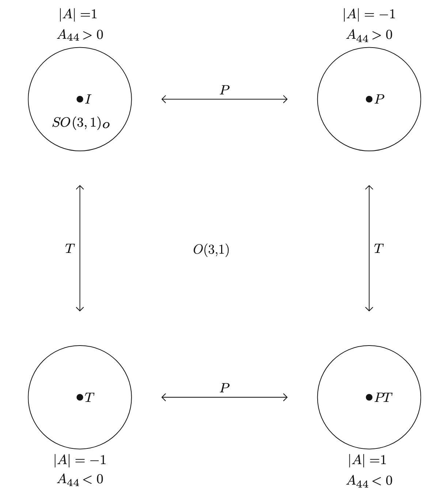
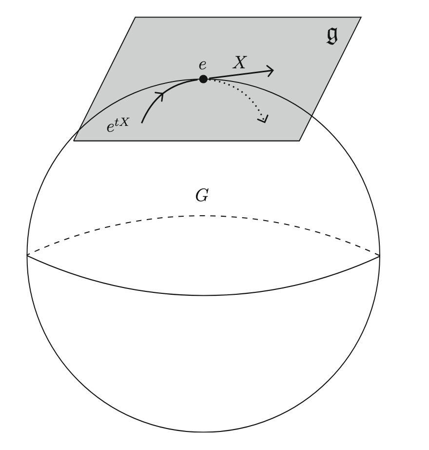

# 群，李群和李代数（Groups, Lie Groups, and Lie Algebras）

如果没有学过群论的话，这一章节可能读起来会有一些吃力，至少可能在一些 mathematical deduction 上会有所困惑。毕竟要在短短的两章过一遍群论的大部分内容本来就是一件困难的事情，因此这一章节起，我会以我自己的视角撰写笔记，对于书中一些简单的例子会选择性的删去，而主要保留最有 insight 的部分。下面是书中对于群、李群和李代数的描述：

- *Group* is just a set of transformations that are composable and invertible.
- *Lie group* is a group which can be smoothly parameterized by one or more contimuous variables.
- The vector space of infinitesimal generators of a matrix Lie group forms a *Lie algebra*.

## 记号汇总

<table border="0" class="dataframe" style="border-collapse: separate; border-spacing: 30px 0;">
  <tr>
    <th style="text-align: left;"><b>符号</b></th>
    <th style="text-align: left;"><b>含义</b></th>
  </tr>
  <tr>
    <td>\(GL(V)\)</td>
    <td>矢量空间 \(V\) 上的一般线性群（general linear group）</td>
  </tr>
  <tr>
    <td>\(GL(n,\mathbb{R})\)</td>
    <td>\(n\) 维实一般线性群</td>
  </tr>
  <tr>
    <td>\(GL(n,\mathbb{C})\)</td>
    <td>\(n\) 维复一般线性群</td>
  </tr>
  <tr>
    <td>\(\text{Isom}(V)\)</td>
    <td>矢量空间 \(V\) 上的等距群（isometry group）</td>
  </tr>
  <tr>
    <td>\(O(n)\)</td>
    <td>\(n\) 维空间 \(V\) 上的正交群（orthogonal group）</td>
  </tr>
  <tr>
    <td>\(U(n)\)</td>
    <td>\(n\) 维空间 \(V\) 上的酉群（unitary group）</td>
  </tr>
  <tr>
    <td>\(O(n-1,1)\)</td>
    <td>\(n\) 维空间 \(V\) 上的洛伦兹群（Lorentz group）</td>
  </tr>
  <tr>
    <td>\(SO(n)\)</td>
    <td>\(n\) 维空间 \(V\) 上的特殊正交群（special orthogonal group）</td>
  </tr>
  <tr>
    <td>\(SU(n)\)</td>
    <td>\(n\) 维空间 \(V\) 上的特殊酉群（special unitary group）</td>
  </tr>
  <tr>
    <td>\(\mathbb{Z}_2\)</td>
    <td>二元群（只有两个元素的群）</td>
  </tr>
  <tr>
    <td>\(S_n\)</td>
    <td>\(n\) 阶置换群</td>
  </tr>
  <tr>
    <td>&emsp;</td>
    <td>&emsp;</td>
  </tr>
  <tr>
    <td>\(SO(n-1,1)_o\)</td>
    <td>The restricted Lorentz group</td>
  </tr>
  <tr>
    <td>&emsp;</td>
    <td>&emsp;</td>
  </tr>
  <tr>
    <td>\(G\simeq H\)</td>
    <td>群 \(G\) 和 \(H\) 同构（isomorphic）</td>
  </tr>
  <tr>
    <td>&emsp;</td>
    <td>&emsp;</td>
  </tr>
  <tr>
    <td>\(\mathfrak{gl}(n,\mathbb{C})\)</td>
    <td>\(GL(n,\mathbb{C})\) 群的李代数</td>
  </tr>
  <tr>
    <td>\(\mathfrak{o}(n)\)</td>
    <td>\(O(n)\) 群的李代数</td>
  </tr>
  <tr>
    <td>\(\mathfrak{u}(n)\)</td>
    <td>\(U(n)\) 群的李代数</td>
  </tr>
  <tr>
    <td>\(\mathfrak{o}(n,n-1)\)</td>
    <td>\(O(n,n-1)\) 群的李代数</td>
  </tr>
  <tr>
    <td>\(\mathfrak{so}(n)\)</td>
    <td>\(SO(n)\) 群的李代数</td>
  </tr>
  <tr>
    <td>\(\mathfrak{su}(n)\)</td>
    <td>\(SU(n)\) 群的李代数</td>
  </tr>
</table>

## 群：定义和实例（Group: Definition and Examples）

**<u>定义</u>**：群（group）$G$ 是一个带有乘法运算的集合，满足下面性质

1. (Closure) $\forall g,h\in G, g\cdot h\in G$
2. (Associativity) $\forall g,h,k\in G,$ $g\cdot(h\cdot k)=(g\cdot h)\cdot k$
3. (Existence of the identity) There exists an element $e\in G$, such that $g\cdot e=e\cdot g=g$, for all $g\in G$
4. (Existence of inverses) $\forall g\in G,\exists h\in G$, such that $g\cdot h=h\cdot g=e$, $h$ is denoted $g^{-1}$

如果对于群中任意两个元素，乘法运算是**可交换的**，即 $g\cdot h=h\cdot g$，那么我们就说这个群是一个***阿贝尔群（abelian group）***，否则这个群就是一个非阿贝尔群。

!!! info "注："
	虽然群的定义非常简单，但是就是这样简单的定义已经非常严格，后面我们会看到，仅从这个定义出发，我们就会得到非常有趣的性质！另外其实在数学上，有限群（群元个数有限）和无限群（群元个数无限）的性质是有所差别的，但是作为物理学家，我们基本上也都不怎么区分有限群和无限群 (๑´ڡ`๑)。

### **实例**：*一般线性群（The general linear group）*

矢量空间 $V$ 上的***一般线性群（general linear group）***，记作 $GL(V)$，这是 $\mathcal{L}(V)$ 的子群，包含了所有 $\mathcal{L}(V)$ 中的**可逆**线性变换。我们很容易可以验证 $GL(V)$ 满足上面群定义中的 4 条性质，因此是一个群。

对于数域 $C$ 上的 $n$ 维矢量空间 $V$，若我们选取一组基，就可以将线性变换写成矩阵的性质：$T\in GL(V)\to[T]\in M_n(C)$，那么显然这些矩阵 $[T]$ 也构成一个群，记为 $GL(n,C)$。当 $C=\mathbb{R}$ 时我们得到 $GL(n,\mathbb{R})$，这被称作 $n$ 维实一般线性群；当 $C=\mathbb{C}$ 时我们得到 $GL(n,\mathbb{C})$，这被称作 $n$ 维复一般线性群。

一般线性群有一些重要的子群(1)，例如***等距群（isometry group）***。给定 $V$ 中的一个非退化厄米形式，考虑非退化厄米形式 $(\cdot|\cdot)$ 的变换
{ .annotate }

1. 子群（subgroup）就是群的子集，且这个子集构成一个群。

$$
\boxed{
(Tv|Tw)=(v|w),\ \forall v,w\in V
}
$$

这些变换被称为等距变换(1)，由所有等距变换构成的群称为等距群（我们容易验证这是一个群），记作 $\text{Isom}(V)$。我们下面会看到，$\text{Isom}(V)$ 的矩阵表示就是正交矩阵、酉矩阵、或者洛伦兹矩阵(2)，这由 $V$ 是否为实空间还是复空间，以及 $(\cdot |\cdot)$ 是否具有正定性决定。
{ .annotate }

1. 若把上面非退化厄米形式看作距离的话，这就是一个保距离的变换（"iso-metry"="same length"）。
1. 矩阵表示（matrix representation）就是用矩阵的形式将群元写出来。或者严谨地说是矩阵空间和群的同态。

### **实例**：*正交群 $O(n)$*

考虑一个 $n$ 维的实内积空间（欧几里得空间）$V$，在 $V$ 上的等距变换就是保距离和角度的变换。给定一个正交归一基 $\mathcal{B}$，在这个基下我们有

$$
\begin{align*}
[v]^T[w]=(v|w)=(Tv|Tw)=[v]^T[T]^T[T][w]
\end{align*}
$$

于是我们得到 $[T]^T[T]=I$，或者
$$
[T]^T=[T]^{-1}
$$

也就是说，所有正交矩阵组成了正交群 $O(n)$。

### **实例**：*酉群 $U(n)$*

考虑复矢量内积空间 $V$。定义算符 $T^\dagger$ 为 算符 $T$ 的***伴随（adjoint）***，且满足
$$
\boxed{
(T^\dagger v|w)\equiv (v|Tw)
}
$$
对于等距变换

$$
\begin{align*}
(v|w)=(Tv|Tw)=(T^\dagger Tv|w),\ \forall v,w\in V
\end{align*}
$$

于是我们得到 $T^\dagger T=TT^\dagger =I$，或者

$$
\boxed{
T^\dagger=T^{-1}
}
$$

满足这个式子的算符被称作***幺正的（unitary）***(1)。如果 $V$ 的维数是 $n$，且在 $V$ 中选定了一组正交归一基，那么我们有
{ .annotate }

1. “酉”和“幺正”都是对 unitary 这个单词的翻译，其实并没有什么不同。

$$
[T]^\dagger=[T]^{-1}
$$

也就是说，在正交归一基下，酉算符可以用酉矩阵来表示（注意如果在非正交归一基下，这个结论就不一定成立）。

???+ note "对于伴随算符的定义"
	我们常常对于 $^\dagger$(dagger) 符号的理解都是对矩阵进行**转置共轭**的操作，但是实际上如果没有矩阵，我们也可以很好的定义伴随（adjoint）算符。 首先我们先定义***转置（transpose）***：若 $A$ 是一个作用在 $V$ 上的线性算符，定义 $A$ 的转置 $A^T$ 为作用在 $V^*$ 上的算符，满足 
$\begin{align*} (A^T(f))(v)\equiv f(Av),\ \text{where }v\in V,f\in V^* \end{align*}$
 再用到我们之前的从矢量到对偶矢量的映射 $L:V\to V^*$（或者 $L(w)=(w|\cdot)$），定义 $A$ 的***伴随算符*** $A^\dagger$ 为作用在 $V$ 上的线性算符：
	$$
	A^\dagger\equiv L^{-1}\circ A^T\circ L:V\to V
	$$ 有了这个定义，我们就可以得到 
$\begin{align*} 
	(A^\dagger v|w)&=L(A^\dagger v)(w)\\
	&=A^T(L(v))(w)\\
	&=L(v)(Aw)\\
	&=(v|Aw)
	\end{align*}$
 即我们常见的对于伴随算符的定义。而在正交归一基下我们会有
	$$
	[A^\dagger]=[A]^\dagger
	$$ 在括号外的 $^\dagger$(dagger) 符号就是我们一般理解的转置共轭。通过这样的定义，我们能够脱离矩阵的语言来描述伴随算符。特别地，当 $A^\dagger=A$ 的时候，我们称这个算符为***自伴的（self-adjoint）***或者***厄米的（Hermitian）***。

### **实例**：*洛伦兹群 $O(n-1,1)$*

在闵可夫斯基度规 $\eta$ 下，选取一组正交归一基，$\eta$ 可以写成矩阵形式(1)
{ .annotate }

1. 有的书上对于这个矩阵有不一样的写法，比如可能将 -1 写在第一行第一列，但是不论怎么写，下面的一般性讨论都是成立的。

$$
[\eta]=\begin{pmatrix}
1& & & \\\
& \ddots & & \\\
& & 1 & \\\
& & & -1
\end{pmatrix}
$$

如果 $T\in\text{Isom}(V)$，根据 $(v|w)=\eta(v,w)$ 我们有（在任何基 $\mathcal{B}$ 下）

$$
\begin{align*}
[v]^T[\eta][w]&=\eta(v,w)\\
&=\eta(Tv,Tw)\\
&=[v]^T[T]^T[\eta][T][w]
\end{align*}
$$

上面式子对任何 $v,w\in V$ 都成立，于是我们有

$$
[T]^T[\eta][T]=[\eta]
$$

在分量式下变为：
$$
{T_\mu}^\rho {T_\nu}^\sigma \eta_{\rho\sigma}=\eta_{\mu\nu}
$$

满足上面式子的变换就被称为洛伦兹变换，而所有的洛伦兹变换就组成了洛伦兹群。

???+ note "对等距变换的主动和被动解释"
	如果稍微注意上面对于等距变换的定义的话，就不难发现，我们其实是在使用**主动变换**来定义等距变换的，即在变换下矢量本身发生了变化。当然我们也可以用**被动变换**来定义等距变换，即在变换下矢量不发生变换而基矢和分量发生变换。两种变换实际上是等价的，不过在运算过程中可能会差一个逆运算。

### **实例**：*特殊正交群和特殊酉群*

***特殊正交群（special orthogonal group）***和***特殊酉群（special unitary group）***，分别记作 $SO(n)$ 和 $SU(n)$，分别是 $O(n)$ 和 $U(n)$ 的一个子群。定义为 $O(n)$ 或者 $U(n)$ 中**行列式为 1 的变换**构成的集合。我们在后面的章节会看到，$SO(n)$ 描述的就是 $n$ 维空间的旋转，$SU(2)$ 是描述量子力学中角动量的群，$SU(3)$ 是在粒子物理中米描述夸克的群。

### **实例**：*二元群 $\mathbb{Z}_2$*

考虑只包含两个元素的群，$\mathbb{Z}_2\equiv\{+1,-1\}\subset\mathbb{Z}$，这个群的乘法就是整数的乘法。我们容易看出这是一个阿贝尔群，并且所有两个元素的群都与其同构（或者说只有一个二阶群）。

### **实例**：*$n$ 阶置换群 $S_n$*

$n$ 阶置换群 $S_n$ 就是将 $n$ 个元素进行重新排列的群（permutation group），一共有 $n!$ 个元素。对于任意一种排列 $\sigma$，我们可以将 $n$ 阶置换群的元素写为
$$
\begin{pmatrix}
1&2&\cdots&n\\\
\sigma(1)&\sigma(2)&\cdots &\sigma(n)
\end{pmatrix}
$$
特别的，我们可以将置换群作用在张量积上。考虑 $V$ 上的 $(0,n)$ 张量空间 $\mathcal{T}^0_n(V)$，$S_n$ 作用在张量空间的元素上可以得到

$$
\begin{align*}
\sigma(v_1\otimes v_2\otimes\cdots\otimes v_n)=v_{\sigma(1)}\otimes v_{\sigma(2)}\otimes\cdots\otimes v_{\sigma(n)}
\end{align*}
$$

这样的操作在讨论量子力学中的全同粒子的时候是很有用的。

## 经典和量子力学中的群（The Groups of Classical and Quantum Physics）

### **实例**：*三维特殊正交群 $SO(3)$*

通过欧拉角，我们可以写出 $SO(3)$ 群元的矩阵（其中 $\phi$ 是绕 $z$ 轴的转角，$\theta$ 是绕 $x'$ 轴的转角，$\psi$ 是绕 $z''$ 轴的转角）

$$
\begin{align*}
R&=\begin{pmatrix}
\cos\psi&\sin\psi&0\\
-\sin\psi&\cos\psi&0\\
0&0&1
\end{pmatrix}\begin{pmatrix}
1&0&0\\
0&\cos\theta&\sin\theta\\
0&-\sin\theta&\cos\theta\\
\end{pmatrix}\begin{pmatrix}
\cos\phi&\sin\phi&0\\
-\sin\phi&\cos\phi&0\\
0&0&1
\end{pmatrix}\\
&=\begin{pmatrix}
\cos\psi\cos\phi-\cos\theta\sin\phi\sin\psi&\cos\psi\sin\phi+\cos\theta\cos\phi\sin\psi&\sin\psi\sin\theta\\
-\sin\psi\cos\phi-\cos\theta\sin\phi\cos\psi&-\sin\psi\sin\phi+\cos\theta\cos\phi\cos\psi&\cos\psi\sin\theta\\
\sin\theta\sin\phi&-\sin\theta\cos\phi&\cos\theta
\end{pmatrix}
\end{align*}
$$

当然，我们这里是主动变换的视角，如果是被动变换的视角，就和上面的结果差一个逆。

### **实例**：*三维正交群 $O(3)$*

由于 $O(3)$ 中的群元也必须是正交变换，所以 $O(3)$ 和 $SO(3)$ 唯一的不同就是：$O(3)$ 的群元 $|R|=\pm 1$，而 $SO(3)$ 的群元 $|R|=1$。$O(3)$ 中 $|R|=-1$ 的变换就被我们称作***瑕旋转（improper rotation）***，相对的 $|R|=1$ 的变换就被称作***旋转（proper rotation）***。瑕旋转中最重要的变换是***反演（inversion）***变换
$$
-I=\begin{pmatrix}
-1&0&0\\\
0&-1&0\\\
0&0&-1
\end{pmatrix}
$$
事实上，任何瑕旋转都可以被写成旋转和反演变换的乘积，即 $R=(-I)(-R)$（这里 $R$ 是瑕旋转，$-R$ 是旋转）。

$O(3)$ 的旋转和瑕旋转两个部分是***不连通的（disconnected）***，也就是说我们没有办法通过连续的参数变换从 $|R|=1$ 的矩阵变成 $|R|=-1$ 的矩阵。我们常常用两个分开的“球”来表示 $O(3)$ 群，其中一个是 $SO(3)$，另一个是 $(-I)SO(3)$。

### **实例**：*二维特殊酉群 $SU(2)$*

$SU(2)$ 群元满足 $A^\dagger=A^{-1}$ 和 $|A|=1$，我们可以将 $A$ 写成下面的矩阵形式

$$
\begin{align*}
\begin{pmatrix}
\alpha&\beta\\
-\bar{\beta}&\bar{\alpha}
\end{pmatrix},\ \alpha,\beta\in\mathbb{C},\ |\alpha|^2+|\beta|^2=1
\end{align*}
$$

我们也可以用欧拉角写出 $SU(2)$ 的群元（这种表示是我们更加常见的）

$$
\begin{pmatrix}
e^{i(\psi+\phi)/2}\cos\frac{\theta}{2}&ie^{i(\psi-\phi)/2}\sin\frac{\theta}{2}\\\
ie^{-i(\psi-\phi)/2}\sin\frac{\theta}{2}&e^{-i(\psi+\phi)/2}\cos\frac{\theta}{2}
\end{pmatrix}
$$

这个矩阵描述的就是 1/2 自旋粒子的转动。显然这个矩阵看上去和 $SO(3)$ 群的矩阵好像可以对应起来，这种感觉是对的，它们之间就是有一些内在联系！我们会在下一章节再讨论这个问题。

### **实例**：*The restricted Lorentz group $SO(3,1)_o$*

The ***restricted Lorentz group***(1) $SO(3,1)_o$ 是 $O(3,1)$ 的子群，并且其中元素满足 $|A|=1$ 且 $A_{44}>1$。其中 $|A|=1$ 这一条件保证时间和空间的取向不会相反，$A_{44}>1$ 这一条件保证了时间的方向不会相反（或者说时间不会倒流）(2)。$SO(3,1)_o$ 中的变换就被称作 ***restriceted Lorentz transformations***。
{  .annotate }

1. 这里我不知道怎么很好的翻译成中文，就直接保留英文了，后同理 :D
1. 这也就是为什么我们不直接写成 SO(3,1)，因为这个群不仅仅要满足行列式为 1。

我们最熟悉的例子是

$$
\begin{align*}
L=\begin{pmatrix}
1&0&0&0\\
0&1&0&0\\
0&0&\gamma&-\beta\gamma\\
0&0&-\beta\gamma&\gamma
\end{pmatrix},\ -1<\beta<1,\gamma=\frac{1}{\sqrt{1-\beta^2}}
\end{align*}
$$

我们一般用**被动视角**来解读这个变换（即矢量本身不发生变换）。这个变换被我们称作一个沿着 $z$ 轴的 ***boost***，也可以被写成

$$
\begin{align*}
L=\begin{pmatrix}
1&0&0&0\\
0&1&0&0\\
0&0&\cosh u&-\sinh u\\
0&0&-\sinh u&\cosh u
\end{pmatrix},\ u\in \mathbb{R}
\end{align*}
$$

这里的 $u$ 被定义为***快度（rapidity）***，其和 $\beta$ 的关系为
$$
\tanh u=\beta
$$
如果我们将这个变换推广到一般情形，即沿着 $\boldsymbol{\beta}=(\beta_x,\beta_y,\beta_z)$ 进行 boost，那我们就可以得到一般的变换矩阵

$$
\begin{align*}
L=\begin{pmatrix}
\frac{\beta^2_x(\gamma-1)}{\beta^2}+1&\frac{\beta_x\beta_y(\gamma-1)}{\beta^2}&\frac{\beta_x\beta_z(\gamma-1)}{\beta^2}&-\beta_x\gamma\\
\frac{\beta_y\beta_x(\gamma-1)}{\beta^2}&\frac{\beta^2_y(\gamma-1)}{\beta^2}+1&\frac{\beta_y\beta_z(\gamma-1)}{\beta^2}&-\beta_y\gamma\\
\frac{\beta_z\beta_x(\gamma-1)}{\beta^2}&\frac{\beta_z\beta_y(\gamma-1)}{\beta^2}&\frac{\beta^2_z(\gamma-1)}{\beta^2}+1&-\beta_z\gamma\\
-\beta_x\gamma&-\beta_y\gamma&-\beta_z\gamma&\gamma
\end{pmatrix}
\end{align*}
$$

???+ note "如何得到一般情况下的 boost 矩阵？"
	要得到上面这个的 boost 矩阵，考虑空间旋转矩阵 
$R=\begin{pmatrix}
	\frac{\beta_x}{\sqrt{\beta^2-\beta_z^2}}&\frac{\beta_x\beta_z}{\beta\sqrt{\beta^2-\beta^2_z}}&\frac{\beta_x}{\beta}&0\\
	-\frac{\beta_x}{\sqrt{\beta^2-\beta^2_z}}&\frac{\beta_y\beta_z}{\beta\sqrt{\beta^2-\beta^2_z}}&\frac{\beta_y}{\beta}&0\\
	0&-\frac{\sqrt{\beta^2-\beta_z^2}}{\beta}&\frac{\beta_z}{\beta}&0\\
	0&0&0&1
	\end{pmatrix}$
 可以验证这是一个正交矩阵，能将标准基 $\{\hat{\boldsymbol{x}},\hat{\boldsymbol{y}},\hat{\boldsymbol{z}}\}$ 旋转至 $\{\boldsymbol{r}_1,\boldsymbol{r}_2,\hat{\boldsymbol{\beta}}\}$ 上，其中 $\boldsymbol{r}_1$ 和 $\boldsymbol{r}_2$ 是和方向 $\hat{\boldsymbol{\beta}}$ 垂直的单位矢量。进行旋转变换： 
$L=R\begin{pmatrix} 1&0&0&0\\ 0&1&0&0\\ 0&0&\gamma&-\beta\gamma\\ 0&0&-\beta\gamma&\gamma \end{pmatrix}R^T$
 就可以得到上面的一般方向 boost 的矩阵。虽然我们后面会用更加优雅的方式导出上面的 boost 矩阵，但是这里可以作为一个 brute-force 矩阵乘法的练习。

如果我们将上面快度和 $\beta$ 的关系在三维空间中写出，就有
$$
\boldsymbol{\beta}=\frac{\tanh u}{u}\boldsymbol{u},\ u=|\boldsymbol{u}|
$$
这样任意方向、大小的 boost 都可以写为下面矩阵的形式

$$
\begin{align*}
L=\begin{pmatrix}
\frac{u^2_x(\cosh u-1)}{u^2}+1&\frac{u_xu_y(\cosh u-1)}{u^2}&\frac{\beta_x\beta_z(\cosh u-1)}{u^2}&-\frac{u_x}{u}\sinh u\\
\frac{u_yu_x(\cosh u-1)}{u^2}&\frac{u^2_y(\cosh u-1)}{u^2}+1&\frac{\beta_y\beta_z(\cosh u-1)}{u^2}&-\frac{u_y}{u}\sinh u\\
\frac{u_zu_x(\cosh u-1)}{u^2}&\frac{\beta_z\beta_y(\cosh u-1)}{u^2}&\frac{u^2_z(\cosh u-1)}{u^2}+1&-\frac{u_z}{u}\sinh u\\
-\frac{u_x}{u}\sinh u&-\frac{u_y}{u}\sinh u&-\frac{u_z}{u}\sinh u&\cosh u
\end{pmatrix}
\end{align*}
$$

这看起来及其复杂，如果感兴趣的话下面的命题可以作为矩阵运算的练习，但是这里直接不加证明的给出结论：**boost 操作在矩阵乘法下不封闭**（或者说两个 boost 相乘可能得到的就不是一个 boost 的操作）。这一结论直接导致了电子的托马斯旋进，当然我们会在后面用更加简洁的方法证明这件事情。

现在我们已经知道 boost 的矩阵形式了，那么对于 $SO(3,1)_o$ 群的任意群元 $A$，我们不加证明的给出，其可以被写成 $A=LR'$，这里
$$
R'=\begin{pmatrix}
R&\\\
&1
\end{pmatrix}, \ R\in SO(3)
$$
而 $L$ 就是上面给出的 boost 矩阵。注意到 $L$ 和 $R'$ 各有 3 个自由度，因此对于 $SO(3,1)_o$ 群的群元 $A=LR'$ 来说，**一共有六个自由参数**。

### **实例**：*The extended Lorentz group $O(3,1)$*

相比于 $SO(3,1)_o$，$O(3,1)$ 中多出两个操作：空间反演 $P$（也称作 ***parity***）和时间反演 $T$

$$
\begin{align*}
P=\begin{pmatrix}
-1&0&0&0\\
0&-1&0&0\\
0&0&-1&0\\
0&0&0&1
\end{pmatrix},\ T=\begin{pmatrix}
1&0&0&0\\
0&1&0&0\\
0&0&1&0\\
0&0&0&-1
\end{pmatrix}
\end{align*}
$$

这个群也被称作 improper 或者 extended Lorentz group。容易看出，$|P|=|T|=-1$，这其实和 $O(3)$ 群中的反演元素 $-I$ 很像。我们可以类比 $O(3)$ 群将 $O(3,1)$ 分为**四个不连通的部分**，它们之间的关系如下图所示。

!!! info "注："
	从上面这张图我们可以更清晰的看出，仅仅让 $|A|=1$ 是没有办法给出 $SO(3,1)_o$ 的。$SO(3,1)_o$ 和 $PTSO(3,1)_o$ 中的元素行列式都是 1，但是只有满足 $A_{44}>0$ 的那一部分才是 restricted Lorentz group。

### **实例**：*二维特殊线性群 $SL(2,\mathbb{C})$*

这个群**不是**等距变换群，但是其在物理中也非常常用。$SL(2,\mathbb{C})$ 被定义为所有行列式为 1 的 2x2 矩阵，对于 $A\in SL(2,\mathbb{C})$ 我们可以写成

$$
\begin{align*}
A=\begin{pmatrix}
a&b\\
c&d
\end{pmatrix},\ a,b,c,d\in\mathbb{C},\ ad-bc=1
\end{align*}
$$

行列式为 1 的条件限制使得 $A$ 有三个复数参数，或者**六个实数参数**，和 $SO(3,1)_o$ 是一样的！实际上，$SL(2,\mathbb{C})$ 和 $SO(3,1)_o$ 的关系就好像 $SU(2)$ 和 $SO(3)$ 的关系一样，$SL(2,\mathbb{C})$ 表示的正是 1/2 自旋粒子的洛伦兹变换！

我们不加证明的给出 $SL(2,\mathbb{C})$ 中的 boost 矩阵写为（快度为 $\boldsymbol{u}$）

$$
\begin{align*}
\tilde{L}=\begin{pmatrix}
\cosh \frac{u}{2}+\frac{u_z}{u}\sinh\frac{u}{2}&-\frac{1}{u}(u_x-iu_y)\sinh\frac{u}{2}\\
-\frac{1}{u}(u_x+iu_y)\sinh\frac{u}{2}&\cosh \frac{u}{2}-\frac{u_z}{u}\sinh\frac{u}{2}
\end{pmatrix},\ \boldsymbol{u}\in\mathbb{R}^3
\end{align*}
$$

而对于 $A\in SL(2,\mathbb{C})$，总可以被分解为 $A=\tilde{L}\tilde{R}$，其中 $\tilde{R}\in SU(2)$。这其实和 $SO(3,1)_o$ 群中元素的分解是非常类似的。

最后，我们用下表来总结一下上面这些群的关系。

<table border="0" class="dataframe" style="border-collapse: separate; border-spacing: 10px 0;">
  <tr>
    <th style="text-align: left;"><b>Summary</b></th>
    <th style="text-align: left;">&emsp;</th>
    <th style="text-align: left;"><b>Lorentz transformations</b></th>
    <th style="text-align: left;"><b>Description</b></th>
  </tr>
  <tr>
    <td>\(SU(2)\)</td>
    <td>\(\subset\)</td>
    <td>\(SL(2,\mathbb{C})\)</td>
    <td>Quantum-mechanical</td>
  </tr>
  <tr>
    <td>\(SO(3)\)</td>
    <td>\(\subset\)</td>
    <td>\(SO(3,1)_o\)</td>
    <td>Proper</td>
  </tr>
  <tr>
    <td>&emsp;\(\cap\)</td>
    <td>&emsp;</td>
    <td>&emsp;\(\cap\)</td>
    <td>-</td>
  </tr>
  <tr>
    <td>\(O(3)\)</td>
    <td>\(\subset\)</td>
    <td>\(O(3,1)\)</td>
    <td>Improper</td>
  </tr>
</table>

## 同态和同构（Homomorphism and Isomorphism）

<table border="0" class="dataframe" style="border-collapse: separate; border-spacing: 10px 0;">
  <tr>
    <th style="text-align: left;"><b>Summary</b></th>
    <th style="text-align: left;">&emsp;</th>
    <th style="text-align: left;"><b>Lorentz transformations</b></th>
    <th style="text-align: left;"><b>Description</b></th>
  </tr>
  <tr>
    <td>\(SU(2)\)</td>
    <td>\(\subset\)</td>
    <td>\(SL(2,\mathbb{C})\)</td>
    <td>Quantum-mechanical</td>
  </tr>
  <tr>
    <td>\(\rho\downarrow\)</td>
    <td>&emsp;</td>
    <td>\(\rho\downarrow\)</td>
    <td>&emsp;</td>
  </tr>
  <tr>
    <td>\(SO(3)\)</td>
    <td>\(\subset\)</td>
    <td>\(SO(3,1)_o\)</td>
    <td>Proper</td>
  </tr>
  <tr>
    <td>&emsp;\(\cap\)</td>
    <td>&emsp;</td>
    <td>&emsp;\(\cap\)</td>
    <td>-</td>
  </tr>
  <tr>
    <td>\(O(3)\)</td>
    <td>\(\subset\)</td>
    <td>\(O(3,1)\)</td>
    <td>Improper</td>
  </tr>
</table>
## 从李群到李代数（From Lie Groups to Lie Algebras）

在上面的例子中，有两种类型的群，一种是类似 $SU(2)$ 和 $SO(3)$ 这样可以被参数连续表示的群，还有一种是类似 $\mathbb{Z_2}$ 和 $S_n$ 这样“离散”的群，前者就被称作李群。***李群（Lie group）***是以挪威数学家 Sophus Lie 命名的群，早在 19 世纪晚期 Lie 就开始研究这样的群，这样的群之所以重要是因为我们可以研究那些“无限靠近”单位元的群元，这被物理学家们称作***无穷小变换（infinitesimal transformation）***或者***生成元（generator）***，或者在数学上被称作群的***李代数（Lie algebra）***。

要定义李群，需要拓扑和微分流形的知识，虽然微分流形的概念是很直观的（就是欧几里得空间的拓展），但是如果要严格定义这些内容还是要花费不少时间，所以我们这里给出一个李群的简单“定义”：*李群就是可以被连续的实变量参数化的群，其对应的李代数就是无限靠近单位元的群元。*

如果我们用 $X$ 表示生成元，那么对于一个单参数的映射 $\gamma:\mathbb{R}\to G$，$\{\gamma(t)|t\in \mathbb{R}\}$ 构成了 $G$ 的一个单参数子群

$$
\begin{align*}
\gamma(t)&=\lim_{n\to \infty}(\gamma(t/n))^n\\
&=\lim_{n\to \infty}\left(\gamma(0)+\frac{t}{n}\frac{d\gamma(x)}{dx}\right)^n\\
&=\lim_{n\to \infty}\left(\gamma(0)+\frac{t}{n}X\right)^n\\
&=e^{tX}
\end{align*}
$$

这里给出一个启发式的描述：如果我们将 $G$ 看作一个多维空间（流形）的话，$\gamma(t)=e^{tX}$ 就是一个参数化的曲线，而 $X$ 就是在单位元处沿着曲线 $\gamma(t)$ 的切向量。

## 李代数：定义、性质和实例（Lie Algebras: Definition, Properties, and Examples）

<u>**定义**</u>：给定李群 $G\subset GL(n,\mathbb{C})$，李代数（Lie algebra）$\mathfrak{g}$ 被定义为
$$
\boxed{
\mathfrak{g}\equiv\{X\in M_n(\mathbb{C})|e^{tX}\in G,\forall t\in\mathbb{R}\}
}
$$
考虑复数域上的 $n$ 维一般线性群 $GL(n,\mathbb{C})$，如何找到它的李代数 $\mathfrak{gl}(n,\mathbb{C})$ 呢？注意到对于任何 $X\in M_n(\mathbb{C})$，那么对于任何 $t$，$e^{tX}$ 是可逆的，其逆就是 $e^{-tX}$。所以
$$
\mathfrak{gl}(n,\mathbb{C})=M_n(C)
$$
同理 $\mathfrak{gl}(n,\mathbb{R})=M_n(\mathbb{R})$。也就是说，**不可逆**的线性变换构成的群的李代数就是**所有**线性变换构成的空间（李代数中的元素可以是不可逆的）！

!!! info "注："
	当我们把算符放在指数上的时候，我们应该用 Taylor 展开的方式来看待，即
	$$
	e^{tX}=\sum_{n=0}^\infty \frac{1}{n!}(tX)^n
	$$ 我们可以证明 $e^{tX}e^{-tX}=1$ 
$\begin{align*}e^{tX}e^{-tX}&=\left(\sum_{n=0}^\infty\frac{1}{n!}(tX)^n\right)\left(\sum_{m=0}^\infty\frac{1}{m!}(-tX)^m\right)\\
	&=\sum_{n=0}^\infty\sum_{m=0}^\infty\frac{1}{n!}(tX)^n\cdot \frac{1}{m!}(-tX)^m\\
	&=\sum_{k=0}^\infty (tX)^k\sum_{n=0}^k\frac{(-1)^{k-n}}{n!(k-n)!}\\
	&=1
	\end{align*}$
 其中第三步用到了 $n+m=k$ 的代换，第四步用到了二项式定理，当 $k\neq 0$ 时，$\sum_{n=0}^k\frac{(-1)^{k-n}}{n!(k-n)!}=(1-1)^k=0$，当 $k=0$ 时，前面一项为 1。

接下来考虑 $\text{Isom}(V)$ 的李代数。由于 $\text{Isom}(V)$ 是等距变换群，我们有
$$
(e^{tX}v|e^{tX}w)=(v|w),\ \forall v,w\in V,t\in\mathbb{R}
$$
两边对 $t$ 求导就可以得到

$$
(Xe^{tX}v|e^{tX}w)+(e^{tX}v|Xe^{tX}w)=0,\ \forall v,w\in V,t\in\mathbb{R}
$$
再令 $t=0$ 我们就得到
$$
\boxed{
(Xv|w)=-(v|Xw),\ \forall v,w\in V
}
$$
这就是等距变换群的李代数的基本性质。注意上面等式两侧相差一个负号，这个负号在后面的讨论中是非常关键的！