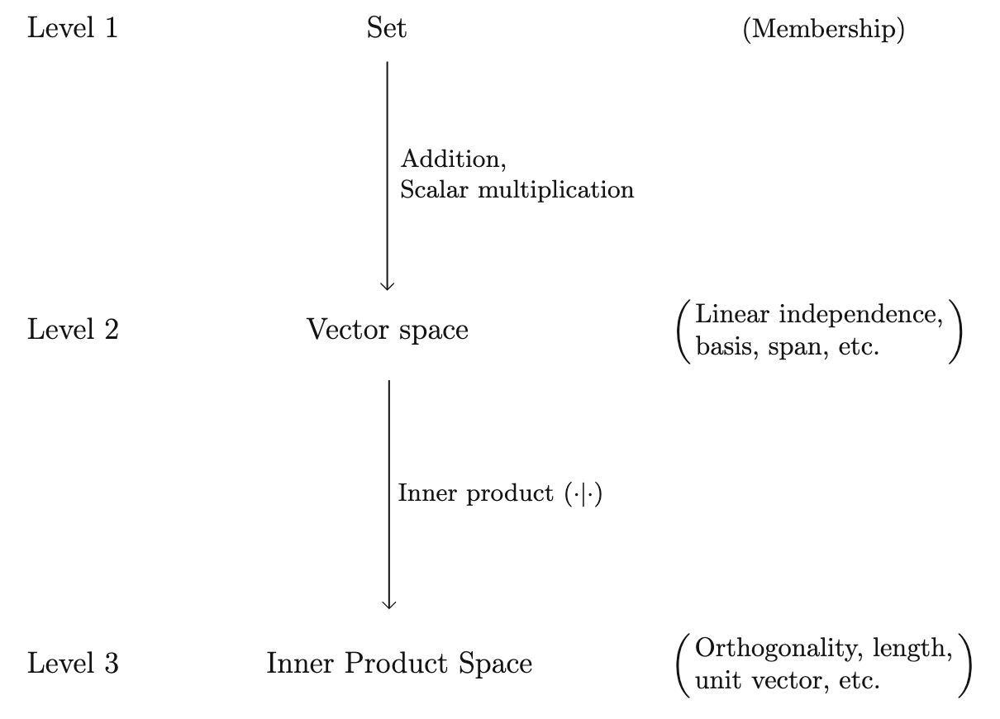

# 矢量空间（Vector Spaces）

## 记号汇总

<table border="0" class="dataframe" style="border-collapse: separate; border-spacing: 30px 0;">
  <tr>
    <th style="text-align: left;"><b>符号</b></th>
    <th style="text-align: left;"><b>含义</b></th>
  </tr>
  <tr>
    <td>\(\mathbb{R}^n\)</td>
    <td>\(n\) 维实矢量空间</td>
  </tr>
  <tr>
    <td>\(\mathbb{C}^n\)</td>
    <td>\(n\) 维复矢量空间</td>
  </tr>
  <tr>
    <td>\(M_n(\mathbb{R})\)</td>
    <td>矩阵元为实数的 \(n\times n\) 矩阵</td>
  </tr>
  <tr>
    <td>\(M_n(\mathbb{C})\)</td>
    <td>矩阵元为复数的 \(n\times n\) 矩阵</td>
  </tr>
  <tr>
    <td>\(H_n(\mathbb{C})\)</td>
    <td>矩阵元为复数的 \(n\times n\) 厄米矩阵（Hermitian matrices）</td>
  </tr>
  <tr>
    <td>\(L^2([a,b])\)</td>
    <td>在 \([a,b]\) 区间内平方可积的复值函数</td>
  </tr>
  <tr>
    <td>\(\mathcal{H}_l(\mathbb{R}^3)\)</td>
    <td>调和函数（harmonic polynomials），满足 \(\nabla^2f=0\) 的 \(l\) 阶多项式</td>
  </tr>
  <tr>
    <td>\(\tilde{\mathcal{H}}_l\)</td>
    <td>球谐函数（spherical harmonics）</td>
  </tr>
  <tr>
    <td>\(GL(n,\mathbb{R})\)</td>
    <td>一般线性群（general linear group），\(n\times n\) 可逆矩阵构成的群</td>
  </tr>
  <tr>
    <td>&emsp;</td>
    <td>&emsp;</td>
  </tr>
  <tr>
    <td>\([v]_\mathcal{B}\)</td>
    <td>矢量 \(v\) 在基 \(\mathcal{B}\) 下的分量表示（坐标）</td>
  </tr>
  <tr>
    <td>&emsp;</td>
    <td>&emsp;</td>
  </tr>
  <tr>
    <td>\(\mathcal{L}(V)\)</td>
    <td>所有作用在 \(V\) 上的线性算符构成的矢量空间</td>
  </tr>
  <tr>
    <td>\(\text{ad}_A\)</td>
    <td>对线性空间 \(\mathcal{L}(V)\) 的伴随作用（adjoint action），满足 \(\text{ad}_A(B)\equiv [A,B]\)</td>
  </tr>
  <tr>
    <td>\([T]_\mathcal{B}\)</td>
    <td>线性算符 \(T\) 在基 \(\mathcal{B}\) 下的分量表示（矩阵）</td>
  </tr>
  <tr>
    <td>&emsp;</td>
    <td>&emsp;</td>
  </tr>
  <tr>
    <td>\(V^*\)</td>
    <td>矢量空间 \(V\)的对偶空间（dual space）</td>
  </tr>
  <tr>
    <td>\(\delta\)</td>
    <td>狄拉克泛函（Dirac delta functional），满足 \(\delta(f(x))\equiv f(0)\)</td>
  </tr>
  <tr>
    <td>\(\delta(x)\)</td>
    <td>狄拉克函数（Dirac delta function），满足 \(\int \delta(x)f(x)dx= f(0)\)</td>
  </tr>
  <tr>
    <td>&emsp;</td>
    <td>&emsp;</td>
  </tr>
  <tr>
    <td>\(\mathcal{H}\)</td>
    <td>希尔伯特空间</td>
  </tr>
  <tr>
    <td>\(P(\mathbb{R})\)</td>
    <td>所有系数为实数的多项式组成的矢量空间</td>
  </tr>
</table>

## 一些基本定义（Basic Definitions）

在线性代数中，我们已经学习过关于线性空间的定义，而在这本书中，我们将线性空间称作矢量空间（vector space），这是因为我们将这个空间中的所有元素都称为矢量。

!!! info "注："
	其实这里的矢量空间（vector space）就是我们在线性代数中学习过的线性空间（linear space），矢量（vector）就是数学中的向量。但是为了保持和书本中的术语一致，我们后面统一使用矢量空间这个名词。

<u>**定义**</u>：一个矢量空间包含：一个集合 $V$，其中所有元素被称作矢量，一个标量的集合 $C$（对于我们来说一般是 $\mathbb{R}$ 或者 $\mathbb{C}$）和一组封闭的加法和标量乘法运算，满足以下条件：

1. $v+w=w+v,\ \forall v,w\in V$ (Commutativity)
2. $v+(w+x)=(v+w)+x,\ \forall v,w,x\in V$ (Associativity)
3. 存在 0 矢量使得 $v+0=0+v=v,\ \forall v\in V$
4. 对 $V$ 中所有矢量 $v$ 存在一个矢量 $-v$ 使得 $v+(-v)=0$
5. $c(v+w)=cv+cw,\ \forall v,w \in V,\ \forall c\in C$ (Distributivity)
6. $1v=v,\ \forall v\in V$
7. $(c_1+c_2)v=c_1v+c_2v,\ \forall v\in V,$ $\forall c_1,c_2\in C$
8. $(c_1c_2)v=c_1c_2v,\ \forall v\in V,\ \forall c_1,c_2\in C$

???+ note "$\mathbb{R}^n$ 和 $\mathbb{C}^n$"
	这两个矢量空间在物理上是常常用到的，我们在规定这两个矢量空间的时候常常规定对于 $\mathbb{R}^n$ 有 $V=\mathbb{R}^n,C=\mathbb{R}$，而对于 $\mathbb{C}^n$ 有 $V=\mathbb{C}^n,C=\mathbb{C}$。但值得注意的是，对于 $\mathbb{C}^n$ 我们并没有具体规定 $C=\mathbb{C}$，事实上，我们可以定义 $C=\mathbb{R}$，此时我们会将原来的空间写作 $\mathbb{C}^n_\mathbb{R}$，这样能够提醒我们，我们在把 $\mathbb{C}^n$ 作为一个实矢量空间来考虑。这事实上涉及到基选取的问题（在后面的章节会涉及到）。目前，我们应该默认对于 $\mathbb{C}^n$ 来说 $C=\mathbb{C}$，除非有另外的明确说明。

### **实例**：*$M_n(\mathbb{R})$ 和 $M_n(\mathbb{C})$，矩阵元为实数或者复数的 $n\times n$ 矩阵*

将矩阵 $A$ 的第 $i$ 行第 $j$ 列记为 $A_{ij}$，定义如下加法和数乘

$$
\begin{align*}
(A+B)_{ij}&\equiv A_{ij}+B_{ij}\\
(cA)_{ij}\equiv cA_{ij}
\end{align*}
$$

这样这些矩阵就构成了矢量空间。当然在物理中，我们不会经常碰到这样的空间，不过它们有些比较重要的子空间，如 $H_n(\mathbb{C})$。

### **实例**：*$H_n(\mathbb{C})$，矩阵元为复数的 $n\times n$ 厄米矩阵（Hermitian matrices）*

$H_n(\mathbb{C})$ 是 $M_n(\mathbb{C})$ 的一个子空间，在量子力学中我们知道可观测量必须是厄米算符，如果这个算符是有限维的，就被包含在矢量空间 $H_n(\mathbb{C})$ 中。例如 1/2 自旋的粒子，其态空间（ket space）就是 $\mathbb{C}^2$，而角动量算符就属于 $H_2(\mathbb{C})$，我们常使用***泡利算符（Pauli matrices）***来描述

$$
\begin{eqnarray*}
\sigma_x\equiv\begin{pmatrix}
0&1\\
1&0
\end{pmatrix},\ \sigma_y\equiv\begin{pmatrix}
0&-i\\
i&0
\end{pmatrix},\ \sigma_z\equiv\begin{pmatrix}
1&0\\
0&-1
\end{pmatrix}
\end{eqnarray*}
$$

这里应该注意的是，$H_n(\mathbb{C})$ **不是一个复矢量空间**，因为如果将 $H_n(\mathbb{C})$ 中的元素乘以 $i$，那么这个矩阵就不再是厄米的。也就是说虽然 $H_n(\mathbb{C})$ 中包含复数，但是它是一个实矢量空间！

### **实例**：*$L^2([a,b])$，在 $[a,b]$ 区间内平方可积的复值函数*
$$
\int^b_a|f(x)|^2dx<\infty,\ [a,b]\subset\mathbb{R}
$$
### **实例**：*$\mathcal{H}_l(\mathbb{R}^3)$ 和 $\tilde{\mathcal{H}}_l$，调和函数（Harmonic Polynomials）和球谐函数（Spherical Harmonics）*

考虑 $\mathbb{R}^3$ 上所有固定阶数的复系数多项式函数集合 $P_l(\mathbb{R}^3)$，也就是说所有 $x^iy^jz^k$ 形式项的线性组合，且满足 $i+j+k=l$。而矢量子空间 $\mathcal{H}_l(\mathbb{R}^3)\subset P_l(\mathbb{R}^3)$ 是 $l$ 次的调和多项式的集合，也就是满足拉普拉斯方程的 $l$ 次多项式
$$
\nabla^2 f=0
$$
使用分离变量法，我们可以在球坐标下求解拉普拉斯方程，得到
$$
f(r,\theta,\phi)=r^l Y^l_m(\theta,\phi)
$$
其中 $Y_m^l(\theta,\phi)$ 就是球谐函数。因此令 $r=1$ 我们就得到了球谐函数，而取 $l$ 阶的球谐函数并乘以 $r^l$ 就可以得到调和函数：

$$
\begin{eqnarray*}
\mathcal{H}_l(\mathbb{R}^3)&\longleftrightarrow&\tilde{\mathcal{H}}_l\\
f&\longrightarrow&f(r=1,\theta,\phi)\\
r^lY(\theta,\phi)&\longleftarrow &Y(\theta,\phi)
\end{eqnarray*}
$$

  <b>The familiar spherical harmonics \(Y^l_m(\theta,\phi)\) are just the restriction of  particular harmonic degree \(l\) polynomials to the unit sphere.</b>

???+ note "反例：一般线性群 $GL(n,\mathbb{R})$，可逆的 $n\times n$ 矩阵"
	一般线性群 $GL(n,\mathbb{R})$（general linear group）是 $M_n(\mathbb{R})$ 的子集，定义为所有可逆的 $n\times n$ 矩阵，并不是一个矢量空间。因为里面不存在零元素（显然零矩阵是不可逆的，不属于 $GL(n,\mathbb{R})$）。

## 线性无关，基和张成空间（Linear Independence, Bases, and Span）

<u>**定义**</u>：一个矢量的集合被称为***线性无关的（linearly independent）***，如果
$$
c^1v_1+\cdots+c^mv_m=0,\ v^i\in S
$$
当且仅当 $c^1=\cdots=c^m=0$，也就是说，不可能找到一个非零的数组，使得矢量的线性叠加为零。这件事情等价于：$S$ 中的任意一个矢量不能够被其他所有矢量线性表出。

有了线性无关的概念，我们就可以定义***基（basis）***：矢量空间 $V$ 中最大的线性无关的集合就是 $V$ 的一个基 $\mathcal{B}$，通过这个基可以张成整个线性空间，线性空间的***维数（dimension）***就被定义为基中元素的个数。

线性代数中，我们已经证明，对于有限维的矢量空间 $V$，不论怎么取，基中元素的个数都是相同的，说明我们上面对于维数的定义是良好的。如果我们找不到有限元素构成的基，那么这个矢量空间就是无穷维的（infinite-dimensional）。

!!! info "注："
	一般我们使用 $e_i$ 而不是 $v_i$ 表示基矢量。

???+ note "$\mathbb{C}^n$ 和 $\mathbb{C}^n_\mathbb{R}$"
	之前我们谈到过 $\mathbb{C}^n$ 和 $\mathbb{C}^n_\mathbb{R}$ 的问题，事实上，这两个矢量空间不同的地方就在于他们的基和维数不同。考虑 $n=1$ 的最简单的情况，$\mathbb{C}^1$ 是一个 1 维的矢量空间：$\mathbb{C}^1=\text{Span}\{1\}$ ，而 $\mathbb{C}^1_\mathbb{R}$  是一个 2 维的矢量空间 $\mathbb{C}^1_\mathbb{R}=\text{Span}\{1,i\}$。所以说，虽然说这两个矢量空间所包含的元素都是一样的（两个集合一致），但是因为数域选取不同，他们有了不同的维数。我们有时会说，$\mathbb{C}^1$ 的复维数为 1（complex dimension），实维数（real dimension）为 2。

### **实例**：*$M_n(\mathbb{R})$ 和 $M_n(\mathbb{C})$*

考虑 $E_{ij}$ 为第 $i$ 行、第 $j$ 列为 1，其他矩阵元皆为零的 $n\times n$ 矩阵，那么显然 $\{E_{ij}\}_{i,j=1,...,n}$ 就是 $M_n(\mathbb{R})$ 和 $M_n(\mathbb{C})$ 一组基。当然我们也可以考虑其他形式的基，如对称化的基 $S_{ij}\equiv E_{ij}+E_{ji}$，和反对称化的基 $A_{ij}\equiv E_{ij}-E_{ji}$

### **实例**：$H_2(\mathbb{C})$

$H_2(\mathbb{C})$ 是 $2\times 2$ 的厄米矩阵，其元素满足 $A=A^\dagger$，事实上我们可以将 $H_2(\mathbb{C})$ 中元素的普遍形式写为

$$
\begin{eqnarray*}
\begin{pmatrix}
t+z&x-iy\\
x+iy&t-z
\end{pmatrix}=tI+x\sigma_x+y\sigma_y+z\sigma_z
\end{eqnarray*}
$$

其中 $I$ 是单位矩阵，$\sigma_i$ 是泡利矩阵。于是我们就找到了 $H_2(\mathbb{C})$ 的一组基：$\mathcal{B}=\{I,\sigma_x,\sigma_y,\sigma_z\}$，同时我们也知道 $\dim H_2(\mathbb{C})=4$。

!!!info "注："
	始终注意 $H_2(\mathbb{C})$ 是一个实矢量空间，也就是说 $(t,x,y,z)$ 是一个实数组！

## 分量（Components）

给定 $V$ 中元素 $v$，以及一个 $V$ 中的基 $\mathcal{B}=\{e_i\}_{i=1,...,n}$，我们有

$$
\boxed{
v=\sum_{i=1}^nv^ie_i
}
$$
其中 $v^i$ 是数字，称作 $v$ 在 $\mathcal{B}$ 下的***分量（components）***，我们也可以将 $v$ 表示为列向量的形式，记做 $[v]_\mathcal{B}$

$$
[v]_\mathcal{B}=\begin{pmatrix}
v^1\\
v^2\\
\vdots\\
v^n
\end{pmatrix}
$$

或者行向量的形式

$$
[v]^T_\mathcal{B}=(v^1,v^2,...,v^n)
$$

只要选择一个基，任何一个矢量空间都可以“看起来像”一个 $\mathbb{R}^n$ 或者 $\mathbb{C}^n$。值得注意的是，**矢量本身和我们选择的基并没有关系，矢量是独立于基存在的**（可以将矢量看作物理实体而基是坐标系，显然物理实体并不因为坐标系的选取发生变化而变化）。

### **实例**：*刚体运动*

在我们处理刚体运动的时候，我们往往会选取两种坐标系，固定坐标系（坐标系不随刚体运动而改变）$K'=\{\hat{\boldsymbol{x}}',\hat{\boldsymbol{y}}',\hat{\boldsymbol{z}}'\}$ 和本体坐标系（坐标系和刚体的相对位置不发生改变）$K=\{\hat{\boldsymbol{x}}(t),\hat{\boldsymbol{y}}(t),\hat{\boldsymbol{z}}(t)\}$。而当我们描述诸如角动量这样的矢量的时候，我们要注意我们所处的坐标系，这是因为矢量的分量表示（component expression）会随着坐标系的变化而变化。例如在无外力矩的刚体定点运动中，$[L]_{K'}$ 是一个常数，但是 $[L]_K$ 会随着时间变化。

### **实例**：$L^2([-a,a])$

在高数中，我们知道在 $[-a,a]$ 区间平方可积的函数能够进行如下展开
$$
f=\sum_{m=-\infty}^\infty c_me^{i\frac{m\pi x}{a}}
$$
这被称作傅里叶展开，而 $c_m$ 是傅里叶级数。事实上，我们完全可以将 $c_m$ 看作矢量 $f$ 在基 $\{\exp({i\frac{m\pi x}{a}})\}_{m\in\mathbb{Z}}$ 下的分量，而这个矢量所在的空间显然是一个无穷维的矢量空间。

## 线性算符（Linear Operators）

**<u>定义</u>**：在 $V$ 上的线性算符就是从 $V$ 到自身的映射函数 $T:V \rightarrow V$，且满足如下的线性条件
$$
T(cv+w)=cT(v)+T(w)
$$

!!!info "注："
	有时我们也会将 $T(v)$ 写为 $Tv$，对应线性代数中学习的矩阵和向量的乘法。

所有在 $V$ 上的线性算符也会构成一个线性空间，使用 $\mathcal{L}(V)$ 表示。最简单的例子就是作用在 $\mathbb{R}^n$ 上的 $n\times n$ 矩阵，这些矩阵既是线性算符，也构成了矢量空间 $M_n(\mathbb{R})$（对于矢量空间 $M_n(\mathbb{C})$ 也同理）。

???+ note "物理量作为线性算符"
	之前我们提到过 $H_2(\mathbb{C})\subset M_2(\mathbb{C})$，在当时我们将 $H_2(\mathbb{C})$ 理解为矢量空间。而事实上，我们会用 $H_2(\mathbb{C})$ 中的元素来定义量子力学中的角动量算符（注意这个算符所在的矢量空间是线性的，而算符本身也是线性算符）。

### **实例**：*位置算符 $\hat{x}$，动量算符 $\hat{p}$ 和角动量算符 $\hat{L}$*

位置算符 $\hat{x}$ 和动量算符 $\hat{p}$ 是作用在矢量空间 $L^2([-a,a])$ 上的，满足

$$
\begin{eqnarray*}
(\hat{x}f)(x)&=&xf(x)\\
(\hat{p}f)(x)&=&-i\frac{\partial f}{\partial x}(x)
\end{eqnarray*}
$$

同样的，我们可以定义作用在矢量空间 $P_l(\mathbb{R}^3)$ 上的角动量算符

$$
\begin{eqnarray*}
L_x(f)&=&-i\left(y\frac{\partial f}{\partial z}-z\frac{\partial f}{\partial y}\right)\\
L_y(f)&=&-i\left(z\frac{\partial f}{\partial x}-x\frac{\partial f}{\partial z}\right)\\
L_z(f)&=&-i\left(x\frac{\partial f}{\partial y}-y\frac{\partial f}{\partial x}\right)
\end{eqnarray*}
$$

### **实例**：*作用在 $\mathcal{L}(V)$ 上的 $\mathcal{L}(V)$*

我们熟悉于作用在矢量上的线性算符，但是**线性算符也是可以作用在线性算符上的**，作用规则如下：给定 $A,B\in \mathcal{L}(V)$，定义作用在 $B$ 上的线性算符 $\text{ad}_A\in \mathcal{L}(\mathcal{L}(V))$ 满足
$$
\text{ad}_A(B)\equiv[A,B]
$$

其中 $[\cdot,\cdot]$ 表示对易子（commutator），注意这里 $\text{ad}_A$ 就是一个**作用在由线性算符构成的（矢量）空间的一个线性算符**。而 $A$ 对 $\mathcal{L}(V)$ 的这种作用被称作***伴随作用（adjoint action）***或者***伴随表示（adjoint representation）***。

!!! info "注："
	注意这里是 $\text{ad}_A$ 作用在线性算符（或者说矢量）$B$ 上。线性算符可以是一个算符，但同时其一定是在一个矢量空间中的矢量。而这里使用到“伴随表示（adjoint representation）”是因为这样的操作在后面章节李群的表示中会再次出现。

伴随表示在量子力学中十分重要，例如海森堡绘景下我们会强调物理量的变化（即线性算符空间 $\mathcal{L}(V)$ 的变化）而不是态矢量（即矢量空间 $V$ 的变化）。在海森堡绘景下，哈密顿量就变成了作用在物理量（线性算符）上的线性算符，对于客观测量量 $A$，海森堡方程为
$$
\frac{dA}{dt}=i\ \text{ad}_H(A)
$$

伴随表示对于理解球张量至关重要，我们将会在下面的章节再次提及。

???+ note "线性算符的可逆性（invertibility）"
	线性算符的可逆性是一个非常重要的性质，但不是所有线性算符都是可逆的。可逆算符能够一对一的将一个矢量空间中的两个矢量建立映射，也就是说对于可逆线性算符 $F$ 有
	
	$$
	\begin{eqnarray*}
	F(v_1)=F(v_2)\Longrightarrow v_1=v_2,\ \forall v_1,v_2\in V
	\end{eqnarray*}
	$$
	
	而对于可逆线性算符的正式定义为：
	
<b>\(T\) is invertible if and only if the only vector it sends to 0 is the zero vector.</b>

值得注意的是，**线性算符不完全等同于矩阵**。如同矢量一样，当基被选定的时候，线性算符的表示（即矩阵）就会被给定。当给定一组基 $\mathcal{B}=\{e_i\}_{i=1,...,n}$ 后，线性算符 $T$ 的作用完全由其对基向量的作用决定

$$
\begin{eqnarray*}
T(v)=T\left(\sum_{i=1}^nv^ie_i\right)=\sum_{i=1}^nv^iT(e_i)=\sum_{i,j=1}^nv^iT_i^{\ j}e_j
\end{eqnarray*}
$$

这里的 $T_i^{\ j}$ 是一个**数字**，也称作 **$T$ 在基 $\mathcal{B}$ 下的分量**，定义为
$$
\boxed{
T(e_i)=\sum_{j=1}^nT_i^{\ j}e_j
}
$$

注意到 $T_i^{\ j}=T(e_i)^j$，也就是矢量 $T(e_i)$ 的第 $j$ 个分量，于是我们有

$$
\begin{eqnarray*}
[v]_\mathcal{B}=\begin{pmatrix}
v^1\\
v^2\\
\vdots\\
v^n
\end{pmatrix},\ [T(v)]_\mathcal{B}=\begin{pmatrix}
\sum_{i=1}^nv^iT_i^{\ 1}\\
\sum_{i=1}^nv^iT_i^{\ 2}\\
\vdots\\
\sum_{i=1}^nv^iT_i^{\ n}
\end{pmatrix}
\end{eqnarray*}
$$

于是 $T$ 作用在 $v$ 上的形式就是我们熟悉的矩阵乘法了，若我们定义线性算符在基 $\mathcal{B}$ 下的分量表示为

$$
\begin{eqnarray*}
[T]_\mathcal{B}=\begin{pmatrix}
T_1^{\ 1}&T_2^{\ 1}&\cdots&T_n^{\ 1}\\
T_1^{\ 2}&T_2^{\ 2}&\cdots&T_n^{\ 2}\\
\vdots&\vdots&\ddots&\vdots\\
T_1^{\ n}&T_n^{\ n}&\cdots&T_n^{\ n}
\end{pmatrix}
\end{eqnarray*}
$$

那么我们有

$$
\boxed{
[T(v)]_\mathcal{B}=[T]_\mathcal{B}[v]_\mathcal{B}
}
$$

???+ note "关于矩阵的上下标问题"
	在我们上面用到的符号 $T_i^{\ j}$ 中，下标（靠左）$i$ 是列指标，上标（靠右）$j$ 是行指标。上下标和行列指标的对应一直是混乱的，并没有统一标准，我们在第二部分（即群论）中可能还会将这样的规定颠倒过来，需要格外注意。但是虽然行列指标是不清晰的，但是求和指标总是清晰的，在后面引入 Einstein 求和规则之后会更清晰的看到这一点。

### **实例**：*$L_z$，$\mathcal{H}_l(\mathbb{R}^3)$ 和球谐函数*

调和函数集 $\mathcal{H}_l(\mathbb{R}^3)$ 是满足拉普拉斯方程的函数集，$\mathcal{H}_1(\mathbb{R}^3)$ 的基可以用球谐函数表示出来：

$$
\begin{eqnarray*}
\{rY^i_m\}_{-1\leq m\leq 1}=\left\{\frac{1}{\sqrt{2}}(x+iy),z,-\frac{1}{\sqrt{2}}(x-iy)\right\}
\end{eqnarray*}
$$

考虑 $z$ 方向的角动量算符 $L_z=-i\left(x\frac{\partial }{\partial y}-y\frac{\partial}{\partial x}\right)$，将 $L_z$ 作用在 $\mathcal{H}_1(\mathbb{R}^3)$ 的基上，我们得到

$$
\begin{eqnarray*}
\frac{1}{\sqrt{2}}L_z(x+iy)&=&\frac{1}{\sqrt{2}}L_z(x+iy)\\
L_z(z)&=&0\\
-\frac{1}{\sqrt{2}}L_z(x-iy)&=&\frac{1}{\sqrt{2}}L_z(x-iy)
\end{eqnarray*}
$$

于是我们就得到了 $L_z$ 在球谐函数表示的基下的分量为
$$
[L_z]_{rY_m^1}=\begin{pmatrix}
1&0&0\\\
0&0&0\\\
0&0&-1
\end{pmatrix}
$$

注意到这个矩阵是一个对角矩阵，所以 $rY_m^1$ 是 $z$ 方向角动量算符 $L_z$ 的本征矢量！当然我们还可以用笛卡尔基 $\{x,y,z\}$ 来写出 $L_z$ 的分量，将 $L_z$ 作用在 $\{x,y,z\}$ 上，我们有

$$
\begin{eqnarray*}
L_z(x)&=&iy\\
L_z(y)&=&-ix\\
L_z(z)&=&0\\
\end{eqnarray*}
$$

于是我们就得到了 $L_z$ 在笛卡尔基下的分量为

$$
[L_z]_{\{x,y,z\}}=\begin{pmatrix}
0&-i&0\\\
i&0&0\\\
0&0&0
\end{pmatrix}
$$

这里我们可以直观感受到，同一个线性算符在不同的基下的分量（矩阵）是完全不同的！事实上，如果大家对于线性代数的知识还有印象，我们可以通过相似变换将两个矩阵联系起来，这也被叫做基变换。

???+ note "本征矢量，本征值和矩阵对角化"
	我们提到过，上面给出的两个矩阵 $[L_z]_{rY_m^1}$ 和 $[L_z]_{\{x,y,z\}}$ 可以通过相似变换联系起来。而实际上，$[L_z]_{rY_m^1}$ 就是对 $[L_z]_{\{x,y,z\}}$ 进行对角化后得到的矩阵。对角化过程中得到的本征矢量正是 $\{rY_m^1\}_{-1\leq m\leq 1}$，而相似变换矩阵就是本征矢量排出来的矩阵：$S=(rY_{-1}^1, rY_{0}^1, rY_{1}^1)$。

## 对偶空间（Dual Spaces）

*这部分是线性代数中不曾讲到过的内容，但是对于我们理解张量十分重要。对偶空间的定义能够帮助我们更好的理解量子力学中的左矢（bra）以及广义相对论中遇到的指标升降。*

<u>**定义**</u>：给定一个矢量空间 $V$ 和数域 $C$，$V$ 的***对偶矢量（dual vector）***是一个作用在 $V$ 上的 $C$ 值线性泛函（linear functional），满足
$$
f(cv+w)=cf(v)+f(w)
$$
我们很容易证明所有 $V$ 的对偶矢量会组成一个新的矢量空间，这个由对偶矢量组成的矢量空间就称作 $V$ 的***对偶空间（dual space）***，记做 $V^*$。

简单来讲，对偶矢量是一个线性泛函，它吃进去一个矢量，吐出来一个数字。

!!! info "注："
	上面的 $f(cv+w)$、$f(v)$ 和 $f(w)$ 都是数域 $C$ 上的数字，$cv+w$ 是发生在 $V$ 中的加法，而 $cf(v)+f(w)$ 就是发生在数域中的加法。 这种运算有点类似于点乘的运算，我们可以进行如下的类比：$f\cdot(cv+w)=c(f\cdot v)+f\cdot w$。但是要注意的是，点乘的两个矢量都是在同一个空间 $V$ 中的，但是上面定义的对偶矢量和矢量是在两个不同空间中的！

最简单的对偶矢量的例子：令 $\{e_i\}$ 为 $V$ 中的一组基，则 $V$ 中的所有矢量都可以写为 $v=\sum_{i=1}^nv^ie_i$。于是我们可以定义对偶矢量 $\{e^i\}$**（注意上下标的位置）**

$$
\boxed{
e^i(v)\equiv v^i
}
$$

也就是说 $e^i$ 作用在 $v$ 上就等同于取出矢量 $v$ 的第 $i$ 个分量，值得注意的是，为了让上面的说法成立，我们必须**提前先选定一组基**。

这样我们就会发现，$\{e^i\}$ 事实上构成了对偶空间 $V^*$ 的一组基，对于任意对偶矢量 $f$ 我们有

$$
\begin{eqnarray*}
f(v)&=&f\left(\sum_{i=1}^nv^ie_i\right)\\
&=&\sum_{i=1}^nv^if(e_i)\\
&\equiv&\sum_{i=1}^nv^if_i
\end{eqnarray*}
$$

其中

$$
\boxed{
f_i\equiv f(e_i)
}
$$
根据上面对于 $e^i$ 的定义，显然我们有 $e^i(e_j)=\delta_j^i$，这样我们就可以将 $f$ 用基表示出来
$$
f=\sum_{i=1}^nf_ie^i
$$
不难说明，$\{e^i\}_{i=1,...,n}$ 和 $\{e_i\}_{i=1,...,n}$ 是一一对应的，所以 $V$ 和 $V^*$ 的维数相同，我们可以用同样的方式将 $f$ 在基 $\{e^i\}\equiv \mathcal{B}^*$ 上用列向量表达出来

$$
[f]_{\mathcal{B}^*}=\begin{pmatrix}
f^1\\\
f^2\\\
\vdots\\\
f^n
\end{pmatrix}
$$

我们还可以用向量的形式将上面 $f(v)$ 的运算写为

$$
f(v)=[f]_{\mathcal{B}^*}^T[v]_{\mathcal{B}}=[f]^T[v]
$$

这就和我们线性代数中学到的点乘运算形式一致了！但这里要注意的是 $f(v)$ 本身和基的选取没有关系，我们**在任何基下计算 $f(v)$ 结果都应该是一致的**，因此在上式的最后，我们将 $\mathcal{B}$ 给略去了。

!!! info "注："
	我们在定义对偶矢量的时候从来说的都是对矢量空间 $V$ 定义对偶矢量，并且在定义对偶矢量的基的时候，我们只用到了 $e^i(e_j)=\delta^i_j$ 这个关系式，我们从来没有定义过 $v\in V$ 的对偶矢量是什么。换言之，仅仅在“对偶矢量”这个章节，**我们并没有建立起 $V$ 和 $V^*$ 中元素的一一对应关系**，只有当我们进一步引入矢量空间的其他性质的时候，我们才能够建立矢量和对偶矢量的对应关系。

### **实例**：*$M_n(\mathbb{R})$ 和 $M_n(\mathbb{C})$ 的对偶空间*

对于 $M_n(\mathbb{R})$ 或 $M_n(\mathbb{C})$ 中的矢量（矩阵）$A$，对偶空间的基 $f^{ij}$ 定义为 $f^{ij}(A)=A_{ij}$，即取出矩阵 $A$ 的第 $i$ 行第 $j$ 列元素。这种运算看上去非常不自然，但有一个我们经常会用到的线性函数：***迹（trace）***，用 $\text{Tr}$ 表示
$$
\text{Tr}(A)=\sum_{i-1}^nA_{ii}
$$
事实上，迹就是一种对偶矢量：
$$
\text{Tr}=\sum_{i=1}f^{ii}
$$

### **（不完全）实例**：*$L^2([-a,a])$ 的对偶空间*

我们在有限维处理对偶空间的时候，会发现其实 $V^*$ 在形式上和 $V$ 非常像（但本质上它们是两个不同的空间），但在无穷维的矢量空间中，这件事情可能会有所不同。考虑 $L^2([-a,a])$，我们可以定义对偶基 $\{e^n\}_{n\in\mathbb{Z}}$

$$
\begin{eqnarray*}
e^n(f(x))\equiv \frac{1}{2a}\int_{-a}^ae^{-i\frac{n\pi x}{a}}f(x)dx
\end{eqnarray*}
$$

这个定义满足 $e^n(e^{i\frac{m\pi x}{a}})=\delta_n^m$，因此是 $\{e^{i\frac{m\pi x}{a}}\}$ 的对偶基。事实上，$e^n$ 作用在矢量上就相当于取出函数的 $n$ 阶傅里叶系数。但是存在不能够被 $e^i$ 线性表出的线性函数（对偶矢量），例如***狄拉克泛函（Dirac delta functional）***$\delta$，满足
$$
\delta(f(x))\equiv f(0)
$$

可能我们会更加熟悉于狄拉克函数，即满足下式的函数

$$
\begin{eqnarray*}
\int \delta(x)f(x)dx=f(0),\ \forall f\in L^2([-a,a])
\end{eqnarray*}
$$

我们在[非退化的厄米形式及对偶空间](#non-degenerate-hermitian-forms-and-dual-spaces)一章会说明狄拉克函数 $\delta(x)$ 和狄拉克泛函 $\delta$ 的关系，并且说明 $\delta$ 是无法被上面的 $e^i$ 线性表出的。

???+ note "对偶空间的对偶空间"
	我们这一章节讲到了 $V$ 的对偶空间是 $V^*$，那很自然的我们会联想，是否存在 $V^*$ 的对偶空间 $V^{**}$？实际上是存在的，但是我们可以直接将 $V^{**}$ 和 $V$ 等同起来。这种等同不仅仅是同构（因为我们知道有限维矢量空间只要维数相同就可以同构，因此 $V\simeq V^*\simeq V^{**}$），而且是**典范**的。 
	关于典范的讨论，这里不展开太多，涉及到数学中范畴论的知识。我们可以做如下的直观理解：当我们取出 $v\in V$ 时，如果我们要确定 $v^*$，就必须要先定一个一个基 $\mathcal{B}=\{e_i\}$，再定义基的对偶矢量 $\mathcal{B}^*=\{e^i\}$，才能够给出一般情况下 $v^*$ 的表达，所以我们说 $V\simeq V^*$ 不是典范的，也就是说 $V^*$ 包含了 $V$ 所不包含的一些信息。但是我们可以在不给出基的情况下就直接给出 $v^{**}=v$（或者说他们各分量相同），这说明这两个空间是别无二致的。 
	因此我们就可以明白，为什么将 $V^*$ 命名为“对偶”空间了，其实更好的说法是：**$V$ 和 $V^*$ 互为对偶空间**。

## 非退化的厄米形式（Non-degenerate Hermitian Forms）

其实这很类似于我们在线性代数中学习的双线性形式，但是由于我们是在复数空间讨论这个问题，所以我们将其重新命名为非退化的厄米形式。

<u>**定义**</u>：一个在 $V$ 中的***非退化的厄米形式（Non-degenerate Hermitian Form）***是一个 $C$ 值函数 $(\cdot|\cdot)$，这个函数将一组有序的矢量 $v,w\in V$ 映射到一个标量上，记为 $(v|w)$，并且满足以下条件：

- $(v|w_1+cw_2)=(v|w_1)+c(v|w_2)$ (linearity in the second argument)
- $(v|w)=\overline{(w|v)}$ (**Hermiticity**; the bar denotes complex conjugation)
- 对于每一个非零的 $v$，存在 $w\in V$ 使得 $(v|w)\neq 0$ (non-degeneracy)

注意第一个和第二个条件就说明了 $(cv|w)=\bar{c}(v|w)$，因此 $(\cdot|\cdot)$ 对第一个矢量是***共轭线性（conjugate-linear）***的。对于实数矢量空间，$(v|w)=(w|v)$（这就是我们在线性代数中的双线性函数），这里 $(\cdot|\cdot)$ 也被称作***度量（metric）***。如果我们在上面三个条件下加入第四个条件：

- 对于所有非零的 $v$，$(v|v)>0$ (positive-definiteness)

那么我们就说 $(\cdot|\cdot)$ 是一个***内积（inner product）***，而有内积结构的矢量空间又被称作***内积空间（inner product space）***，内积空间中可以引入“距离”（范数）
$$
||v||\equiv\sqrt{(v|v)}
$$

!!!info "注："
	我们现在讨论的都是同一个矢量空间 $V$ 中的结构，这里我们还并**没有**引入对偶空间的概念。

有了非退化的厄米形式，我们就可以定义***正交归一基（orthonormal bases）***$\mathcal{B}=\{e_i\}$，满足 $(e_i|e_j)=\pm\delta_{ij}$，如果我们进一步在内积空间中讨论（$(\cdot|\cdot)$ 具有正定性），正交归一基就会满足 $(e_i|e_j)=\delta_{ij}$，我们可以通过 Gram-Schmidt 正交化过程从任意一组基求出一组正交归一基。

### **实例**：*欧几里得空间的度量*

在欧几里得空间 $\mathbb{R}^n$ 中，给定 $v=(v^1,...,v^n)^T$ 和 $w=(w^1,...,w^n)^T$，其非退化厄米形式（或者说度量）定义为

$$
(v|w)\equiv v\cdot w=\sum_{i=1}^n v^iw^i
$$

!!! info "注："
	我们这里的定义其实是建立在基的选择上，我们是先选择了一组基（正交归一基），才定义了这样的度量。而正交变换实际上又被定义为保内积不变的变换（可以思考这前后的逻辑关系）。

### **实例**：*$\mathbb{C}^n$ 上的厄米内积*

在 $\mathbb{C}^n$ 中，我们可以定义非退化厄米形式为
$$
(v|w)=\sum_{i=1}^n \bar{v}^iw^i
$$

这种定义方式被称作厄米内积（由于我们对其中一个分量取共轭，所以这个非退化厄米形式满足正定性，即这是一个合理的内积(1)）。
{ .annotate }

1. 注意我们前面说过，只有满足 positive-definiteness 的时候，非退化厄米形式才可以被称作“内积”，而只有在内积空间才有范数（距离）的概念。

### **实例**：*4D Minkowski 时空 $\mathbb{R^4}$*

考虑 Minkowski 时空的两个矢量 $v_i=(t_i,x_i,y_i,z_i)^T,i=1,2$，Minkowski 度规定义为

$$
\begin{eqnarray*}
\eta(v_1,v_2)\equiv(v_1|v_2)= t_1t_2-x_1x_2-y_1y_2-z_1z_2
\end{eqnarray*}
$$

这显然是一个双线性函数，但是它不是正定的，因此这不能够称作内积（虽然在实际我们常常也会称其为“内积”，但是始终要注意数学上内积是需要正定性的）。我们可以定义基 $\mathcal{B}$ 下 $\eta$ 的分量：

$$
\boxed{
\eta_{ij}\equiv \eta(e_i,e_j)
}
$$

显然，根据（实）双线性函数的定义，$\eta_{ij}$ 是对称的。我们可以将 $[\eta]_\mathcal{B}$ 写作矩阵形式

$$
[\eta]_\mathcal{B}=\begin{pmatrix}
1&0&0&0\\\
0&-1&0&0\\\
0&0&-1&0\\\
0&0&0&-1
\end{pmatrix}
$$

有了矩阵形式，我们就可以将度规写为
$$
\eta(v_1,v_2)=[v_2]^T[\eta][v_1]
$$

!!! info "注："
	有的地方会将 Minkowski 时空写为 $\mathbb{R^{1,3}}$，这其实是将度规（非退化厄米形式）融入到 $\mathbb{R}^4$ 后得到的记号。我们这里写 $\mathbb{R}^4$ 仅仅是表达这是一个 4 维的、实数的矢量空间，而 Minkowski 度规的信息并没有体现在 $\mathbb{R}^4$ 的记号中。

### **实例**：*$L^2([-a,a])$ 上的厄米内积*

对于 $f,g\in L^2([-a,a])$，定义
$$
(f|g)\equiv\frac{1}{2a}\int_{-a}^a\bar{f}gdx
$$
这显然是一个内积，并且 $\{e^{i\frac{n\pi x}{a}}\}_{n\in \mathbb{Z}}$ 是一个正交基，而定义了内积的 $L^2([-a,a])$ 就被称作***希尔伯特空间（Hilbert Space）***，这是一个完备的内积空间。我们用 $\mathcal{H}$ 表示希尔伯特空间，那么给定一个正交归一矢量集 $\{e_i\}\subset\mathcal{H}$（集合元素可能有无穷多个），那么这个矢量集合被称作 **$\mathcal{H}$ 的正交归一基**，如果
$$
(e_i|f)=0,\ \forall i\Longrightarrow f=0
$$

在无穷维的矢量空间中，我们并不要求 $\text{Span}\{e_i\}=\mathcal{H}$（在张成的定义中，我们需要有限个矢量进行线性组合），那么任意无穷多基向量的组合都是 $\mathcal{H}$ 中的元素吗？实际上，并不是所有无穷多基向量的组合都是 $\mathcal{H}$ 中的元素（任何有穷多基向量的组合属于 $\mathcal{H}$，这个是显然的）。对于 $L^2([-a,a])$，若我们考虑正交基 $\{e^{i\frac{n\pi x}{a}}\}_{n\in \mathbb{Z}}$，那么任何矢量（函数）都可以写为
$$
f=\sum_{n=-\infty}^{\infty}c_ne^{i\frac{n\pi x}{a}}
$$

其中必须要有

$$
\begin{eqnarray*}
\frac{1}{2a}\int^a_{-a}|f|^2dx=\sum_{n=-\infty}^{\infty}|c_n|^2<\infty
\end{eqnarray*}
$$

只要满足上面的不等式，任意无穷多基向量的组合都还可以落在希尔伯特空间中。反过来也一样，对于希尔伯特空间中的任意矢量，上面的不等式也都成立。至此我们得到关于希尔伯特空间基向量的叙述：

<b>A basis for a Hilbert space is an infinite set whose infinite linear combinations, together with some suitable convergence condition, form the entire vector space.</b>

???+ note "希尔伯特空间的完备性"
	完备性的定义是比较复杂的，我们在这里不做过多讨论。简而言之，完备性就是指：在 $L^2([-a,a])$ 上的任何函数列的极限还属于 $L^2([-a,a])$。当然关于这部分的证明是数学分析中的内容，已经完全超出物理人所关心的范围了（x）。

### **实例**：*在实多项式 $P(\mathbb{R})$ 空间中的各种内积*

$P(\mathbb{R})$ 就是所有系数为实数的多项式构成的矢量空间，显然这是一个无穷多维的空间。一个显然的基选取方式是 $\mathcal{B}=\{1,x,x^2,...\}$，但是这并不是最有用的选择。实际上，我们可以选取一个正交归一基，而要定义“正交归一”这个词就要我们先定义内积。第一种我们常见的内积定义是
$$
(f|g)\equiv\int_a^b f(x)g(x)W(x)dx
$$
其中 $W(x)$ 被称作***权重函数（weight function）***，不同的积分区间 $[a,b]$ 和不同的权重函数 $W(x)$ 给出了不同的正交归一基（可以通过对 $\{1,x,x^2,...\}$ 进行 Gram-Schmidt 正交化得到正交归一基）。有趣的是，这样得到的不同的正交归一基就是各种各样的我们会在电动力学和量子力学中碰到的正交多项式（Legendre、Hermite、Laguerre 多项式等等）！

例如让 $[a,b]=[-1,1]$ 且 $W(x)=1$，通过对 $\{1,x,x^2,...\}$ 进行 Gram-Schmidt 正交化，我们就可以得到 ***Legendre 多项式***：

$$
\begin{eqnarray*}
P_0(x)&=&1\\
P_1(x)&=&x\\
P_2(x)&=&\frac{1}{2}(3x^2-1)\\
P_3(x)&=&\frac{1}{2}(5x^3-3x)\\
&\vdots&
\end{eqnarray*}
$$

让 $[a,b]=(-\infty,\infty)$ 且 $W(x)=e^{-x^2}$，通过对 $\{1,x,x^2,...\}$ 进行 Gram-Schmidt 正交化，我们就可以得到 ***Hermite 多项式***：

$$
\begin{eqnarray*}
H_0(x)&=&1\\
H_1(x)&=&2x\\
H_2(x)&=&4x^2-2\\
H_3(x)&=&8x^3-12x\\
&\vdots&
\end{eqnarray*}
$$

Hermite 多项式会在量子力学中求解一维谐振子的时候碰到。注意到这里 $W(x)=e^{-x^2}$ 正是高斯函数，也就是谐振子的基态波函数！

## 非退化的厄米形式及对偶空间（Non-degenerate Hermitian Forms and Dual Spaces）

现在我们考虑非退厄米形式以及对偶空间的关系。这会让我们更充分的了解 bra 和 ket，协变和逆变指标，以及狄拉克函数。

在<u>有限维</u>矢量空间 $V$ 中给定一个非退化的厄米形式 $(\cdot|\cdot)$，我们可以定义 $v\in V$ 的对偶向量 $\tilde{v}\in V^*$：
$$
\boxed{
\tilde{v}(w)=(v|w)
}
$$
这定义了一个重要的映射（注意在“对偶矢量”这个章节我们并没有定义这样的映射，只有引入非退化的厄米形式之后我们才能够建立这样的映射！）

$$
\boxed{
\begin{eqnarray*}
L:V &\rightarrow& V^*\\
v &\mapsto& \tilde{v}
\end{eqnarray*}}
$$

有时我们也会将 $\tilde{v}$ 写作 $L(v)$ 或者 $(v|\cdot)$，这被称作 $v$ 的 ***metric dual***。

!!! info "注："
	到这里我们看到，非退化厄米形式中，$v$ 和 $w$ 的顺序是重要的。我们将 $v$ 的对偶矢量定义为 $\tilde{v}(w)=(v|w)$，但我们前面说明过，对偶矢量的对偶矢量就是这个矢量本身，那么显然 $w$ 也可以作用在 $\tilde{v}$ 上，那么 $w$ 作用在 $\tilde{v}$ 上的结果是什么呢？事实上，就是 $w(\tilde{v})=(v|w)$，注意到括号里的顺序并没有改变！这是因为 $(\cdot|\cdot)$ 是在矢量空间 $V$ 中定义的，而非 $V^*$ 中，于是 $V$ 和 $V^*$ 的地位就不平等了。

$L$ 是共轭线性的（conjugate-linear），考虑 $v=cx+y \in V$，我们有

$$
\begin{eqnarray*}
L(v)=(v|\cdot)=(cx+y|\cdot)=\bar{c}(x|\cdot)+(y|\cdot)=\bar{c}L(x)+L(y)
\end{eqnarray*}
$$

上面第三个等号是我们在定义非退化厄米形式的时候就提到的 hermiticity 性质。注意：从 $V\to V^*$ 的映射，$L$ 是共轭线性的，但是 $L(v)$ 作为一个对偶矢量（线性泛函），是一个从 $V\to C$ 的完全线性的映射（请分清楚两个映射是从哪里到哪里的映射）！

???+ note "$e^i$ 和 $L(e_i)$"
	假设我们选取了 $V$ 中的一组基 $\{e_i\}$，那么我们可以给出两组对偶矢量：一个是由 $e^i(e_j)=\delta^i_j$ 定义的**对偶空间的基**，另一个是由上面的非厄米形式定义的 **metric dual** $L(e_i)$。很重要的是，给定 $i$，**对偶矢量基 $e^i$ 和 metric dual $L(e_i)$ 不一定一样！**具体来说，对偶矢量 $e^i$ 是用整个基 $\{e_i\}_{i=1,...,n}$ 定义的（注意 $e^i$ 的定义式），但是 $L(e_i)$ 只和 $e_i$ 以及非退化厄米形式有关，和其他所有基向量无关。只有当我们选取的基是正交归一的，才有 $e^i=L(e_i)$。 最简单的例子：Minkowski 4 维时空中，$e^i(e_j)=\delta^i_j$，而 $L(e_i)(e_j)=(e_i|e_j)=\eta_{ij}$，两者显然不相等，也就是说 $e_i$ 对应的对偶矢量不是 $e^i$ 而是 $\sum_{j=1}^4e^j\eta_{ij}$。

### **实例**：*量子力学中的左矢（bra）和右矢（ket）*

大多数量子力学的书籍都略过了 bra 和 ket 是什么的讨论，只告诉我们 $c|{\psi}\rangle$ 对应的 bra 是 $\bar{c}\langle{\psi}|$，而从这里我们就可以看出：

<b>Bras are nothing but dual vectors.</b>

左矢 $\langle{\psi}|$ 就是 $L(\psi)$，或者说 $(\psi|\cdot)$。到这里我们看到我们在定义 bra 的时候，要事先将希尔伯特空间中的非退化厄米形式定义清楚，然后 bra 就可以和 ket 发生一一对应。

### **实例**：*相对论中的升降指标*

考虑四维时空的 Minkowski 度规，并分别令 $\mathcal{B}=\{e_\mu\}_{\mu=1,...,4}$ 和 $\mathcal{B}^*=\{e^\mu\}_{\mu=1,...,4}$ 为 $\mathbb{R}^4$ 的标准基和对偶基。令 $v=\sum_{\mu=1}^4v^\mu e_\mu\in\mathbb{R}^4$，那么 $v$ 的对偶矢量 $\tilde{v}$ 的分量由下式决定：

$$
\begin{eqnarray*}
\tilde{v}_\mu=\tilde{v}(e_\mu)=(v|e_\mu)=\sum_\nu v^\nu(e_\nu|e_\mu)=\sum_\nu v^\nu\eta_{\nu\mu}
\end{eqnarray*}
$$

!!! info "注："
	第一次读到这里的时候总是被一些定义给混淆。这里再次说明，我们在一开始定义对偶空间的时候，引入了对偶空间的基 $\{e^i\}$，满足 $e^i(e_j)=\delta^i_j$，可以看出对偶空间基的选取是要建立在 $V$ 的一组基 $\{e_i\}$ 的基础上的。但是在我们引入非退化厄米形式，以及 $L:V\rightarrow V^*$ 的映射关系后，我们才建立起 $v$ 和其对偶矢量 $\tilde{v}$ 的一一对应关系。上面公式推导中，$\tilde{v}_\mu=\tilde{v}(e_\mu)$ 这一步是没有用到 $L$ 映射的，我们使用的是 $e^i(e_j)=\delta^i_j$ 性质：$\tilde{v}(e_\mu)=\sum_{\nu}\tilde{v}_\nu e^\nu (e_\mu)=\sum_\nu \tilde{v}_\nu\delta_\mu^\nu=\tilde{v}_\mu$。只有在下一步 $\tilde{v}(e_\mu)=(v|e_\mu)$ 中我们才用到了 $L$ 这个映射。

用矩阵表示即为

$$
[\tilde{v}]_{\mathcal{B}^*}=[\eta]_\mathcal{B}[v]_\mathcal{B}
$$

若 $L$ 是可逆的，我们就可以考虑 $L^{-1}$ 的分量形式 $[\eta]^{-1}$，由 $\eta^{\mu\nu}$ 表示（满足 $\sum_\lambda\eta^{\lambda\mu}\eta_{\nu\lambda}=\delta^\mu_\nu$）。考虑对偶空间中矢量 $f\in V^*$，$f$ 的对偶矢量（即 $\mathbb{R}^4$ 中的矢量）$\tilde{f}\equiv L^{-1}(f)$，我们有（注意 tilde 只是代表 $f$ 和 $\tilde{f}$ 互为对偶矢量，不是说明 $f$ 或者 $\tilde{f}$ 所在的空间）
$$
\tilde{f}^\mu=\sum_\nu\eta^{\nu\mu}f_\nu
$$
在相对论中，我们常常将 $v^\mu$ 称为***逆变分量（contravariant components）***，将 $v_\mu$ 称为***协变分量（covariant components）***。于是我们知道

<b>The contravariant components of a vector are just its usual components, while its covariant components are actually the components of the associated dual vector \(\tilde{v}\)</b>

对于对偶矢量（dual vector），情况正相反：逆变分量是实际的分量，而协变分量是其对偶矢量的分量。而指标的上升和下降实际上就是在使用 $L$ 进行映射。

!!! info "注："
	在相对论中，矢量 $v$ 和对偶矢量 $\tilde{v}$ 是物理实体，是不会随着基的选取不同（坐标系变换）而改变的。但是我们说的逆变分量和协变分量都一定要在某一组基下讨论才有意义，并且在不同的基下同一个（对偶）矢量的逆变/协变分量是不同的。

### **实例**：*$L^2([-a,a])$ 和其对偶矢量*

注意我们在定义 $L$ 映射的时候，我们规定 $V$ 必须是有限维的。而在无限维的情况下，可能。。考虑对偶矢量狄拉克泛函 $\delta\in L^2([-a,a])$ 存在一个函数（矢量）$f(x)\in L^2([-a,a])$ 使得 $L(f(x))=\delta$ 吗？如果存在，那么我们就有

$$
\begin{eqnarray*}
g(0)=\delta(g)=(f(x)|g)=\int_{-a}^a f(x)g(x)dx
\end{eqnarray*}
$$

这样我们就发现了，满足这样的函数正是之前定义过的狄拉克函数 $f(x)=\delta(x)$。这是一个平方可积的函数吗？考虑将 $g$ 写为
$$
g(x)=\sum_{n=-\infty}^\infty d_ne^{-\frac{n\pi x}{a}}
$$
那么我们就有
$$
g(0)=\sum_{n=-\infty}^\infty d_n\overset{?}{=}(\delta(x)|g)
$$
而我们又知道，对于 $f(x)=\sum_{n=-\infty}^\infty c_ne^{-\frac{n\pi x}{a}}$ 和 $g(x)=\sum_{n=-\infty}^\infty d_ne^{-\frac{n\pi x}{a}}$ 有
$$
(f|g)=\sum_{n=-\infty}^\infty \tilde{c}_nd_n
$$
这说明狄拉克函数 $\delta(x)$ 的各个傅里叶系数都是 1！显然，这样的函数是不满足平方可积的。也就是说，$L^2([-a,a])$ 中没有狄拉克函数 $\delta(x)$，但是 $L^2([-a,a])^*$ 中有狄拉克泛函 $\delta$，也就是说上面定义的 $L$ 在这里会出一些问题。

**不过物理学家显然是不在乎数学上的严谨性的**，所以为了方便，我们仍然认为 $\delta$ 是 $\delta(x)$ 的对偶矢量，$\delta(x)$ 是可以参与进我们的运算中的。不过 $\delta(x)$ 只会出现在积分中，所以对我们的运算并不会造成很大的影响。

## 后记：线性代数的层级结构（Epilogue: Tiers of Structure in Linear Algebra）

如果对数学的语言比较敏感，自然会发现上面的一步步定义实际上是从集合到矢量空间到内积空间的不断演进。我们通过对集合定义“加法”和“数乘”，定义了矢量空间，又通过非退化厄米形式、对偶矢量等概念定义了内积空间。这些概念看起来并不是特别抽象，即使没有一步步小心的定义和推导，我们也可以直观上理解这些概念。但数学的强大之处在于，如果我们将所有结构严谨的抽象出来，那么这个结构就是普适性的，我们能够在各种情景中运用这个结构，并且对我们所处理问题的认识理解的更加深入。

<b>Algebra is generous: she often gives more than is asked for.</b> D MacHale, Comic Sections (Dublin 1993)
